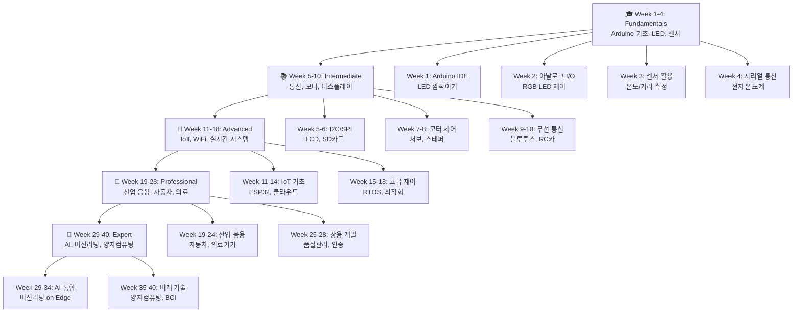

# 🚀 Embedded Systems with Arduino - Complete Learning Path

<div align="center">


**차세대 임베디드 시스템 개발자를 위한 완벽한 학습 저장소**

[English](README_EN.md) | [한국어](README.md)

</div>

## 🎯 바로 시작하기

<div align="center">

### 📚 **40주 체계적 학습 로드맵**

[](STUDY_ROADMAP.md)

</div>

### 📅 **학습 순서 (수업처럼 단계별로!)**

| 순서 | 학습 가이드 | 내용 | 시간 |
|------|-------------|------|------|
| **1단계** | [📚 STUDY_ROADMAP.md](STUDY_ROADMAP.md) | 40주 전체 학습 계획 및 목표 | 10분 |
| **2단계** | [📖 WEEKLY_GUIDES.md](WEEKLY_GUIDES.md) | 주차별 상세 일정 및 프로젝트 | 시작 |
| **3단계** | [📊 PROGRESS_TRACKER.md](PROGRESS_TRACKER.md) | 개인 학습 진도 추적 | 진행 중 |

---

## 🛤️ 40주 학습 로드맵 미리보기



---

## 🎯 **매주 학습 목표**

### 🎓 **Phase 1: Fundamentals (Week 1-4)**
| Week | 학습 주제 | 핵심 프로젝트 | 난이도 |
|------|-----------|---------------|---------|
| **Week 1** | Arduino 개발환경 & 기본 I/O | LED 깜빡이기, 버튼 제어 | ⭐ |
| **Week 2** | 아날로그 I/O & PWM | RGB LED, 가변저항 조명 | ⭐ |
| **Week 3** | 센서 활용 기초 | 온도센서, 초음파 거리측정 | ⭐⭐ |
| **Week 4** | 시리얼 통신 & 통합 | **전자 온도계 시스템** | ⭐⭐ |

### 📚 **Phase 2: Intermediate (Week 5-10)**
| Week | 학습 주제 | 핵심 프로젝트 | 난이도 |
|------|-----------|---------------|---------|
| **Week 5** | I2C 통신 & LCD | LCD 디스플레이 제어 | ⭐⭐ |
| **Week 6** | SPI 통신 & 데이터 로깅 | SD카드 데이터 저장 | ⭐⭐⭐ |
| **Week 7** | 서보 & DC 모터 제어 | 로봇팔 기초 제어 | ⭐⭐⭐ |
| **Week 8** | 스테퍼 모터 & 정밀제어 | CNC 미니 플로터 | ⭐⭐⭐ |
| **Week 9** | 무선 통신 (블루투스) | 스마트폰 제어 시스템 | ⭐⭐⭐ |
| **Week 10** | 통합 프로젝트 | **RC카 또는 드론 제어** | ⭐⭐⭐⭐ |

### 🚀 **Phase 3: Advanced (Week 11-18)**
| Week | 학습 주제 | 핵심 프로젝트 | 난이도 |
|------|-----------|---------------|---------|
| **Week 11-12** | ESP32 & WiFi IoT | 기상 스테이션 웹서버 | ⭐⭐⭐⭐ |
| **Week 13-14** | 실시간 시스템 (RTOS) | 멀티태스킹 제어 | ⭐⭐⭐⭐ |
| **Week 15-16** | 장거리 통신 & 비전 | LoRa 통신, 카메라 | ⭐⭐⭐⭐⭐ |
| **Week 17-18** | 전력관리 & 최적화 | **스마트 홈 시스템** | ⭐⭐⭐⭐⭐ |

### 💼 **Phase 4: Professional (Week 19-28)**
| Week | 학습 주제 | 핵심 프로젝트 | 난이도 |
|------|-----------|---------------|---------|
| **Week 19-22** | 산업 & 자동차 전자 | OBD-II 진단, PLC 연동 | ⭐⭐⭐⭐⭐ |
| **Week 23-26** | 의료 & 항공우주 | 심박수 모니터, 드론 시스템 | ⭐⭐⭐⭐⭐ |
| **Week 27-28** | 품질관리 & 인증 | **상용 제품 프로토타입** | ⭐⭐⭐⭐⭐ |

### 🧠 **Phase 5: Expert (Week 29-40)**
| Week | 학습 주제 | 핵심 프로젝트 | 난이도 |
|------|-----------|---------------|---------|
| **Week 29-32** | AI & 머신러닝 on Edge | AI 카메라, 뉴럴 프로세서 | 🔥🔥🔥🔥🔥 |
| **Week 33-36** | 고급 로보틱스 | 자율주행 로봇, BCI | 🔥🔥🔥🔥🔥 |
| **Week 37-40** | 미래 기술 & 포트폴리오 | **혁신적 개인 프로젝트** | 🔥🔥🔥🔥🔥 |

---

## 🏆 **성취 뱃지 시스템**

| 단계 완료 | 획득 뱃지 | 조건 | 예상 실력 |
|-----------|-----------|------|-----------|
| **Week 4** |  | 기초 4주 + 5개 프로젝트 | 취미 개발자 |
| **Week 10** |  | 중급 6주 + RC카 프로젝트 | 중급 개발자 |
| **Week 18** |  | 고급 8주 + 스마트홈 | IoT 전문가 |
| **Week 28** |  | 전문 10주 + 상용 프로토타입 | 산업 전문가 |
| **Week 40** |  | 최고급 12주 + 혁신 프로젝트 | **AI 융합 전문가** |

---

## 📚 **완벽한 학습 시스템**

### ⏰ **일일 학습 구조 (하루 2시간)**
- **이론 학습**: 1시간 (개념, 원리 학습)
- **실습 코딩**: 1시간 (회로 구성, 프로그래밍)

### 📊 **주간 평가 시스템**
- **월-목**: 일일 프로젝트 실습
- **금요일**: 주간 복습 & 통합 프로젝트

### 🎯 **학습 지원 도구**
- **체크리스트**: 매일/매주 완료 항목 체크
- **진도 추적**: 개인별 학습 진도 관리
- **코드 예제**: 모든 프로젝트 완성 코드 제공
- **문제 해결**: 단계별 디버깅 및 문제해결 가이드

---

## 🚦 **지금 바로 시작하기**

<div align="center">

### **3단계로 시작하세요!**

</div>

### **1️⃣ 저장소 준비**
```bash
git clone https://github.com/Jirehhyeon/embedded_with_arduino.git
cd embedded_with_arduino
```

### **2️⃣ 학습 계획 확인**
```bash
# 전체 로드맵 확인
cat STUDY_ROADMAP.md

# Week 1 상세 가이드 확인  
cat WEEKLY_GUIDES.md
```

### **3️⃣ Week 1 시작!**
```bash
# Week 1 프로젝트 폴더로 이동
cd 01-fundamentals/arduino-introduction/03-first-program-blink/

# Arduino IDE에서 Blink_Basic.ino 열기
```

---

## 📁 **프로젝트 구조**

```
embedded_with_arduino/
│
├── 📚 STUDY_ROADMAP.md          # ← 1단계: 전체 학습 계획
├── 📖 WEEKLY_GUIDES.md          # ← 2단계: 주차별 상세 가이드  
├── 📊 PROGRESS_TRACKER.md       # ← 3단계: 개인 진도 추적
│
├── 📂 01-fundamentals/          # Week 1-4: 기초 과정
├── 📂 02-intermediate/          # Week 5-10: 중급 과정
├── 📂 03-advanced/             # Week 11-18: 고급 과정
├── 📂 04-professional/         # Week 19-28: 전문가 과정
├── 📂 05-expert/               # Week 29-40: 최고급 과정
│
├── 📂 docs/                    # 상세 문서
├── 📂 resources/               # 회로도, 부품 정보
├── 📂 tools/                   # 개발 도구
└── 📂 projects/                # 완성된 프로젝트들
```

---

## 🔧 **필요한 준비물**

### **🔌 하드웨어 (단계별 구매 가능)**

#### **Week 1-4 (기초)**: ~50,000원
- Arduino Uno R3
- 브레드보드 + 점퍼선
- LED, 저항, 버튼
- 온도센서, 초음파센서

#### **Week 5-10 (중급)**: +30,000원  
- LCD 디스플레이
- 서보모터, DC모터
- 블루투스 모듈

#### **Week 11+ (고급)**: +50,000원
- ESP32 개발보드
- 카메라 모듈
- 고급 센서류

### **💻 소프트웨어 (무료)**
- Arduino IDE 2.0+
- VS Code + PlatformIO (선택)

---

## 🤝 **학습 지원**

### **❓ 막혔을 때**
1. [WEEKLY_GUIDES.md](WEEKLY_GUIDES.md) 상세 가이드 확인
2. GitHub Issues에 질문 등록
3. 커뮤니티 포럼 활용

### **🎓 인증서 발급**
- 각 Phase 완료시 GitHub 뱃지 획득
- 최종 완료시 LinkedIn 공유 가능한 포트폴리오

---

<div align="center">

## 🚀 **지금 바로 시작하세요!**

**40주 후, 당신은 AI 융합 임베디드 전문가가 됩니다!**

[](STUDY_ROADMAP.md)
[](WEEKLY_GUIDES.md)
[](PROGRESS_TRACKER.md)

**⭐ 이 저장소가 도움이 되셨다면 Star를 눌러주세요!**

[](https://github.com/Jirehhyeon/embedded_with_arduino)
[](https://github.com/Jirehhyeon/embedded_with_arduino)

</div>

---

## 📜 **라이선스**

이 프로젝트는 MIT 라이선스 하에 배포됩니다. [LICENSE](LICENSE) 파일을 참조하세요.

**Made with ❤️ by Embedded Enthusiasts**