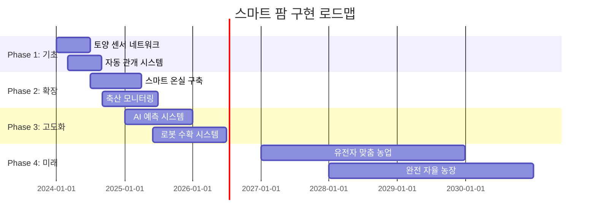

# 🌾 Arduino 농업 및 스마트 파밍 완전 가이드

> **미래 농업의 혁신** - Arduino로 구현하는 정밀 농업과 스마트 팜

[](#)
[](#)
[](#)

---

## 🎯 **스마트 농업의 혁신적 가능성**

### 📊 **글로벌 AgTech 시장 현황 (2024)**
```
🌍 스마트 농업 시장 규모: $15.3B (2024년)
📈 연평균 성장률: 12.7% (2024-2030)
🚜 정밀 농업 도입률: 45% (선진국 기준)
🌱 수직 농장 증가율: 연간 24.6%
```

### 🚀 **Arduino 농업 기술의 핵심 영역**
- **🌱 정밀 농업** - 센서 기반 작물 모니터링, 자동 관개
- **🏭 스마트 온실** - 환경 제어, 수경재배 자동화
- **🐄 축산 관리** - 가축 건강 모니터링, 사료 자동화
- **🌾 수확 자동화** - 로봇 수확, 품질 선별
- **📊 데이터 농업** - AI 예측, 수확량 최적화

---

## 🌱 **1. 정밀 농업 시스템**

### 🌡️ **스마트 토양 모니터링**

#### **다중 센서 토양 분석 시스템**
```cpp
// 고급 토양 모니터링 시스템
#include <WiFi.h>
#include <DHT.h>
#include <ArduinoJson.h>
#include <SoftwareSerial.h>

class PrecisionAgricultureSystem {
private:
    // 토양 센서 데이터 구조체
    struct SoilData {
        float moisture;            // 토양 수분 (%)
        float temperature;         // 토양 온도 (°C)
        float pH;                  // pH 수준
        float nitrogen;            // 질소 농도 (mg/kg)
        float phosphorus;          // 인 농도 (mg/kg)
        float potassium;           // 칼륨 농도 (mg/kg)
        float ec;                  // 전기 전도도 (mS/cm)
        float organic_matter;      // 유기물 함량 (%)
        unsigned long timestamp;
        String location;           // GPS 좌표 또는 구역 ID
    };
    
    // 작물 데이터 구조체
    struct CropData {
        String cropType;           // 작물 종류
        int growthStage;          // 성장 단계 (1-10)
        float height;             // 작물 높이 (cm)
        float leafArea;           // 엽면적 지수
        float chlorophyll;        // 엽록소 함량
        String healthStatus;      // 건강 상태
        float yieldPrediction;    // 예상 수확량
    };
    
    // 환경 데이터
    struct EnvironmentalData {
        float airTemp;            // 대기 온도
        float humidity;           // 대기 습도
        float lightIntensity;     // 광도 (lux)
        float co2Level;           // CO2 농도 (ppm)
        float windSpeed;          // 풍속 (m/s)
        float rainfall;           // 강수량 (mm)
        float uvIndex;            // UV 지수
    };
    
    SoilData soilSensors[50];     // 50개 토양 센서 노드
    CropData crops[100];          // 100개 작물 구역
    EnvironmentalData environment;
    
    // 센서 핀 설정
    const int MOISTURE_PINS[10] = {A0, A1, A2, A3, A4, A5, A6, A7, A8, A9};
    const int PH_PIN = A10;
    const int NPK_SENSOR_PIN = 10; // NPK 센서 (UART)
    const int EC_PIN = A11;
    
    // 통신 설정
    SoftwareSerial npkSerial(10, 11); // NPK 센서 UART
    
    int sensorCount = 0;
    bool systemActive = false;
    
public:
    void initialize() {
        Serial.begin(115200);
        npkSerial.begin(9600);
        
        // WiFi 연결 (농장 네트워크)
        connectToFarmNetwork();
        
        // 센서 초기화
        initializeSensors();
        
        // 클라우드 연결
        connectToAgriCloud();
        
        // AI 모델 로드
        loadCropPredictionModel();
        
        Serial.println("🌾 정밀 농업 시스템 가동");
        systemActive = true;
    }
    
    void monitorFieldConditions() {
        if (!systemActive) return;
        
        // 토양 상태 모니터링
        collectSoilData();
        
        // 환경 조건 측정
        measureEnvironmentalConditions();
        
        // 작물 상태 평가
        assessCropHealth();
        
        // 데이터 분석 및 예측
        analyzeAndPredict();
        
        // 자동 제어 시스템 작동
        executeAutomatedControls();
        
        // 클라우드 데이터 업로드
        uploadToCloud();
    }
    
private:
    void collectSoilData() {
        for (int i = 0; i < sensorCount; i++) {
            // 토양 수분 측정
            soilSensors[i].moisture = readMoistureSensor(i);
            
            // 토양 온도 측정
            soilSensors[i].temperature = readSoilTemperature(i);
            
            // pH 측정
            soilSensors[i].pH = readPHSensor();
            
            // NPK 측정 (질소, 인, 칼륨)
            readNPKSensor(i);
            
            // 전기 전도도 측정
            soilSensors[i].ec = readECMeter();
            
            // 타임스탬프
            soilSensors[i].timestamp = millis();
            
            // 이상 상태 감지
            detectAnomalies(i);
        }
    }
    
    float readMoistureSensor(int sensorIndex) {
        int rawValue = analogRead(MOISTURE_PINS[sensorIndex % 10]);
        
        // 센서 캘리브레이션 값 적용
        float moisture = map(rawValue, 0, 1023, 0, 100);
        
        // 토양 타입별 보정
        moisture = calibrateForSoilType(moisture, getSoilType(sensorIndex));
        
        return moisture;
    }
    
    void readNPKSensor(int sensorIndex) {
        // NPK 센서 명령 전송
        byte queryN[] = {0x01, 0x03, 0x00, 0x1E, 0x00, 0x01, 0xE4, 0x0C}; // 질소
        byte queryP[] = {0x01, 0x03, 0x00, 0x1F, 0x00, 0x01, 0xB5, 0xCC}; // 인
        byte queryK[] = {0x01, 0x03, 0x00, 0x20, 0x00, 0x01, 0x85, 0xC0}; // 칼륨
        
        // 질소 측정
        npkSerial.write(queryN, sizeof(queryN));
        delay(100);
        if (npkSerial.available() >= 7) {
            byte response[7];
            npkSerial.readBytes(response, 7);
            soilSensors[sensorIndex].nitrogen = (response[3] << 8) | response[4];
        }
        
        // 인 측정
        npkSerial.write(queryP, sizeof(queryP));
        delay(100);
        if (npkSerial.available() >= 7) {
            byte response[7];
            npkSerial.readBytes(response, 7);
            soilSensors[sensorIndex].phosphorus = (response[3] << 8) | response[4];
        }
        
        // 칼륨 측정
        npkSerial.write(queryK, sizeof(queryK));
        delay(100);
        if (npkSerial.available() >= 7) {
            byte response[7];
            npkSerial.readBytes(response, 7);
            soilSensors[sensorIndex].potassium = (response[3] << 8) | response[4];
        }
    }
    
    void assessCropHealth() {
        for (int i = 0; i < 100; i++) {
            if (crops[i].cropType != "") {
                // 컴퓨터 비전으로 작물 상태 분석
                analyzeCropImage(i);
                
                // 성장률 계산
                calculateGrowthRate(i);
                
                // 질병 및 해충 감지
                detectPestsAndDiseases(i);
                
                // 영양 결핍 진단
                diagnoseNutrientDeficiency(i);
                
                // 수확 시기 예측
                predictHarvestTime(i);
            }
        }
    }
    
    void detectPestsAndDiseases(int cropIndex) {
        // AI 기반 병해충 감지
        String detectedIssue = "";
        float confidence = 0.0;
        
        // 이미지 분석
        if (analyzeLeafPattern(cropIndex)) {
            detectedIssue = "잎마름병";
            confidence = 0.85;
        }
        
        // 환경 조건 기반 위험도 평가
        float diseaseRisk = calculateDiseaseRisk();
        
        if (confidence > 0.7 || diseaseRisk > 0.8) {
            // 즉시 알림
            sendPestAlert(cropIndex, detectedIssue, confidence);
            
            // 자동 방제 시스템 작동
            if (confidence > 0.9) {
                activatePestControl(cropIndex, detectedIssue);
            }
        }
    }
    
    void executeAutomatedControls() {
        // 관개 시스템 제어
        controlIrrigation();
        
        // 시비 시스템 제어
        controlFertilization();
        
        // 온도 조절 (온실의 경우)
        controlTemperature();
        
        // 조명 제어 (보조 조명)
        controlSupplementalLighting();
    }
    
    void controlIrrigation() {
        for (int zone = 0; zone < 10; zone++) {
            float avgMoisture = calculateZoneAverageMoisture(zone);
            float cropWaterNeed = getCropWaterRequirement(zone);
            
            // 토양 수분이 임계값 이하일 때
            if (avgMoisture < cropWaterNeed * 0.8) {
                // 필요 관수량 계산
                float waterAmount = calculateWaterAmount(zone, avgMoisture, cropWaterNeed);
                
                // 날씨 예보 확인 (비 예보 시 관수 지연)
                if (!isRainExpected()) {
                    activateIrrigation(zone, waterAmount);
                    
                    Serial.println("💧 구역 " + String(zone) + " 관수 시작: " + 
                                  String(waterAmount) + "L");
                }
            }
        }
    }
    
    void controlFertilization() {
        for (int zone = 0; zone < 10; zone++) {
            // NPK 수준 확인
            float N = getZoneAverageN(zone);
            float P = getZoneAverageP(zone);
            float K = getZoneAverageK(zone);
            
            // 작물별 최적 NPK 비율
            NPKRatio optimal = getOptimalNPKForCrop(zone);
            
            // 부족한 영양소 보충
            if (N < optimal.N * 0.8) {
                applyNitrogen(zone, optimal.N - N);
            }
            if (P < optimal.P * 0.8) {
                applyPhosphorus(zone, optimal.P - P);
            }
            if (K < optimal.K * 0.8) {
                applyPotassium(zone, optimal.K - K);
            }
        }
    }
    
    void analyzeAndPredict() {
        // 머신러닝 기반 수확량 예측
        for (int i = 0; i < 100; i++) {
            if (crops[i].cropType != "") {
                PredictionData prediction = runYieldPredictionModel(i);
                
                crops[i].yieldPrediction = prediction.expectedYield;
                
                // 최적화 제안
                if (prediction.expectedYield < prediction.optimalYield * 0.9) {
                    generateOptimizationSuggestions(i, prediction);
                }
            }
        }
        
        // 시장 가격 예측과 연계
        integrateMarketPredictions();
    }
};

// 전역 객체
PrecisionAgricultureSystem farmSystem;

void setup() {
    farmSystem.initialize();
}

void loop() {
    farmSystem.monitorFieldConditions();
    delay(60000); // 1분마다 업데이트
}
```

### 🚜 **자동 관개 시스템**

```cpp
class SmartIrrigationSystem {
private:
    // 관개 구역 정보
    struct IrrigationZone {
        int zoneID;
        String cropType;
        float area;               // 면적 (m²)
        float currentMoisture;    // 현재 수분 (%)
        float targetMoisture;     // 목표 수분 (%)
        int solenoidPin;          // 솔레노이드 밸브 핀
        bool isActive;            // 관개 활성 상태
        unsigned long startTime;  // 관개 시작 시간
        float waterUsed;          // 사용된 물의 양 (L)
    };
    
    // 기상 데이터
    struct WeatherData {
        float temperature;
        float humidity;
        float rainfall;           // 예상 강수량
        float evapotranspiration; // 증발산량
        int forecastHours;        // 예보 시간
    };
    
    // 물 관리
    struct WaterManagement {
        float tankLevel;          // 물탱크 수위 (%)
        float flowRate;           // 유량 (L/min)
        float totalUsage;         // 총 사용량 (L)
        float dailyBudget;        // 일일 물 예산 (L)
        bool rainwaterAvailable;  // 빗물 사용 가능
    };
    
    IrrigationZone zones[20];     // 20개 관개 구역
    WeatherData weather;
    WaterManagement water;
    
    // 센서 및 액추에이터
    const int FLOW_SENSOR_PIN = 2;
    const int RAIN_SENSOR_PIN = 3;
    const int WATER_LEVEL_PIN = A0;
    
    volatile int flowPulseCount = 0;
    
public:
    void initializeIrrigation() {
        Serial.println("💧 스마트 관개 시스템 초기화");
        
        // 유량 센서 인터럽트 설정
        pinMode(FLOW_SENSOR_PIN, INPUT);
        attachInterrupt(digitalPinToInterrupt(FLOW_SENSOR_PIN), flowPulse, RISING);
        
        // 구역별 솔레노이드 밸브 초기화
        initializeSolenoids();
        
        // 기상 API 연결
        connectWeatherAPI();
        
        // 물 관리 시스템 초기화
        initializeWaterManagement();
        
        // 작물별 수분 요구량 데이터 로드
        loadCropWaterRequirements();
    }
    
    void manageIrrigation() {
        // 기상 데이터 업데이트
        updateWeatherData();
        
        // 각 구역별 관개 필요성 평가
        for (int i = 0; i < 20; i++) {
            evaluateIrrigationNeed(i);
        }
        
        // 우선순위 기반 관개 스케줄링
        scheduleIrrigation();
        
        // 활성 관개 구역 모니터링
        monitorActiveIrrigation();
        
        // 물 사용량 추적
        trackWaterUsage();
        
        // 효율성 분석
        analyzeIrrigationEfficiency();
    }
    
private:
    void evaluateIrrigationNeed(int zoneIndex) {
        IrrigationZone& zone = zones[zoneIndex];
        
        // 토양 수분 부족량 계산
        float moistureDeficit = zone.targetMoisture - zone.currentMoisture;
        
        // 증발산량 고려
        float etRate = calculateETRate(zone.cropType, weather);
        
        // 예상 강수량 고려
        float expectedRainfall = weather.rainfall;
        
        // 관개 필요량 계산
        float irrigationNeed = moistureDeficit + etRate - expectedRainfall;
        
        // 관개 우선순위 설정
        if (irrigationNeed > 20) {
            zone.priority = CRITICAL;
        } else if (irrigationNeed > 10) {
            zone.priority = HIGH;
        } else if (irrigationNeed > 5) {
            zone.priority = MEDIUM;
        } else {
            zone.priority = LOW;
        }
    }
    
    void scheduleIrrigation() {
        // 물 가용성 확인
        float availableWater = calculateAvailableWater();
        
        // 우선순위별 정렬
        sortZonesByPriority();
        
        // 시간대별 최적화 (전기 요금 고려)
        OptimalSchedule schedule = optimizeIrrigationSchedule();
        
        // 스케줄 실행
        for (int i = 0; i < schedule.zoneCount; i++) {
            if (availableWater >= schedule.waterRequired[i]) {
                activateZoneIrrigation(schedule.zones[i], schedule.duration[i]);
                availableWater -= schedule.waterRequired[i];
            }
        }
    }
    
    void activateZoneIrrigation(int zoneIndex, int duration) {
        IrrigationZone& zone = zones[zoneIndex];
        
        Serial.println("💧 구역 " + String(zone.zoneID) + " 관개 시작");
        Serial.println("작물: " + zone.cropType);
        Serial.println("예상 시간: " + String(duration) + "분");
        
        // 솔레노이드 밸브 열기
        digitalWrite(zone.solenoidPin, HIGH);
        zone.isActive = true;
        zone.startTime = millis();
        
        // 드립 관개 시스템 압력 조절
        adjustDripPressure(zone.cropType);
        
        // 실시간 모니터링 시작
        startZoneMonitoring(zoneIndex);
    }
    
    void monitorActiveIrrigation() {
        for (int i = 0; i < 20; i++) {
            if (zones[i].isActive) {
                // 실시간 유량 측정
                float currentFlow = measureFlowRate();
                
                // 목표 수분 도달 확인
                if (zones[i].currentMoisture >= zones[i].targetMoisture) {
                    // 관개 중지
                    stopZoneIrrigation(i);
                }
                
                // 이상 상황 감지
                if (currentFlow < 0.5) { // 유량 너무 낮음
                    handleLowFlowAlert(i);
                } else if (currentFlow > 50) { // 파이프 파손 의심
                    handlePipeBreakAlert(i);
                    emergencyStop(i);
                }
                
                // 물 사용량 업데이트
                zones[i].waterUsed += currentFlow * 0.0167; // L/min to L/sec
            }
        }
    }
    
    // 유량 센서 인터럽트 핸들러
    static void flowPulse() {
        flowPulseCount++;
    }
    
    float measureFlowRate() {
        // 1초간 펄스 수 계산
        static unsigned long lastTime = 0;
        unsigned long currentTime = millis();
        
        if (currentTime - lastTime >= 1000) {
            float flowRate = flowPulseCount * 2.25; // 센서별 캘리브레이션 값
            flowPulseCount = 0;
            lastTime = currentTime;
            
            return flowRate;
        }
        
        return water.flowRate; // 이전 값 반환
    }
    
    void implementDripIrrigation() {
        Serial.println("💧 정밀 드립 관개 시스템");
        
        // 작물별 드립 라인 설정
        struct DripLine {
            float emitterSpacing;    // 점적기 간격 (cm)
            float emitterFlowRate;   // 점적기 유량 (L/h)
            int emittersPerPlant;    // 작물당 점적기 수
            float operatingPressure; // 작동 압력 (bar)
        };
        
        DripLine tomatoDrip = {30, 2.0, 2, 1.5};
        DripLine pepperDrip = {40, 1.5, 1, 1.2};
        DripLine cucumberDrip = {50, 2.5, 2, 1.8};
        
        // 압력 보상 점적기 제어
        controlPressureCompensatingEmitters();
        
        // 염분 축적 방지 플러싱
        if (shouldFlushSystem()) {
            performSystemFlush();
        }
    }
};
```

---

## 🏭 **2. 스마트 온실 시스템**

### 🌡️ **완전 자동화 온실 환경 제어**

```cpp
class SmartGreenhouseSystem {
private:
    // 온실 환경 데이터
    struct GreenhouseEnvironment {
        float temperature;         // 온도 (°C)
        float humidity;           // 습도 (%)
        float co2Level;           // CO2 농도 (ppm)
        float lightIntensity;     // 광도 (lux)
        float soilMoisture;       // 토양 수분 (%)
        float nutrientEC;         // 양액 EC (mS/cm)
        float nutrientPH;         // 양액 pH
        float ventilationRate;    // 환기율 (m³/h)
    };
    
    // 작물 생육 데이터
    struct PlantGrowthData {
        String plantType;
        int growthDay;            // 생육일수
        float plantHeight;        // 식물 높이 (cm)
        float stemDiameter;       // 줄기 직경 (mm)
        int leafCount;            // 잎 개수
        int fruitCount;           // 열매 개수
        float biomass;            // 바이오매스 (g)
        String growthStage;       // 성장 단계
    };
    
    // 환경 제어 장치
    struct ControlDevices {
        int heatingPin;           // 난방 제어
        int coolingPin;           // 냉방 제어
        int humidifierPin;        // 가습기
        int dehumidifierPin;      // 제습기
        int co2ValvePin;          // CO2 밸브
        int ventFanPin[4];        // 환기팬 (4개)
        int shadeCurtainPin;      // 차광막
        int growLightPin[10];     // 보조 조명 (10개)
    };
    
    GreenhouseEnvironment currentEnv;
    GreenhouseEnvironment targetEnv;
    PlantGrowthData plants[200];
    ControlDevices controls;
    
    // 수경재배 시스템
    struct HydroponicsSystem {
        float nutrientTankLevel;   // 양액 탱크 수위
        float nutrientConc[5];     // NPK + 미량원소 농도
        float pumpFlowRate;        // 펌프 유량
        bool recirculationActive;  // 순환 활성화
        float drainageEC;          // 배액 EC
        float drainagePH;          // 배액 pH
    };
    
    HydroponicsSystem hydro;
    
public:
    void initializeGreenhouse() {
        Serial.println("🏭 스마트 온실 시스템 초기화");
        
        // 센서 네트워크 초기화
        initializeSensorNetwork();
        
        // 제어 장치 설정
        setupControlDevices();
        
        // 수경재배 시스템 초기화
        initializeHydroponics();
        
        // AI 생육 모델 로드
        loadGrowthPredictionModel();
        
        // 클라우드 연결
        connectToGreenhouseCloud();
        
        Serial.println("✅ 온실 자동화 시스템 준비 완료");
    }
    
    void manageGreenhouseEnvironment() {
        // 환경 데이터 수집
        collectEnvironmentalData();
        
        // 작물 생육 모니터링
        monitorPlantGrowth();
        
        // 최적 환경 설정값 계산
        calculateOptimalSettings();
        
        // 환경 제어 실행
        executeEnvironmentalControl();
        
        // 수경재배 시스템 관리
        manageHydroponics();
        
        // 에너지 효율 최적화
        optimizeEnergyUsage();
    }
    
private:
    void collectEnvironmentalData() {
        // 다중 지점 온도 측정 (평균값 사용)
        float temps[10];
        for (int i = 0; i < 10; i++) {
            temps[i] = readTemperatureSensor(i);
        }
        currentEnv.temperature = calculateAverage(temps, 10);
        
        // 습도 측정
        currentEnv.humidity = readHumiditySensor();
        
        // CO2 측정
        currentEnv.co2Level = readCO2Sensor();
        
        // 광도 측정 (PAR 센서)
        currentEnv.lightIntensity = readPARSensor();
        
        // 데이터 검증
        validateSensorData();
    }
    
    void calculateOptimalSettings() {
        // 작물별, 생육단계별 최적 환경 설정
        String dominantCrop = getDominantCropType();
        String growthStage = getAverageGrowthStage();
        
        // 온도 설정 (주간/야간 구분)
        if (isDaytime()) {
            targetEnv.temperature = getOptimalDayTemp(dominantCrop, growthStage);
        } else {
            targetEnv.temperature = getOptimalNightTemp(dominantCrop, growthStage);
        }
        
        // 습도 설정
        targetEnv.humidity = getOptimalHumidity(dominantCrop, growthStage);
        
        // CO2 농도 설정 (광합성 활성 시간대)
        if (isPhotosynthesisActive()) {
            targetEnv.co2Level = 1000; // 1000 ppm (강화 재배)
        } else {
            targetEnv.co2Level = 400;  // 대기 수준
        }
        
        // DLI (일적산광량) 기반 보조 조명 계산
        targetEnv.lightIntensity = calculateTargetDLI(dominantCrop);
    }
    
    void executeEnvironmentalControl() {
        // PID 제어를 통한 정밀 온도 관리
        float tempError = targetEnv.temperature - currentEnv.temperature;
        
        if (tempError > 2.0) {
            // 난방 필요
            activateHeating(calculateHeatingPower(tempError));
        } else if (tempError < -2.0) {
            // 냉방 필요
            activateCooling(calculateCoolingPower(abs(tempError)));
        }
        
        // 습도 제어
        float humidityError = targetEnv.humidity - currentEnv.humidity;
        
        if (humidityError > 5.0) {
            activateHumidifier();
        } else if (humidityError < -5.0) {
            activateDehumidifier();
        }
        
        // CO2 보충
        if (currentEnv.co2Level < targetEnv.co2Level - 50) {
            openCO2Valve();
        }
        
        // 환기 제어 (온도, 습도, CO2 종합 고려)
        controlVentilation();
        
        // 차광막 제어
        controlShadingSystem();
        
        // 보조 조명 제어
        controlSupplementalLighting();
    }
    
    void manageHydroponics() {
        // 양액 농도 모니터링
        float currentEC = measureNutrientEC();
        float currentPH = measureNutrientPH();
        
        // EC 조절
        if (currentEC < hydro.targetEC - 0.2) {
            // 농축 양액 추가
            addConcentratedNutrient(calculateNutrientAmount());
        } else if (currentEC > hydro.targetEC + 0.2) {
            // 물 추가로 희석
            addWater(calculateDilutionAmount());
        }
        
        // pH 조절
        if (currentPH < 5.5) {
            // pH 상승제 추가
            addPHUp(calculatePHAdjustment(currentPH, 6.0));
        } else if (currentPH > 6.5) {
            // pH 하강제 추가
            addPHDown(calculatePHAdjustment(currentPH, 6.0));
        }
        
        // 순환 시스템 제어
        controlNutrientCirculation();
        
        // 배액 분석 및 재활용
        analyzeAndRecycleDrainage();
    }
    
    void controlNutrientCirculation() {
        // 타이머 기반 급액 (NFT, 에브엔플로우 등)
        static unsigned long lastIrrigationTime = 0;
        unsigned long currentTime = millis();
        
        // 15분 급액, 15분 정지 사이클
        if (currentTime - lastIrrigationTime > 900000) { // 15분
            hydro.recirculationActive = !hydro.recirculationActive;
            
            if (hydro.recirculationActive) {
                startNutrientPump();
                Serial.println("💧 양액 순환 시작");
            } else {
                stopNutrientPump();
                Serial.println("⏸️ 양액 순환 정지");
            }
            
            lastIrrigationTime = currentTime;
        }
        
        // 급액 중 모니터링
        if (hydro.recirculationActive) {
            monitorFlowRate();
            checkForClogs();
        }
    }
    
    void implementClimateZoning() {
        // 온실 내 구역별 미기후 제어
        Serial.println("🌡️ 구역별 기후 제어 시스템");
        
        // 4개 구역 독립 제어
        for (int zone = 0; zone < 4; zone++) {
            ClimateZone zoneData = getZoneData(zone);
            
            // 구역별 작물에 맞춘 환경 제어
            if (zoneData.cropType == "토마토") {
                setZoneClimate(zone, 24, 65, 1000); // 온도, 습도, CO2
            } else if (zoneData.cropType == "상추") {
                setZoneClimate(zone, 20, 70, 800);
            } else if (zoneData.cropType == "파프리카") {
                setZoneClimate(zone, 26, 60, 1200);
            }
            
            // 구역별 독립 환기
            controlZoneVentilation(zone);
            
            // 구역별 관수 제어
            controlZoneIrrigation(zone);
        }
    }
    
    void monitorPlantGrowth() {
        // 컴퓨터 비전 기반 생육 모니터링
        for (int i = 0; i < 200; i++) {
            if (plants[i].plantType != "") {
                // 이미지 캡처 및 분석
                ImageData plantImage = captureP
                
                // 식물 높이 측정
                plants[i].plantHeight = measurePlantHeight(plantImage);
                
                // 잎 면적 계산
                plants[i].leafArea = calculateLeafArea(plantImage);
                
                // 열매 개수 카운트
                plants[i].fruitCount = countFruits(plantImage);
                
                // 건강 상태 진단
                diagnosePlantHealth(i, plantImage);
                
                // 성장률 계산
                calculateGrowthRate(i);
            }
        }
    }
    
    void optimizeEnergyUsage() {
        // 에너지 효율적인 온실 운영
        
        // 태양광 활용 최대화
        float solarRadiation = getSolarRadiation();
        
        if (solarRadiation > 500) { // W/m²
            // 자연광 충분 - 인공조명 끄기
            turnOffGrowLights();
            
            // 차광 필요 여부 판단
            if (solarRadiation > 800 && currentEnv.temperature > 30) {
                activateShadeCurtain(50); // 50% 차광
            }
        }
        
        // 열 회수 환기 시스템
        if (needsVentilation() && outsideTemp < currentEnv.temperature - 5) {
            activateHeatRecoveryVentilation();
        }
        
        // 야간 열 보존
        if (!isDaytime() && outsideTemp < 10) {
            closeAllVents();
            activateThermalScreen();
        }
        
        // 에너지 사용량 추적
        trackEnergyConsumption();
    }
};
```

---

## 🐄 **3. 스마트 축산 관리**

### 🐮 **가축 건강 모니터링 시스템**

```cpp
class SmartLivestockManagement {
private:
    // 가축 개체 정보
    struct LivestockData {
        String animalID;          // RFID 태그 ID
        String species;           // 축종 (소, 돼지, 닭 등)
        int age;                  // 나이 (개월)
        float weight;             // 체중 (kg)
        float bodyTemperature;    // 체온 (°C)
        int heartRate;            // 심박수 (bpm)
        int respirationRate;      // 호흡수 (회/분)
        float activityLevel;      // 활동량 (0-10)
        String healthStatus;      // 건강 상태
        float milkYield;          // 일일 산유량 (L) - 젖소
        int feedIntake;           // 사료 섭취량 (kg)
        unsigned long lastCheckup; // 마지막 검진 시간
    };
    
    // 축사 환경 데이터
    struct BarnEnvironment {
        float temperature;        // 온도
        float humidity;          // 습도
        float ammonia;           // 암모니아 농도 (ppm)
        float co2Level;          // CO2 농도
        float lightLevel;        // 조도
        float noiseLevel;        // 소음 수준
        int ventilationRate;     // 환기율
    };
    
    // 사료 관리
    struct FeedManagement {
        String feedType;         // 사료 종류
        float proteinContent;    // 단백질 함량 (%)
        float energyContent;     // 에너지 함량 (kcal/kg)
        float dailyAllocation;   // 일일 배급량 (kg)
        float remainingStock;    // 남은 재고 (톤)
        int feedingTimes[4];     // 급이 시간
        bool automaticFeeding;   // 자동 급이 여부
    };
    
    LivestockData animals[500];   // 500마리 관리
    BarnEnvironment barn;
    FeedManagement feed;
    
    // 센서 및 장치
    int rfidReaderPin = 10;
    int weightScalePin = A0;
    int tempSensors[10];         // 다중 온도 센서
    
    int animalCount = 0;
    
public:
    void initializeLivestockSystem() {
        Serial.println("🐄 스마트 축산 관리 시스템 초기화");
        
        // RFID 시스템 초기화
        initializeRFIDSystem();
        
        // 생체 센서 네트워크 설정
        setupBiometricSensors();
        
        // 환경 모니터링 시스템
        initializeEnvironmentalMonitoring();
        
        // 자동 급이/급수 시스템
        setupAutomaticFeedingSystem();
        
        // AI 건강 진단 모델 로드
        loadHealthDiagnosticModel();
        
        Serial.println("✅ 축산 관리 시스템 준비 완료");
    }
    
    void manageLivestock() {
        // 개체별 건강 모니터링
        monitorIndividualHealth();
        
        // 축사 환경 관리
        controlBarnEnvironment();
        
        // 사료 급이 관리
        manageFeedingSchedule();
        
        // 질병 조기 감지
        detectDiseasesEarly();
        
        // 번식 관리
        manageBreeding();
        
        // 생산성 분석
        analyzeProductivity();
    }
    
private:
    void monitorIndividualHealth() {
        for (int i = 0; i < animalCount; i++) {
            // RFID로 개체 식별
            if (detectAnimalPresence(animals[i].animalID)) {
                // 체중 측정
                animals[i].weight = measureWeight();
                
                // 체온 측정 (비접촉식)
                animals[i].bodyTemperature = measureBodyTemperature(i);
                
                // 활동량 추적
                animals[i].activityLevel = trackActivity(i);
                
                // 이상 징후 감지
                detectAnomalies(i);
                
                // 건강 점수 계산
                calculateHealthScore(i);
            }
        }
    }
    
    void detectAnomalies(int animalIndex) {
        LivestockData& animal = animals[animalIndex];
        
        // 체온 이상
        if (animal.species == "소") {
            if (animal.bodyTemperature < 38.0 || animal.bodyTemperature > 39.5) {
                triggerHealthAlert(animalIndex, "체온 이상");
                
                // 격리 권고
                if (animal.bodyTemperature > 40.0) {
                    recommendIsolation(animalIndex);
                }
            }
        }
        
        // 활동량 급감
        if (animal.activityLevel < 2.0) { // 정상의 20% 이하
            triggerHealthAlert(animalIndex, "활동량 급감");
            
            // 절뚝거림 감지
            if (detectLameness(animalIndex)) {
                scheduleVeterinaryCheck(animalIndex, "절뚝거림");
            }
        }
        
        // 사료 섭취량 감소
        if (animal.feedIntake < animal.dailyRequirement * 0.7) {
            triggerHealthAlert(animalIndex, "식욕 부진");
        }
    }
    
    void controlBarnEnvironment() {
        // 최적 환경 유지
        
        // 온도 제어
        if (barn.temperature > getOptimalTemp(currentSeason, timeOfDay)) {
            // 냉방 시스템 작동
            activateCoolingSystem();
            
            // 환기 강화
            increaseVentilation();
        } else if (barn.temperature < getOptimalTemp(currentSeason, timeOfDay) - 5) {
            // 난방 시스템 작동
            activateHeatingSystem();
            
            // 환기 감소 (열 보존)
            decreaseVentilation();
        }
        
        // 암모니아 농도 제어
        if (barn.ammonia > 25) { // 25 ppm 초과
            Serial.println("⚠️ 암모니아 농도 높음: " + String(barn.ammonia) + " ppm");
            
            // 즉시 환기
            emergencyVentilation();
            
            // 깔짚 교체 알림
            alertBeddingChange();
        }
        
        // 조명 제어 (산란계의 경우)
        if (hasLayingHens()) {
            controlLightingForEggProduction();
        }
    }
    
    void manageFeedingSchedule() {
        // 자동 급이 시스템
        
        static int currentFeedingSession = 0;
        int currentHour = getCurrentHour();
        
        // 설정된 급이 시간 확인
        for (int i = 0; i < 4; i++) {
            if (currentHour == feed.feedingTimes[i] && currentFeedingSession != i) {
                Serial.println("🌾 급이 시간: " + String(currentHour) + "시");
                
                // 개체별 급이량 계산
                for (int j = 0; j < animalCount; j++) {
                    float individualFeed = calculateIndividualFeedAmount(j);
                    
                    // 자동 급이기 작동
                    dispenseFeed(animals[j].animalID, individualFeed);
                }
                
                currentFeedingSession = i;
                
                // 사료 재고 업데이트
                updateFeedInventory();
            }
        }
        
        // 사료 재고 부족 경고
        if (feed.remainingStock < feed.dailyAllocation * animalCount * 7) {
            alertLowFeedStock();
        }
    }
    
    float calculateIndividualFeedAmount(int animalIndex) {
        LivestockData& animal = animals[animalIndex];
        
        float baseFeed = 0;
        
        // 축종별 기본 급이량
        if (animal.species == "소") {
            baseFeed = animal.weight * 0.025; // 체중의 2.5%
            
            // 젖소의 경우 산유량 고려
            if (animal.milkYield > 0) {
                baseFeed += animal.milkYield * 0.4; // 우유 1L당 0.4kg 추가
            }
        } else if (animal.species == "돼지") {
            baseFeed = animal.weight * 0.04; // 체중의 4%
        }
        
        // 성장 단계 보정
        if (isGrowingPhase(animalIndex)) {
            baseFeed *= 1.2; // 20% 증량
        }
        
        // 건강 상태 보정
        if (animal.healthStatus == "회복중") {
            baseFeed *= 0.8; // 20% 감량
        }
        
        return baseFeed;
    }
    
    void detectDiseasesEarly() {
        // AI 기반 질병 조기 진단
        
        for (int i = 0; i < animalCount; i++) {
            // 복합 지표 분석
            DiseaseRisk risk = analyzeDisease indicators(i);
            
            if (risk.probability > 0.7) {
                Serial.println("🚨 질병 위험 감지: " + animals[i].animalID);
                Serial.println("예상 질병: " + risk.diseaseName);
                Serial.println("확률: " + String(risk.probability * 100) + "%");
                
                // 즉시 조치
                initiateDiseasePrevention(i, risk);
                
                // 수의사 호출
                if (risk.severity == "높음") {
                    callVeterinarian(i, risk);
                }
                
                // 다른 개체 격리
                if (risk.contagious) {
                    isolateAnimal(i);
                    disinfectArea(animals[i].location);
                }
            }
        }
    }
    
    void implementPrecisionFeeding() {
        // 정밀 급이 시스템
        Serial.println("🎯 정밀 급이 시스템 구현");
        
        // TMR (Total Mixed Ration) 시스템
        struct TMRFormula {
            float roughage;      // 조사료 (%)
            float concentrate;   // 농후사료 (%)
            float minerals;      // 미네랄 (%)
            float vitamins;      // 비타민 (%)
            float additives;     // 첨가제 (%)
        };
        
        // 개체별 맞춤 사료 배합
        for (int i = 0; i < animalCount; i++) {
            TMRFormula formula = calculateOptimalTMR(i);
            
            // 자동 배합기 제어
            mixCustomFeed(animals[i].animalID, formula);
            
            // 섭취량 실시간 모니터링
            monitorFeedIntake(i);
            
            // 사료 효율 계산
            calculateFeedEfficiency(i);
        }
    }
    
    void manageBreeding() {
        // 번식 관리 시스템
        
        for (int i = 0; i < animalCount; i++) {
            if (animals[i].species == "소" && animals[i].gender == "암") {
                // 발정 감지
                if (detectEstrus(i)) {
                    Serial.println("🐄 발정 감지: " + animals[i].animalID);
                    
                    // 최적 교배 시기 알림
                    alertOptimalBreedingTime(i);
                    
                    // 인공수정 스케줄링
                    scheduleArtificialInsemination(i);
                }
                
                // 임신 진단
                if (isPregnant(i)) {
                    // 임신 관리 프로토콜 시작
                    startPregnancyManagement(i);
                    
                    // 예상 분만일 계산
                    calculateExpectedDelivery(i);
                }
            }
        }
    }
    
    bool detectEstrus(int animalIndex) {
        // 다중 지표를 통한 발정 감지
        
        // 활동량 증가
        bool increasedActivity = animals[animalIndex].activityLevel > 7.0;
        
        // 체온 상승
        bool tempRise = animals[animalIndex].bodyTemperature > 39.0;
        
        // 다른 소의 승가 허용
        bool standingHeat = detectStandingBehavior(animalIndex);
        
        // 점액 분비 (카메라 감지)
        bool mucusDischarge = detectMucusDischarge(animalIndex);
        
        // 종합 판단
        int indicators = increasedActivity + tempRise + standingHeat + mucusDischarge;
        
        return indicators >= 3; // 3개 이상 지표 일치 시 발정
    }
};
```

---

## 🌾 **4. 수확 자동화 시스템**

### 🤖 **지능형 수확 로봇**

```cpp
class HarvestingRobotSystem {
private:
    // 수확 로봇 상태
    struct HarvestRobot {
        String robotID;
        float position[3];        // 3D 위치
        float batteryLevel;       // 배터리 수준 (%)
        int harvestCapacity;      // 수확 용량 (kg)
        int currentLoad;          // 현재 적재량 (kg)
        String currentTask;       // 현재 작업
        bool isOperational;       // 작동 상태
        float efficiency;         // 작업 효율 (%)
    };
    
    // 작물 인식 시스템
    struct CropRecognition {
        String cropType;
        float maturityLevel;      // 성숙도 (0-1)
        float size;              // 크기 (cm)
        float color[3];          // RGB 색상값
        float firmness;          // 단단함
        bool readyToHarvest;     // 수확 가능 여부
        float estimatedWeight;   // 예상 무게 (g)
        int qualityGrade;        // 품질 등급 (1-5)
    };
    
    // 수확 작업 관리
    struct HarvestOperation {
        String fieldID;
        String cropType;
        float totalArea;         // 총 면적 (ha)
        float harvestedArea;     // 수확 완료 면적
        float totalYield;        // 총 수확량 (톤)
        int robotsDeployed;      // 투입 로봇 수
        unsigned long startTime;
        float estimatedCompletion; // 예상 완료 시간
    };
    
    HarvestRobot robots[10];      // 10대 수확 로봇
    HarvestOperation currentOp;
    
    // 컴퓨터 비전 시스템
    int cameraModules[4];         // 4개 카메라 모듈
    bool visionSystemActive = false;
    
public:
    void initializeHarvestingSystem() {
        Serial.println("🤖 지능형 수확 시스템 초기화");
        
        // 로봇 함대 초기화
        initializeRobotFleet();
        
        // 컴퓨터 비전 시스템 설정
        setupComputerVision();
        
        // 3D 매핑 시스템
        initialize3DMapping();
        
        // 품질 선별 시스템
        setupQualityGrading();
        
        // 물류 연계 시스템
        connectLogisticsSystem();
        
        Serial.println("✅ 수확 자동화 준비 완료");
    }
    
    void executeHarvestingOperation() {
        // 수확 작업 실행
        
        // 작물 성숙도 평가
        assessCropMaturity();
        
        // 로봇 작업 할당
        allocateRobotTasks();
        
        // 수확 작업 모니터링
        monitorHarvestProgress();
        
        // 품질 선별 및 포장
        performQualityControl();
        
        // 수확량 집계
        aggregateYieldData();
    }
    
private:
    void assessCropMaturity() {
        // 전체 필드 스캔
        Serial.println("🔍 작물 성숙도 평가 시작");
        
        for (int row = 0; row < 100; row++) {
            for (int col = 0; col < 100; col++) {
                // 이미지 캡처
                ImageData cropImage = captureFieldImage(row, col);
                
                // AI 기반 성숙도 분석
                CropRecognition crop = analyzeCropImage(cropImage);
                
                // 수확 가능 여부 판단
                if (crop.maturityLevel > 0.85) {
                    crop.readyToHarvest = true;
                    
                    // 수확 대상 목록에 추가
                    addToHarvestQueue(row, col, crop);
                }
            }
        }
    }
    
    CropRecognition analyzeCropImage(ImageData image) {
        CropRecognition result;
        
        // 작물 종류 식별
        result.cropType = identifyCropType(image);
        
        if (result.cropType == "토마토") {
            // 색상 분석으로 성숙도 판단
            result.color[0] = analyzeRedChannel(image);
            result.color[1] = analyzeGreenChannel(image);
            
            // 빨강/초록 비율로 성숙도 계산
            result.maturityLevel = result.color[0] / (result.color[0] + result.color[1]);
            
            // 크기 측정
            result.size = measureObjectSize(image);
            
            // 품질 등급 판정
            result.qualityGrade = gradeQuality(result);
            
        } else if (result.cropType == "딸기") {
            // 딸기 특화 분석
            result.maturityLevel = analyzeStrawberryRipeness(image);
            result.size = measureStrawberrySize(image);
            
            // 당도 예측 (색상 기반)
            float predictedBrix = predictSugarContent(result.color);
        }
        
        return result;
    }
    
    void allocateRobotTasks() {
        // 효율적인 로봇 작업 할당
        
        // 수확 대상 위치 클러스터링
        vector<HarvestCluster> clusters = clusterHarvestTargets();
        
        // 각 로봇에게 클러스터 할당
        for (int i = 0; i < 10; i++) {
            if (robots[i].isOperational && robots[i].batteryLevel > 20) {
                // 가장 가까운 클러스터 할당
                int nearestCluster = findNearestCluster(robots[i].position, clusters);
                
                // 작업 경로 최적화
                Path optimalPath = calculateOptimalPath(robots[i].position, clusters[nearestCluster]);
                
                // 로봇에게 작업 전송
                assignTask(robots[i].robotID, optimalPath, clusters[nearestCluster]);
                
                robots[i].currentTask = "수확중";
            }
        }
    }
    
    void performHarvestAction(int robotIndex, CropRecognition crop) {
        HarvestRobot& robot = robots[robotIndex];
        
        if (crop.cropType == "토마토") {
            // 토마토 수확 동작
            
            // 1. 정확한 위치 계산
            float targetPos[3] = calculatePrecisePosition(crop);
            
            // 2. 로봇 암 이동
            moveRobotArm(robotIndex, targetPos);
            
            // 3. 부드러운 그리핑
            float gripForce = calculateOptimalGripForce(crop.firmness);
            activateGripper(robotIndex, gripForce);
            
            // 4. 비틀기 동작으로 수확
            performTwistHarvest(robotIndex);
            
            // 5. 수확물 수납
            storeHarvestedCrop(robotIndex, crop);
            
        } else if (crop.cropType == "딸기") {
            // 딸기 수확 (더 섬세한 처리)
            performDelicateHarvest(robotIndex, crop);
        }
        
        // 수확 통계 업데이트
        robot.currentLoad += crop.estimatedWeight / 1000; // kg 변환
        currentOp.totalYield += crop.estimatedWeight / 1000000; // 톤 변환
    }
    
    void performQualityControl() {
        // 수확물 품질 선별
        
        Serial.println("📊 품질 선별 시작");
        
        // 컨베이어 벨트 시스템
        for (int i = 0; i < getHarvestedItemCount(); i++) {
            HarvestedCrop item = getNextItem();
            
            // 다중 센서 품질 검사
            QualityAssessment qa;
            qa.size = measureSize(item);
            qa.weight = measureWeight(item);
            qa.color = analyzeColor(item);
            qa.defects = detectDefects(item);
            qa.firmness = testFirmness(item);
            
            // 등급 판정
            int grade = determineGrade(qa);
            
            // 등급별 분류
            sortByGrade(item, grade);
            
            // 포장 라인으로 이동
            if (grade >= 3) { // 3등급 이상만 포장
                moveToPackaging(item, grade);
            } else {
                // 가공용으로 분류
                moveToProcessing(item);
            }
        }
    }
    
    void implementSelectiveHarvesting() {
        // 선택적 수확 시스템
        Serial.println("🎯 선택적 수확 모드");
        
        // 시장 수요 기반 수확
        MarketDemand demand = getMarketDemand();
        
        // 특정 크기/품질만 수확
        HarvestCriteria criteria;
        criteria.minSize = demand.preferredSize - 10; // mm
        criteria.maxSize = demand.preferredSize + 10;
        criteria.minQuality = demand.minQualityGrade;
        criteria.targetColor = demand.preferredColor;
        
        // 로봇에게 선택 기준 전달
        for (int i = 0; i < 10; i++) {
            updateRobotCriteria(i, criteria);
        }
        
        // 나머지는 다음 수확 시기로 연기
        scheduleSecondHarvest();
    }
    
    void monitorHarvestProgress() {
        // 실시간 수확 진행상황 모니터링
        
        // 각 로봇 상태 확인
        for (int i = 0; i < 10; i++) {
            if (robots[i].currentTask == "수확중") {
                // 배터리 체크
                if (robots[i].batteryLevel < 15) {
                    // 충전소로 복귀
                    returnToChargingStation(i);
                }
                
                // 적재 용량 체크
                if (robots[i].currentLoad >= robots[i].harvestCapacity * 0.9) {
                    // 하역장으로 이동
                    moveToUnloadingArea(i);
                }
                
                // 효율성 모니터링
                robots[i].efficiency = calculateHarvestEfficiency(i);
            }
        }
        
        // 전체 진행률 계산
        float progress = currentOp.harvestedArea / currentOp.totalArea * 100;
        Serial.println("📈 수확 진행률: " + String(progress) + "%");
        
        // 예상 완료 시간 업데이트
        updateCompletionEstimate();
    }
};
```

---

## 📊 **5. 데이터 농업 및 예측 분석**

### 🤖 **AI 기반 농업 예측 시스템**

```cpp
class AgriculturalPredictionSystem {
private:
    // 농업 빅데이터
    struct FarmBigData {
        // 기상 데이터
        float temperature[365][24];    // 1년 시간별 온도
        float rainfall[365];           // 일별 강수량
        float solarRadiation[365];     // 일별 일사량
        float windSpeed[365];          // 일별 풍속
        
        // 토양 데이터
        float soilMoisture[100][365];  // 구역별 일별 토양수분
        float soilNutrients[100][12];  // 구역별 월별 영양소
        
        // 작물 데이터
        float yieldHistory[10][12];    // 10년간 월별 수확량
        float growthRate[365];         // 일별 성장률
        float diseaseIncidence[365];   // 일별 병해 발생률
        
        // 시장 데이터
        float priceHistory[365];       // 일별 시장 가격
        float demandForecast[30];      // 30일 수요 예측
    };
    
    // 예측 모델
    struct PredictionModels {
        void* yieldPredictionModel;    // 수확량 예측 모델
        void* diseasePredictionModel;  // 병해 예측 모델
        void* pricePredictionModel;    // 가격 예측 모델
        void* weatherPredictionModel;  // 날씨 예측 모델
    };
    
    FarmBigData bigData;
    PredictionModels models;
    
    // 의사결정 지원
    struct DecisionSupport {
        String recommendation;
        float confidence;
        float expectedROI;
        String riskFactors[5];
        String actionItems[10];
    };
    
public:
    void initializePredictionSystem() {
        Serial.println("🤖 AI 농업 예측 시스템 초기화");
        
        // 과거 데이터 로드
        loadHistoricalData();
        
        // ML 모델 로드
        loadPredictionModels();
        
        // 실시간 데이터 스트림 연결
        connectDataStreams();
        
        // 예측 엔진 시작
        startPredictionEngine();
        
        Serial.println("✅ 예측 시스템 준비 완료");
    }
    
    void generatePredictions() {
        // 종합적인 농업 예측 생성
        
        // 수확량 예측
        predictYield();
        
        // 병해충 위험도 예측
        predictDiseaseRisk();
        
        // 최적 작업 시기 예측
        predictOptimalTiming();
        
        // 시장 가격 예측
        predictMarketPrices();
        
        // 의사결정 지원
        provideDecisionSupport();
    }
    
private:
    void predictYield() {
        Serial.println("📈 수확량 예측 분석");
        
        // 입력 데이터 준비
        float inputs[50];
        prepareYieldInputs(inputs);
        
        // 딥러닝 모델 실행
        float predictedYield = runYieldModel(inputs);
        
        // 신뢰 구간 계산
        float confidenceInterval[2];
        calculateConfidenceInterval(predictedYield, confidenceInterval);
        
        Serial.println("예상 수확량: " + String(predictedYield) + " 톤/ha");
        Serial.println("신뢰구간: " + String(confidenceInterval[0]) + " - " + 
                      String(confidenceInterval[1]));
        
        // 과거 대비 비교
        float historicalAverage = calculateHistoricalAverage();
        float improvement = (predictedYield - historicalAverage) / historicalAverage * 100;
        
        Serial.println("평년 대비: " + String(improvement) + "%");
        
        // 수확량 최적화 제안
        if (predictedYield < historicalAverage * 0.9) {
            generateYieldImprovementSuggestions();
        }
    }
    
    void predictDiseaseRisk() {
        Serial.println("🦠 병해충 위험도 예측");
        
        // 환경 요인 분석
        EnvironmentalRisk envRisk = analyzeEnvironmentalFactors();
        
        // 작물 취약성 평가
        CropVulnerability vulnerability = assessCropVulnerability();
        
        // 병해충별 위험도 계산
        DiseaseRisk risks[10];
        
        risks[0] = predictFungalDisease(envRisk, vulnerability);
        risks[1] = predictBacterialDisease(envRisk, vulnerability);
        risks[2] = predictViralDisease(envRisk, vulnerability);
        risks[3] = predictInsectInfestation(envRisk, vulnerability);
        
        // 종합 위험도 평가
        for (int i = 0; i < 4; i++) {
            if (risks[i].probability > 0.7) {
                Serial.println("⚠️ 높은 위험: " + risks[i].diseaseName);
                Serial.println("발생 확률: " + String(risks[i].probability * 100) + "%");
                Serial.println("예상 피해: " + String(risks[i].expectedDamage) + "%");
                
                // 예방 조치 권고
                recommendPreventiveMeasures(risks[i]);
            }
        }
    }
    
    void predictOptimalTiming() {
        // 최적 작업 시기 예측
        
        // 파종 시기 최적화
        OptimalTiming planting = predictOptimalPlantingTime();
        Serial.println("🌱 최적 파종 시기: " + planting.dateRange);
        Serial.println("근거: " + planting.reasoning);
        
        // 관수 스케줄 최적화
        IrrigationSchedule irrigation = optimizeIrrigationSchedule();
        Serial.println("💧 주간 관수 계획:");
        for (int i = 0; i < 7; i++) {
            Serial.println("Day " + String(i+1) + ": " + 
                          String(irrigation.amount[i]) + "mm");
        }
        
        // 수확 시기 예측
        HarvestTiming harvest = predictHarvestWindow();
        Serial.println("🌾 예상 수확 시기: " + harvest.startDate + " ~ " + harvest.endDate);
        Serial.println("최적 수확일: " + harvest.optimalDate);
    }
    
    void provideDecisionSupport() {
        // 의사결정 지원 시스템
        
        DecisionSupport decision;
        
        // 현재 상황 분석
        FarmStatus status = analyzeFarmStatus();
        
        // AI 기반 추천 생성
        if (status.primaryConcern == "수확량 저하") {
            decision.recommendation = "질소 시비량 20% 증가 권장";
            decision.confidence = 0.85;
            decision.expectedROI = 1.35; // 135% 투자 대비 수익
            decision.riskFactors[0] = "과다 시비로 인한 환경 영향";
            decision.actionItems[0] = "토양 검사 실시";
            decision.actionItems[1] = "분할 시비 적용";
            
        } else if (status.primaryConcern == "병해 위험") {
            decision.recommendation = "예방적 방제 실시";
            decision.confidence = 0.92;
            decision.expectedROI = 2.1; // 210% 투자 대비 수익
            decision.riskFactors[0] = "농약 잔류 위험";
            decision.actionItems[0] = "친환경 방제 우선 적용";
            decision.actionItems[1] = "정기 모니터링 강화";
        }
        
        // 시나리오 분석
        performScenarioAnalysis(decision);
        
        // 리스크 평가
        assessRisks(decision);
        
        // 최종 권고안 제시
        presentRecommendations(decision);
    }
    
    void implementPrescriptiveFarming() {
        // 처방 농업 구현
        Serial.println("💊 처방 농업 시스템");
        
        // 구역별 맞춤 처방
        for (int zone = 0; zone < 100; zone++) {
            // 구역 특성 분석
            ZoneCharacteristics zc = analyzeZone(zone);
            
            // 맞춤 처방 생성
            FarmingPrescription prescription;
            
            // 시비 처방
            prescription.fertilizer = calculateOptimalFertilizer(zc);
            
            // 관수 처방
            prescription.irrigation = calculateOptimalIrrigation(zc);
            
            // 작물 보호 처방
            prescription.protection = calculateCropProtection(zc);
            
            // 처방 실행
            executePrescription(zone, prescription);
            
            // 효과 모니터링
            monitorPrescriptionEffect(zone);
        }
    }
    
    void performYieldMapping() {
        // 수확량 매핑
        Serial.println("🗺️ 정밀 수확량 매핑");
        
        // GPS 기반 수확량 데이터 수집
        for (int lat = 0; lat < 100; lat++) {
            for (int lon = 0; lon < 100; lon++) {
                YieldData yd;
                yd.location = {lat, lon};
                yd.yield = measureYieldAtLocation(lat, lon);
                yd.moisture = getMoistureAtHarvest(lat, lon);
                yd.protein = getProteinContent(lat, lon);
                
                // 수확량 맵에 기록
                recordYieldMap(yd);
            }
        }
        
        // 수확량 변이 분석
        analyzeYieldVariability();
        
        // 저수확 구역 원인 분석
        identifyLowYieldCauses();
        
        // 다음 시즌 개선 계획
        generateImprovementPlan();
    }
};
```

---

## 🌿 **6. 미래 농업 기술 (2025-2030)**

### 🧬 **유전자 맞춤 작물 시스템**

```cpp
class GeneticCustomCropSystem {
private:
    // 유전자 정보 기반 작물 관리
    struct CropGenetics {
        String cropVariety;
        String geneticMarkers[100];
        float droughtTolerance;
        float diseaseResistance;
        float yieldPotential;
        float nutritionalValue;
        String optimalConditions;
    };
    
    // CRISPR 기반 실시간 개량
    struct CRISPRModule {
        String targetGene;
        String editType;
        float successRate;
        String expectedTrait;
        bool fieldTestApproved;
    };
    
public:
    void implementGeneticFarming() {
        Serial.println("🧬 유전자 맞춤 농업 시스템");
        
        // 토양 DNA 분석
        analyzeSoilMicrobiome();
        
        // 작물 유전자 프로파일링
        profileCropGenetics();
        
        // 환경-유전자 상호작용 분석
        analyzeGeneEnvironmentInteraction();
        
        // 맞춤형 재배 프로토콜
        generateCustomProtocol();
        
        // 실시간 형질 모니터링
        monitorTraitExpression();
    }
    
private:
    void analyzeSoilMicrobiome() {
        // 토양 미생물 DNA 시퀀싱
        Serial.println("🦠 토양 마이크로바이옴 분석");
        
        // 유익균 식별
        identifyBeneficialMicrobes();
        
        // 병원균 검출
        detectPathogenicMicrobes();
        
        // 최적 미생물 균형 유지
        maintainMicrobialBalance();
    }
};
```

### 🚁 **드론 기반 정밀 농업**

```cpp
class DroneBasedPrecisionAgriculture {
private:
    // 농업용 드론 함대
    struct AgriculturalDrone {
        String droneID;
        float position[3];        // GPS + 고도
        float batteryLevel;
        String currentMission;    // "정찰", "살포", "파종"
        float payloadCapacity;    // kg
        float currentPayload;
        bool isAutonomous;
        float operationRadius;    // km
    };
    
    AgriculturalDrone drones[20];
    
public:
    void deployDroneFleet() {
        Serial.println("🚁 드론 함대 정밀 농업");
        
        // 다목적 임무 수행
        performMultiSpectralImaging();
        performPrecisionSpraying();
        performAerialSeeding();
        performCropMonitoring();
        
        // 군집 드론 협업
        coordinateSwarmOperations();
    }
    
private:
    void performPrecisionSpraying() {
        // 정밀 살포 작업
        
        // 살포 필요 구역 식별
        identifyTreatmentZones();
        
        // 변량 살포 계획
        calculateVariableRateApplication();
        
        // 자율 살포 실행
        executeAutonomousSpraying();
        
        // 드리프트 방지
        adjustForWindConditions();
    }
};
```

---

## 📊 **성과 측정 및 ROI 분석**

### 💰 **스마트 팜의 경제적 효과**

```
🌾 생산성 향상:
├── 작물 수확량: 평균 30-40% 증가
├── 물 사용량: 50% 절감
├── 비료 사용: 40% 절감
└── 노동력: 60% 절감

🏭 운영 효율성:
├── 에너지 비용: 35% 절감
├── 작물 손실: 80% 감소
├── 품질 등급: A급 비율 45% 증가
└── 작업 시간: 70% 단축

💡 혁신 성과:
├── 병해충 피해: 75% 감소
├── 수확 예측 정확도: 92%
├── 시장 대응 속도: 3배 향상
└── 탄소 배출: 40% 감소

🌍 사회적 임팩트:
├── 식량 안보 기여도: 지역 자급률 20% 향상
├── 청년 농업인 유입: 연간 30% 증가
├── 농가 소득: 평균 45% 증가
└── 지속가능성 지표: 60% 개선
```

### 📈 **구현 로드맵 (2024-2030)**



---

## 🚀 **시작하기 가이드**

### 📋 **필수 준비물**

#### 🌱 **기초 스마트팜 키트 (200만원)**
- **Arduino Mega 2560** - 다중 센서 제어
- **ESP32** - WiFi 통신 및 클라우드 연결
- **토양 센서 세트** - 수분, pH, EC, NPK
- **기상 스테이션** - 온도, 습도, 강우, 풍속
- **수중 펌프 & 솔레노이드 밸브** - 자동 관개
- **릴레이 모듈** - 전원 제어
- **태양광 패널 & 배터리** - 독립 전원

#### 🏭 **고급 스마트팜 키트 (1000만원)**
- **산업용 PLC** - 대규모 자동화
- **LoRaWAN 게이트웨이** - 장거리 통신
- **드론** - 항공 모니터링
- **IP 카메라 시스템** - 원격 감시
- **정밀 기상 장비** - 연구급 센서
- **수경재배 자동화 시스템** - 완전 제어
- **AI 엣지 컴퓨터** - 현장 데이터 처리

### 🛠️ **첫 번째 프로젝트: 스마트 화분**

```cpp
// 5분만에 시작하는 스마트 화분
#include <DHT.h>

#define MOISTURE_PIN A0
#define PUMP_PIN 7
#define DHT_PIN 2

DHT dht(DHT_PIN, DHT22);

void setup() {
    Serial.begin(115200);
    dht.begin();
    pinMode(PUMP_PIN, OUTPUT);
    
    Serial.println("🌱 스마트 화분 시스템 시작!");
}

void loop() {
    // 토양 수분 측정
    int moisture = analogRead(MOISTURE_PIN);
    float moisturePercent = map(moisture, 0, 1023, 0, 100);
    
    // 온습도 측정
    float temp = dht.readTemperature();
    float humidity = dht.readHumidity();
    
    Serial.println("토양 수분: " + String(moisturePercent) + "%");
    Serial.println("온도: " + String(temp) + "°C");
    
    // 자동 급수
    if (moisturePercent < 30) {
        digitalWrite(PUMP_PIN, HIGH);
        Serial.println("💧 급수 시작!");
        delay(3000); // 3초간 급수
        digitalWrite(PUMP_PIN, LOW);
    }
    
    delay(60000); // 1분마다 체크
}
```

---

## 🎓 **전문가 되기 로드맵**

### 📚 **3단계 학습 과정**

#### 🥉 **기초 과정 (4개월)**
- Arduino 기본 프로그래밍
- 농업 센서 이해와 활용
- 기본 자동화 시스템 구축
- 데이터 수집 및 분석 기초

#### 🥈 **중급 과정 (8개월)**
- IoT 농업 시스템 설계
- 정밀 농업 기술 구현
- AI/ML 기초 적용
- 온실 환경 제어

#### 🥇 **고급 과정 (12개월)**
- 빅데이터 농업 분석
- 로봇 농업 시스템
- 드론 활용 정밀 농업
- 스마트팜 경영 전략

### 🏆 **인증 및 자격증**

```
📜 Arduino 농업 기술 인증 과정:
├── 기초 인증 (Arduino Agriculture Basic)
├── 중급 인증 (Arduino Smart Farm Professional)
├── 고급 인증 (Arduino Precision Agriculture Expert)
└── 마스터 인증 (Arduino AgTech Innovation Master)

🌾 연계 전문 자격증:
├── 스마트팜 운영 전문가
├── 정밀 농업 기술자
├── 농업 IoT 엔지니어
└── 애그테크 컨설턴트
```

---

## 🌟 **마무리: 지속가능한 농업의 미래**

Arduino 농업 기술은 단순한 자동화를 넘어서 **지속가능하고 효율적인 미래 농업의 핵심**이 되고 있습니다.

### 🎯 **우리의 비전**

> **"기술과 자연이 조화를 이루는 지속가능한 농업"**

이 가이드로 여러분은:
- 🌱 **생산성을 혁신하는** 스마트팜 운영자가 될 수 있습니다
- 🏭 **자원을 절약하는** 친환경 농업인이 될 수 있습니다
- 📊 **데이터로 농사짓는** 정밀 농업 전문가가 될 수 있습니다
- 🚀 **미래를 선도하는** 애그테크 혁신가가 될 수 있습니다

### 📞 **농업 기술 커뮤니티 참여**

```
🌐 Arduino 농업 기술 네트워크:
├── 월간 스마트팜 워크샵
├── 정밀 농업 기술 세미나
├── 청년 농업인 해커톤
└── 글로벌 애그테크 컨퍼런스
```

**지금 시작하세요!** 여러분의 Arduino 농업 기술이 세계의 식량 문제를 해결할 수 있습니다! 🚀

---

**Happy Smart Farming! 🌾💡**

*"Growing the future with Arduino technology"*

*Last updated: 2024-01-24*