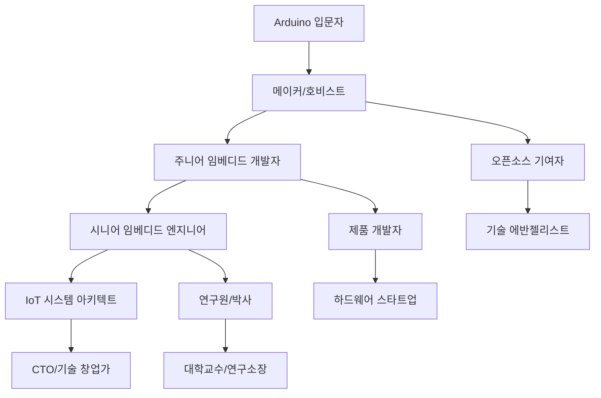
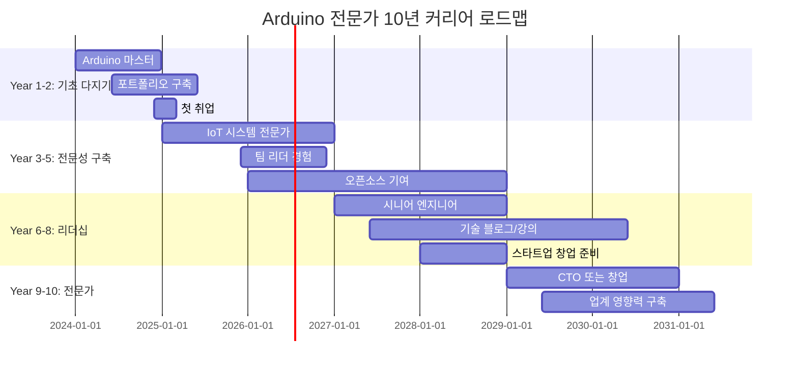

# 🚀 Arduino 전문가 커리어 개발 완전 가이드

> **"From Maker to Professional"** - 취미에서 전문가로, 꿈에서 현실로

## 🎯 커리어 경로 로드맵

### 📈 단계별 커리어 발전 경로



## 💼 직무별 상세 가이드

### 1️⃣ 임베디드 시스템 개발자

#### 📊 시장 현황 (2024년 기준)
```yaml
평균_연봉:
  주니어: "3500-4500만원"
  시니어: "6000-8000만원"
  리드급: "8000만원-1억원+"

채용_수요: "매우 높음 (연 15% 증가)"
주요_기업: 
  - 대기업: "삼성전자, LG전자, 현대자동차"
  - 중견기업: "네이버랩스, 카카오, 우아한형제들"
  - 스타트업: "토스, 당근마켓, 마켓컬리"

필수_기술:
  - C/C++ 프로그래밍
  - RTOS (FreeRTOS, Zephyr)
  - 통신 프로토콜 (CAN, I2C, SPI)
  - 디버깅 도구 (JTAG, 로직분석기)
```

#### 🎯 필수 역량 개발 가이드
```cpp
// 1. 메모리 최적화 능력
class OptimizedMemoryManager {
private:
    static uint8_t memoryPool[1024];
    static uint16_t freePointer;
    
public:
    static void* allocate(size_t size) {
        if (freePointer + size > sizeof(memoryPool)) {
            return nullptr; // 메모리 부족
        }
        void* ptr = &memoryPool[freePointer];
        freePointer += size;
        return ptr;
    }
    
    // 메모리 풀 리셋 (가비지 컬렉션)
    static void reset() {
        freePointer = 0;
    }
};

// 2. 실시간 처리 능력
void setupRealTimeTimer() {
    // 1ms 정밀도 타이머 설정
    TCCR1A = 0;
    TCCR1B = (1 << WGM12) | (1 << CS12);
    OCR1A = 15624; // 16MHz/1024/1000Hz - 1
    TIMSK1 |= (1 << OCIE1A);
}

ISR(TIMER1_COMPA_vect) {
    // 실시간 작업 처리
    updateSensorReadings();
    processControlAlgorithm();
    updateActuators();
}
```

#### 📝 포트폴리오 프로젝트 추천
1. **실시간 데이터 수집 시스템**
   - 10개 센서 동시 모니터링
   - 1ms 주기 데이터 수집
   - SD카드 로깅 + 무선 전송

2. **모터 제어 시스템**
   - PID 제어 알고리즘
   - 엔코더 피드백 처리
   - CAN 통신 인터페이스

3. **IoT 게이트웨이**
   - 다중 프로토콜 지원
   - 클라우드 연동
   - OTA 업데이트 기능

### 2️⃣ IoT 시스템 엔지니어

#### 📊 시장 현황
```yaml
평균_연봉:
  주니어: "4000-5000만원"
  시니어: "7000-9000만원"
  아키텍트: "1억원-1억5000만원"

성장률: "연 25% (가장 빠른 성장)"
주요_도메인:
  - 스마트시티: "교통, 환경, 안전"
  - 제조업: "스마트팩토리, 예측정비"
  - 농업: "스마트팜, 정밀농업"
  - 헬스케어: "원격진료, 웨어러블"

핵심_기술:
  - 클라우드 플랫폼 (AWS IoT, Azure IoT)
  - 엣지 컴퓨팅 (NVIDIA Jetson, Intel NUC)
  - 통신 프로토콜 (LoRaWAN, NB-IoT, 5G)
  - 데이터 분석 (InfluxDB, Grafana)
```

#### 🌐 실전 IoT 아키텍처 설계
```python
# IoT 시스템 아키텍처 예제
class IoTSystemArchitect:
    def __init__(self):
        self.edge_devices = []
        self.gateways = []
        self.cloud_services = {}
        
    def design_smart_city_system(self):
        """스마트시티 IoT 시스템 설계"""
        
        # 1. 엣지 디바이스 레이어
        edge_devices = {
            "air_quality_sensors": {
                "count": 1000,
                "protocol": "LoRaWAN",
                "power": "solar + battery",
                "data_interval": "5min"
            },
            "traffic_cameras": {
                "count": 500,
                "protocol": "5G",
                "power": "grid",
                "data_rate": "real-time"
            },
            "parking_sensors": {
                "count": 10000,
                "protocol": "NB-IoT",
                "power": "battery (10년)",
                "data_interval": "event-based"
            }
        }
        
        # 2. 게이트웨이 레이어
        gateways = {
            "lorawan_gateway": {
                "coverage": "5km radius",
                "capacity": "10000 devices",
                "uplink": "4G/5G"
            },
            "edge_ai_gateway": {
                "processing": "NVIDIA Jetson Xavier",
                "ai_models": ["traffic_analysis", "anomaly_detection"],
                "storage": "1TB NVMe"
            }
        }
        
        # 3. 클라우드 서비스 레이어  
        cloud_services = {
            "data_ingestion": "AWS IoT Core",
            "data_storage": "InfluxDB + S3",
            "analytics": "Spark + MLlib",
            "visualization": "Grafana + Kibana",
            "apis": "GraphQL + REST"
        }
        
        return self.optimize_architecture(edge_devices, gateways, cloud_services)
```

#### 🏆 고급 프로젝트 아이디어
1. **스마트 빌딩 통합 관리 시스템**
   - 에너지 최적화 AI
   - 보안 시스템 통합
   - 예측 정비 알고리즘

2. **산업용 디지털 트윈**
   - 실시간 시뮬레이션
   - 머신러닝 예측 모델
   - AR/VR 인터페이스

### 3️⃣ 하드웨어 스타트업 창업가

#### 💡 성공 사례 분석
```markdown
## 🌟 Arduino 기반 성공 스타트업

### 1. Particle (IoT 플랫폼)
- **창립**: 2012년 (Arduino 호환 보드로 시작)
- **성과**: $40M 투자 유치, IoT 플랫폼 리더
- **핵심**: 개발자 친화적 클라우드 플랫폼

### 2. Adafruit Industries
- **창립**: 2005년 (Arduino 부품 판매로 시작)
- **성과**: 연매출 $45M, 오픈소스 하드웨어 선도
- **핵심**: 교육용 콘텐츠 + 고품질 부품

### 3. SparkFun Electronics  
- **창립**: 2003년 (Arduino 호환 보드 개발)
- **성과**: 연매출 $30M, 글로벌 메이커 커뮤니티
- **핵심**: 오픈소스 철학 + 튜토리얼

### 4. Seeed Studio
- **창립**: 2008년 (중국, Arduino 생태계)
- **성과**: Grove 시스템으로 글로벌 확장
- **핵심**: 모듈화 + 제조 효율성
```

#### 📈 스타트업 단계별 가이드

##### Phase 1: 아이디어 검증 (0-6개월)
```cpp
// MVP(Minimum Viable Product) 개발 예제
class SmartGardenMVP {
private:
    SensorManager sensors;
    ActuatorController actuators;
    CloudConnector cloud;
    
public:
    void setup() {
        // 핵심 기능만 구현
        sensors.init(SOIL_MOISTURE | TEMPERATURE);
        actuators.init(WATER_PUMP | LED_GROW_LIGHT);
        cloud.connect("aws-iot-core");
        
        Serial.println("스마트 가든 MVP v1.0 시작");
    }
    
    void loop() {
        // 기본 자동화 로직
        if (sensors.getSoilMoisture() < 30) {
            actuators.activateWaterPump(5000); // 5초간 급수
        }
        
        if (sensors.getLightLevel() < 200) {
            actuators.setGrowLight(80); // 80% 밝기
        }
        
        // 클라우드 데이터 전송
        cloud.sendData(sensors.getAllData());
        delay(300000); // 5분 간격
    }
};
```

##### Phase 2: 고객 검증 (6-12개월)
- **베타 테스터 모집**: 100명 목표
- **피드백 수집**: 주간 사용자 인터뷰
- **기능 개선**: 데이터 기반 우선순위
- **비즈니스 모델 확정**: SaaS vs 하드웨어 판매

##### Phase 3: 제품 완성 (12-18개월)
- **대량 생산 준비**: PCB 설계, 케이스 제작
- **품질 관리**: 테스트 자동화, 인증 획득
- **공급망 구축**: 부품 조달, 제조사 계약

##### Phase 4: 시장 출시 (18-24개월)
- **마케팅 전략**: 크라우드펀딩, 온라인 판매
- **파트너십**: 유통업체, 시스템 통합업체
- **투자 유치**: 시드/시리즈A 라운드

#### 💰 투자 유치 전략
```yaml
투자_단계별_가이드:
  pre_seed:
    목표금액: "1억-5억원"
    투자자: "엔젤투자자, 정부지원사업"
    사용용도: "MVP 개발, 팀 빌딩"
    성과지표: "기술 검증, 초기 사용자"
    
  seed:
    목표금액: "5억-20억원"  
    투자자: "시드 VC, 액셀러레이터"
    사용용도: "제품 완성, 시장 검증"
    성과지표: "매출 발생, 고객 확보"
    
  series_a:
    목표금액: "20억-100억원"
    투자자: "성장 단계 VC"
    사용용도: "마케팅, 인력 확충"
    성과지표: "빠른 성장, 시장 점유율"

필수_자료:
  - 사업계획서 (30페이지)
  - 재무 모델 (5년 계획)
  - 기술 데모 (실제 동작)
  - 팀 소개 (핵심 인력)
  - 시장 분석 (TAM, SAM, SOM)
```

### 4️⃣ 기술 교육자/컨설턴트

#### 📚 교육 사업 모델
```markdown
## 💼 Arduino 교육 비즈니스 모델

### 1. 온라인 강의 플랫폼
**수익 모델**: 강의 판매, 구독 서비스
- **기초 과정**: 10만원 (20시간)
- **심화 과정**: 30만원 (50시간)  
- **프리미엄 멘토링**: 50만원 (3개월)

**예상 수익**: 월 500만원-2000만원

### 2. 기업 교육/컨설팅
**수익 모델**: 프로젝트 단위 계약
- **기초 교육**: 일당 100만원
- **IoT 컨설팅**: 월 500만원-1000만원
- **시스템 구축**: 프로젝트당 3000만원-1억원

**타겟 고객**:
- 제조업 (디지털 전환)
- 농업 (스마트팜)
- 교육기관 (STEM 교육)

### 3. 콘텐츠 제작
**수익원**: 도서, 영상, 라이선스
- **기술서적**: 인세 5-10%
- **YouTube**: 광고수익, 스폰서십
- **기업 콘텐츠**: 제작비 500만원-2000만원
```

#### 🎥 콘텐츠 제작 가이드
```python
# 콘텐츠 제작 자동화 도구
class ContentCreator:
    def __init__(self):
        self.topic_generator = TopicGenerator()
        self.code_formatter = CodeFormatter()
        self.video_editor = VideoEditor()
        
    def create_tutorial_series(self, theme="IoT Basics"):
        """튜토리얼 시리즈 자동 생성"""
        
        topics = self.topic_generator.generate(
            theme=theme,
            difficulty="beginner",
            count=10
        )
        
        for i, topic in enumerate(topics):
            # 1. 코드 예제 생성
            code = self.generate_code_example(topic)
            formatted_code = self.code_formatter.format(
                code, 
                style="arduino_ide"
            )
            
            # 2. 회로도 생성
            circuit = self.generate_circuit_diagram(topic)
            
            # 3. 스크립트 작성
            script = self.write_video_script(
                topic=topic,
                code=formatted_code,
                circuit=circuit,
                duration=15  # 15분 목표
            )
            
            # 4. 영상 제작 준비
            self.prepare_video_production(
                episode=i+1,
                script=script,
                materials=[code, circuit]
            )
            
    def optimize_for_seo(self, content):
        """SEO 최적화"""
        keywords = [
            "Arduino 강의", "임베디드 시스템", 
            "IoT 개발", "마이크로컨트롤러"
        ]
        return self.seo_optimizer.optimize(content, keywords)
```

## 🏢 업계별 진출 전략

### 1️⃣ 자동차 산업 (Automotive)

#### 🚗 시장 기회
```yaml
시장_규모: "2024년 $50B → 2030년 $120B"
성장_동력:
  - 전기차 급성장
  - 자율주행 기술
  - V2X 통신
  - 차량용 IoT

핵심_기술:
  - CAN/CAN-FD 통신
  - 함수형 안전 (ISO 26262)
  - AUTOSAR 플랫폼
  - 실시간 시스템
```

#### 🔧 실무 프로젝트 예제
```cpp
// 차량용 ECU 시뮬레이터
class AutomotiveECU {
private:
    CANController can;
    SafetyMonitor safety;
    DiagnosticManager diag;
    
public:
    void setup() {
        // ISO 26262 ASIL-D 레벨 안전 시스템
        safety.init(ASIL_D);
        can.init(CAN_500KBPS);
        diag.init(UDS_PROTOCOL);
        
        // 안전 감시 태스크 시작
        safety.startWatchdog(100); // 100ms 주기
    }
    
    void loop() {
        // 엔진 제어 로직
        if (safety.checkAllSensors()) {
            processEngineControl();
            updateCANMessages();
        } else {
            // 안전 모드 진입
            safety.enterSafeMode();
            sendDiagnosticCode(DTC_SENSOR_FAILURE);
        }
    }
    
    void processEngineControl() {
        // 실시간 엔진 제어 (1ms 주기)
        uint16_t rpm = sensors.getEngineRPM();
        uint8_t throttle = sensors.getThrottlePosition();
        
        // PID 제어 알고리즘
        float targetAirFlow = calculateAirFlow(rpm, throttle);
        actuators.setThrottleBody(targetAirFlow);
    }
};
```

### 2️⃣ 스마트 제조업 (Industry 4.0)

#### 🏭 디지털 트윈 구현
```cpp
// 산업용 디지털 트윈 시스템
class IndustrialDigitalTwin {
private:
    PLCInterface plc;
    SCADAConnector scada;
    MLPredictor predictor;
    CloudSync cloud;
    
public:
    struct MachineState {
        float temperature;
        float vibration;
        float pressure;
        uint32_t runtime;
        bool maintenance_due;
        uint8_t efficiency;
    };
    
    void setupFactory() {
        // 100개 기계 모니터링
        for (int i = 0; i < 100; i++) {
            machines[i].id = i;
            machines[i].type = detectMachineType(i);
            setupSensors(machines[i]);
        }
        
        // 예측 모델 로드
        predictor.loadModel("predictive_maintenance.tflite");
        
        // 클라우드 연결
        cloud.connect("industrial-iot-platform.com");
    }
    
    void processRealTimeData() {
        for (auto& machine : machines) {
            MachineState state = readMachineState(machine);
            
            // 이상 감지
            if (detectAnomalies(state)) {
                triggerMaintenanceAlert(machine.id);
            }
            
            // 예측 정비
            float failure_prob = predictor.predict(state);
            if (failure_prob > 0.8) {
                scheduleMaintenance(machine.id, URGENT);
            }
            
            // 효율성 최적화
            optimizeParameters(machine, state);
        }
    }
};
```

### 3️⃣ 농업 기술 (AgriTech)

#### 🌱 스마트팜 통합 시스템
```cpp
// 대규모 스마트팜 관리 시스템
class SmartFarmManager {
private:
    struct GreenhouseZone {
        uint8_t zone_id;
        CropType crop;
        GrowthStage stage;
        EnvironmentControl env_control;
        IrrigationSystem irrigation;
        NutritientSystem nutrients;
    };
    
    std::vector<GreenhouseZone> zones;
    WeatherStation weather;
    AIOptimizer ai_optimizer;
    
public:
    void setup() {
        // 100개 구역 초기화
        initializeZones(100);
        
        // 기상 스테이션 연결
        weather.connect("local_weather_api");
        
        // AI 최적화 엔진
        ai_optimizer.loadModel("crop_optimization.onnx");
    }
    
    void optimizeCropProduction() {
        for (auto& zone : zones) {
            // 현재 환경 데이터 수집
            EnvironmentData env = zone.env_control.getCurrentData();
            
            // AI 기반 최적 조건 계산
            OptimalConditions optimal = ai_optimizer.calculate(
                zone.crop, 
                zone.stage, 
                env,
                weather.getForecast()
            );
            
            // 자동 제어 실행
            zone.env_control.setTemperature(optimal.temperature);
            zone.env_control.setHumidity(optimal.humidity);
            zone.irrigation.setSchedule(optimal.water_schedule);
            zone.nutrients.adjustMixture(optimal.nutrients);
        }
    }
    
    void predictYield() {
        // 수확량 예측 및 시장 가격 연동
        for (const auto& zone : zones) {
            float predicted_yield = ai_optimizer.predictYield(zone);
            float market_price = getMarketPrice(zone.crop);
            
            // 수익 최적화 알고리즘
            if (predicted_yield * market_price < target_profit) {
                adjustGrowthStrategy(zone);
            }
        }
    }
};
```

## 📊 연봉 협상 전략

### 💰 시장 가치 평가 도구
```python
class SalaryCalculator:
    def __init__(self):
        self.market_data = self.load_market_data()
        self.skill_weights = {
            'arduino_proficiency': 1.0,
            'embedded_c': 1.2,
            'rtos_experience': 1.5,
            'iot_platforms': 1.3,
            'ai_ml_integration': 1.8,
            'product_development': 1.6,
            'team_leadership': 1.4,
            'english_proficiency': 1.1
        }
    
    def calculate_market_value(self, profile):
        """개인 시장 가치 계산"""
        base_salary = self.get_base_salary(
            profile['experience_years'],
            profile['location'],
            profile['company_size']
        )
        
        skill_multiplier = 1.0
        for skill, level in profile['skills'].items():
            if skill in self.skill_weights:
                skill_multiplier += (level / 10) * self.skill_weights[skill]
        
        market_value = base_salary * skill_multiplier
        
        return {
            'base_salary': base_salary,
            'skill_premium': (skill_multiplier - 1.0) * 100,
            'market_value': market_value,
            'negotiation_range': (market_value * 0.9, market_value * 1.15)
        }
    
    def generate_negotiation_strategy(self, current_offer, market_value):
        """연봉 협상 전략 생성"""
        if current_offer < market_value['negotiation_range'][0]:
            return {
                'strategy': 'strong_counter',
                'counter_offer': market_value['market_value'],
                'justification': self.build_justification(market_value)
            }
        elif current_offer < market_value['market_value']:
            return {
                'strategy': 'moderate_counter',
                'counter_offer': market_value['negotiation_range'][1],
                'justification': self.build_moderate_case(market_value)
            }
        else:
            return {
                'strategy': 'accept_and_grow',
                'response': 'market_aligned',
                'focus': 'growth_opportunities'
            }
```

### 🎯 협상 실전 가이드
```markdown
## 💼 연봉 협상 체크리스트

### 준비 단계 (협상 2주 전)
- [ ] 시장 조사 완료 (3개 이상 유사 포지션)
- [ ] 개인 성과 정리 (정량적 지표 중심)
- [ ] 포트폴리오 업데이트
- [ ] 추천서/추천인 확보
- [ ] 대안 옵션 확보 (다른 회사 오퍼)

### 협상 중 (면접/협상 당일)
- [ ] 연봉 외 혜택도 고려 (스톡옵션, 교육비 등)
- [ ] 성장 기회 확인 (멘토링, 프로젝트 참여)
- [ ] 팀 문화 및 업무 환경 평가
- [ ] 장기적 커리어 패스 논의

### 협상 후 (결정 단계)
- [ ] 모든 조건 서면 확인
- [ ] 계약서 세부 조건 검토
- [ ] 시작일 및 온보딩 프로세스 확인
- [ ] 네트워킹 관계 유지 (거절하는 회사도)

### 협상 팁
1. **첫 제안은 거절**: 더 좋은 조건 협상 가능성
2. **총 보상 관점**: 연봉, 보너스, 스톡옵션 종합 고려
3. **성장 기회 중시**: 단기 연봉보다 장기 성장 가능성
4. **감정적 결정 지양**: 데이터 기반 합리적 판단
```

## 🌐 글로벌 진출 전략

### 🇺🇸 미국 시장 진출
```yaml
미국_시장_특성:
  강점:
    - 세계 최대 기술 시장
    - 높은 연봉 수준
    - 다양한 기회
    - 자유로운 창업 환경
  
  진출_요구사항:
    - H1-B 비자 또는 영주권
    - 영어 능력 (TOEIC 900+ 권장)
    - 미국 내 네트워킹
    - 현지 취업 경험

  추천_도시:
    - 실리콘밸리: "최고 연봉, 높은 생활비"
    - 시애틀: "아마존, 마이크로소프트"
    - 오스틴: "저렴한 생활비, 성장하는 테크허브"
    - 보스턴: "MIT, 하버드 근처, IoT 연구 중심"

  연봉_범위:
    - 주니어: "$80K-120K"
    - 시니어: "$130K-200K"  
    - 스태프: "$200K-300K+"
```

### 🇩🇪 독일/유럽 시장
```yaml
독일_시장_특성:
  강점:
    - Industry 4.0 발원지
    - 제조업 강국
    - 안정적인 고용
    - 우수한 복지 시스템
  
  진출_요구사항:
    - EU 블루카드 자격
    - 독일어 B2 레벨 (기술직은 영어도 가능)
    - 엔지니어링 학위 인정
    - 현지 문화 이해

  주요_기업:
    - Siemens: "산업 자동화 리더"
    - Bosch: "IoT, 자동차 전자"
    - SAP: "기업용 소프트웨어"
    - BMW/Mercedes: "자동차 전자 시스템"

  연봉_범위:
    - 주니어: "€45K-65K"
    - 시니어: "€70K-100K"
    - 매니저: "€100K-150K+"
```

### 🇸🇬 싱가포르/아시아 허브
```yaml
싱가포르_특성:
  강점:
    - 아시아 금융/기술 허브
    - 영어 사용 환경
    - 글로벌 기업 아시아 본부
    - 스타트업 생태계 발달
  
  진출_전략:
    - Employment Pass 취득
    - 다국적 기업 경험 선호
    - 아시아 시장 이해도
    - 중국어 능력 우대

  연봉_범위:
    - 주니어: "SGD 60K-90K"
    - 시니어: "SGD 100K-150K"
    - 리드: "SGD 150K-250K+"
```

## 📈 장기 커리어 전략

### 🎯 10년 마스터 플랜


### 🏆 최종 목표 설정
```cpp
class CareerGoalManager {
private:
    struct CareerGoal {
        string title;
        uint8_t priority;  // 1-10
        uint16_t timeline_months;
        vector<string> milestones;
        float completion_rate;
    };
    
    vector<CareerGoal> goals;
    
public:
    void setLifetimeGoals() {
        // 기술적 목표
        goals.push_back({
            "Arduino 세계 전문가 인정",
            10,
            120, // 10년
            {"국제 컨퍼런스 발표", "오픈소스 메인테이너", "기술서적 출간"},
            0.0
        });
        
        // 비즈니스 목표
        goals.push_back({
            "연매출 100억 기술회사 운영",
            9,
            144, // 12년
            {"팀 50명 구축", "글로벌 고객 확보", "IPO 준비"},
            0.0
        });
        
        // 사회적 영향 목표
        goals.push_back({
            "10만명 Arduino 교육",
            8,
            180, // 15년
            {"온라인 강의 플랫폼", "교육 콘텐츠 100개", "멘토링 프로그램"},
            0.0
        });
    }
    
    void trackProgress() {
        for (auto& goal : goals) {
            updateCompletionRate(goal);
            if (goal.completion_rate < 0.8 && isOverdue(goal)) {
                adjustStrategy(goal);
            }
        }
    }
    
    void generateActionPlan() {
        // 다음 분기 실행 계획 생성
        for (const auto& goal : goals) {
            if (goal.priority >= 8) {
                createQuarterlyActions(goal);
            }
        }
    }
};
```

이제 Arduino 전문가로서의 **완전한 커리어 개발 가이드**가 완성되었습니다! 

🚀 **다음 단계**: 실무 면접 완전 정복 가이드를 만들어 보실까요?