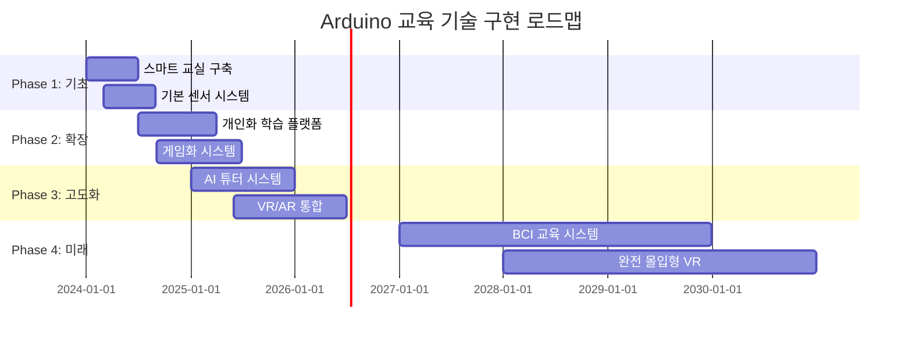

# 🎓 Arduino 교육 기술 완전 가이드

> **미래 교육의 혁신** - Arduino로 구현하는 스마트 러닝 시스템

[](#)
[](#)
[](#)

---

## 🎯 **교육 기술의 혁신적 가능성**

### 📊 **글로벌 에듀테크 시장 현황 (2024)**
```
🌍 에듀테크 시장 규모: $254.8B (2024년)
📈 연평균 성장률: 16.5% (2024-2030)
💻 온라인 학습 도입률: 87% (선진국 기준)
🤖 AI 교육 도구 사용률: 62% (급속 증가)
```

### 🚀 **Arduino 교육 기술의 핵심 영역**
- **🏫 스마트 교실** - 인터랙티브 학습 환경, 자동화된 관리
- **📚 개인화 학습** - AI 기반 맞춤형 커리큘럼, 실시간 피드백
- **🧪 STEAM 교육** - 실습 중심 과학/기술/공학 교육
- **🎮 게임화 학습** - 동기부여 시스템, 성취도 추적
- **🌐 원격 교육** - 실시간 협업, 가상 실험실

---

## 🏫 **1. 스마트 교실 시스템**

### 📡 **지능형 교실 환경 관리**

#### **자동화된 교실 관리 시스템**
```cpp
// 스마트 교실 통합 관리 시스템
#include <WiFi.h>
#include <DHT.h>
#include <Adafruit_NeoPixel.h>
#include <ArduinoJson.h>
#include <MFRC522.h>

class SmartClassroomSystem {
private:
    // 환경 센서 구조체
    struct EnvironmentalData {
        float temperature;          // 온도
        float humidity;            // 습도
        int lightLevel;            // 조도
        int noiseLevel;            // 소음
        float co2Level;            // CO2 농도
        int airQuality;            // 공기질 지수
        unsigned long timestamp;
    };
    
    // 학생 출석 정보
    struct StudentAttendance {
        String studentID;
        String studentName;
        String seatNumber;
        unsigned long checkInTime;
        bool isPresent;
        int participationScore;    // 수업 참여도
        float attentionLevel;      // 집중도 (0.0-1.0)
    };
    
    // 수업 정보
    struct ClassSession {
        String classID;
        String subject;
        String teacherID;
        unsigned long startTime;
        unsigned long endTime;
        int enrolledStudents;
        int presentStudents;
        String lessonPlan;
        float engagementScore;     // 전체 수업 참여도
    };
    
    EnvironmentalData environment;
    StudentAttendance students[40];  // 최대 40명
    ClassSession currentClass;
    int studentCount = 0;
    
    // 센서 및 액추에이터
    DHT dht(2, DHT22);
    Adafruit_NeoPixel pixels(60, 6, NEO_GRB + NEO_KHZ800);
    MFRC522 rfid(10, 9);  // RFID 리더
    
    // 최적 환경 설정값
    const float OPTIMAL_TEMP = 22.0;
    const float OPTIMAL_HUMIDITY = 50.0;
    const int OPTIMAL_LIGHT = 500;
    const int MAX_NOISE = 60;
    const float MAX_CO2 = 1000.0;
    
public:
    void initialize() {
        Serial.begin(115200);
        
        // WiFi 연결
        connectToSchoolNetwork();
        
        // 센서 초기화
        dht.begin();
        pixels.begin();
        rfid.PCD_Init();
        
        // 환경 제어 시스템 초기화
        initializeEnvironmentControl();
        
        // 출석 시스템 초기화
        initializeAttendanceSystem();
        
        // 인터랙티브 디스플레이 초기화
        initializeInteractiveDisplay();
        
        Serial.println("🏫 스마트 교실 시스템 가동");
    }
    
    void manageClassroom() {
        // 환경 모니터링 및 제어
        monitorAndControlEnvironment();
        
        // 학생 출석 및 참여도 추적
        trackStudentEngagement();
        
        // 수업 진행 지원
        supportTeachingActivities();
        
        // 안전 및 보안 관리
        ensureSafetyAndSecurity();
        
        // 데이터 수집 및 분석
        collectAndAnalyzeData();
    }
    
private:
    void monitorAndControlEnvironment() {
        // 환경 데이터 수집
        environment.temperature = dht.readTemperature();
        environment.humidity = dht.readHumidity();
        environment.lightLevel = analogRead(A0);
        environment.noiseLevel = measureNoiseLevel();
        environment.co2Level = measureCO2Level();
        environment.airQuality = calculateAirQuality();
        environment.timestamp = millis();
        
        // 자동 환경 조절
        adjustEnvironment();
        
        // 환경 상태 시각화
        visualizeEnvironmentStatus();
    }
    
    void adjustEnvironment() {
        // 온도 제어
        if (abs(environment.temperature - OPTIMAL_TEMP) > 2.0) {
            adjustTemperature(environment.temperature);
        }
        
        // 조명 제어
        if (environment.lightLevel < OPTIMAL_LIGHT - 100) {
            increaseLighting();
        } else if (environment.lightLevel > OPTIMAL_LIGHT + 100) {
            decreaseLighting();
        }
        
        // 환기 제어 (CO2 기준)
        if (environment.co2Level > MAX_CO2) {
            activateVentilation();
            Serial.println("🌬️ 환기 시스템 작동 - CO2 농도 높음");
        }
        
        // 소음 경고
        if (environment.noiseLevel > MAX_NOISE) {
            displayNoiseWarning();
        }
    }
    
    void trackStudentEngagement() {
        // RFID를 통한 자동 출석 체크
        checkStudentAttendance();
        
        // 학생 참여도 모니터링
        for (int i = 0; i < studentCount; i++) {
            if (students[i].isPresent) {
                // 움직임 감지를 통한 활동성 측정
                float activityLevel = measureStudentActivity(i);
                
                // 시선 추적을 통한 집중도 측정
                float focusLevel = measureStudentFocus(i);
                
                // 종합 참여도 계산
                students[i].participationScore = calculateParticipation(activityLevel, focusLevel);
                students[i].attentionLevel = focusLevel;
                
                // 집중도 저하 시 알림
                if (students[i].attentionLevel < 0.3) {
                    gentleStudentReminder(i);
                }
            }
        }
        
        // 전체 수업 참여도 계산
        calculateClassEngagement();
    }
    
    void checkStudentAttendance() {
        if (rfid.PICC_IsNewCardPresent() && rfid.PICC_ReadCardSerial()) {
            String cardID = "";
            for (byte i = 0; i < rfid.uid.size; i++) {
                cardID += String(rfid.uid.uidByte[i], HEX);
            }
            
            // 학생 정보 조회
            int studentIndex = findStudentByCard(cardID);
            if (studentIndex >= 0) {
                students[studentIndex].isPresent = true;
                students[studentIndex].checkInTime = millis();
                
                // 환영 메시지 표시
                displayWelcomeMessage(students[studentIndex].studentName);
                
                // 출석 데이터 서버 전송
                sendAttendanceData(studentIndex);
                
                Serial.println("✅ 출석: " + students[studentIndex].studentName);
            }
            
            rfid.PICC_HaltA();
        }
    }
    
    void supportTeachingActivities() {
        // 수업 단계별 지원
        unsigned long classElapsed = millis() - currentClass.startTime;
        
        if (classElapsed < 600000) { // 첫 10분
            // 수업 시작 지원
            supportClassOpening();
        } else if (classElapsed < 2400000) { // 10-40분
            // 핵심 수업 활동 지원
            supportCoreTeaching();
        } else { // 40분 이후
            // 수업 마무리 지원
            supportClassClosing();
        }
        
        // 실시간 피드백 제공
        provideRealTimeFeedback();
    }
    
    void supportCoreTeaching() {
        // 인터랙티브 콘텐츠 지원
        if (isInteractiveContentActive()) {
            manageInteractiveContent();
        }
        
        // 그룹 활동 지원
        if (isGroupActivityActive()) {
            facilitateGroupWork();
        }
        
        // 실시간 퀴즈 지원
        if (isQuizActive()) {
            manageRealTimeQuiz();
        }
        
        // 학습 자료 배포
        distributeDigitalMaterials();
    }
    
    void manageInteractiveContent() {
        // 스마트보드 연동
        syncWithSmartBoard();
        
        // 학생 디바이스 동기화
        syncStudentDevices();
        
        // 실시간 피드백 수집
        collectStudentResponses();
        
        // 콘텐츠 적응형 조정
        adaptContentDifficulty();
    }
    
    void visualizeEnvironmentStatus() {
        // NeoPixel LED로 환경 상태 표시
        for (int i = 0; i < 60; i++) {
            uint32_t color = pixels.Color(0, 0, 0);
            
            // 온도 표시 (빨강-파랑 그라데이션)
            if (i < 15) {
                int temp = map(environment.temperature, 15, 30, 0, 255);
                color = pixels.Color(temp, 0, 255 - temp);
            }
            // CO2 농도 표시 (녹색-빨강)
            else if (i < 30) {
                int co2 = map(environment.co2Level, 400, 2000, 0, 255);
                color = pixels.Color(co2, 255 - co2, 0);
            }
            // 소음 레벨 표시 (노랑 강도)
            else if (i < 45) {
                int noise = map(environment.noiseLevel, 30, 80, 0, 255);
                color = pixels.Color(noise, noise, 0);
            }
            // 전체 쾌적도 표시
            else {
                int comfort = calculateComfortIndex();
                color = pixels.Color(0, comfort, 0);
            }
            
            pixels.setPixelColor(i, color);
        }
        pixels.show();
    }
};

// 전역 객체
SmartClassroomSystem classroom;

void setup() {
    classroom.initialize();
}

void loop() {
    classroom.manageClassroom();
    delay(1000); // 1초마다 업데이트
}
```

### 🎯 **인터랙티브 학습 도구**

```cpp
class InteractiveLearningTools {
private:
    // 학습 활동 구조체
    struct LearningActivity {
        String activityID;
        String activityType;       // "퀴즈", "실험", "토론", "프로젝트"
        String subject;
        int difficulty;            // 1-5
        int targetAge;            // 대상 연령
        String learningObjectives[5];
        int objectiveCount;
        float completionRate;
        float averageScore;
    };
    
    // 학생 진도 추적
    struct StudentProgress {
        String studentID;
        String currentTopic;
        float masteryLevel;        // 0.0-1.0
        int completedActivities;
        int correctAnswers;
        int totalAttempts;
        String strengths[5];
        String weaknesses[5];
        float learningSpeed;       // 상대적 학습 속도
    };
    
    LearningActivity activities[100];
    StudentProgress studentData[40];
    int activityCount = 0;
    
    // 게임화 요소
    struct GameElements {
        int points;
        int level;
        String badges[20];
        int badgeCount;
        String currentQuest;
        float progressBar;
    };
    
    GameElements gameStatus[40];
    
public:
    void initializeLearningTools() {
        Serial.println("🎯 인터랙티브 학습 도구 초기화");
        
        // 학습 활동 데이터베이스 로드
        loadLearningActivities();
        
        // 학생 프로필 로드
        loadStudentProfiles();
        
        // 게임화 시스템 초기화
        initializeGamification();
        
        // AR/VR 학습 도구 준비
        prepareARVRTools();
    }
    
    void conductInteractiveLearning() {
        // 개인별 맞춤 학습 제공
        for (int i = 0; i < 40; i++) {
            if (isStudentActive(i)) {
                // AI 기반 다음 활동 추천
                LearningActivity nextActivity = recommendNextActivity(i);
                
                // 활동 제시
                presentActivity(i, nextActivity);
                
                // 실시간 도움말 제공
                provideAdaptiveHints(i);
                
                // 진도 추적 및 피드백
                trackProgressAndFeedback(i);
            }
        }
    }
    
private:
    LearningActivity recommendNextActivity(int studentIndex) {
        StudentProgress& student = studentData[studentIndex];
        LearningActivity recommended;
        
        // 학생의 현재 수준 분석
        float currentLevel = student.masteryLevel;
        
        // 학습 스타일 고려
        String learningStyle = identifyLearningStyle(studentIndex);
        
        // 최근 성과 분석
        float recentPerformance = analyzeRecentPerformance(studentIndex);
        
        // AI 추천 알고리즘
        for (int i = 0; i < activityCount; i++) {
            float suitabilityScore = calculateSuitability(
                activities[i], 
                currentLevel, 
                learningStyle, 
                recentPerformance
            );
            
            if (suitabilityScore > 0.8) {
                recommended = activities[i];
                break;
            }
        }
        
        Serial.println("📚 추천 활동: " + recommended.activityType + 
                      " - " + recommended.subject);
        
        return recommended;
    }
    
    void presentActivity(int studentIndex, LearningActivity activity) {
        // 활동 유형별 제시 방법
        if (activity.activityType == "퀴즈") {
            presentInteractiveQuiz(studentIndex, activity);
        } else if (activity.activityType == "실험") {
            presentVirtualExperiment(studentIndex, activity);
        } else if (activity.activityType == "토론") {
            facilitateDiscussion(studentIndex, activity);
        } else if (activity.activityType == "프로젝트") {
            guideProjectWork(studentIndex, activity);
        }
    }
    
    void presentInteractiveQuiz(int studentIndex, LearningActivity quiz) {
        Serial.println("🎯 인터랙티브 퀴즈 시작");
        
        // 문제 생성 (난이도 조절)
        QuizQuestion questions[10];
        generateAdaptiveQuestions(quiz, studentData[studentIndex].masteryLevel, questions);
        
        // 시각적 피드백 준비
        prepareVisualFeedback();
        
        // 실시간 진행
        for (int q = 0; q < 10; q++) {
            // 문제 표시
            displayQuestion(questions[q]);
            
            // 답변 수집
            String answer = collectStudentAnswer(studentIndex);
            
            // 즉시 피드백
            bool isCorrect = checkAnswer(questions[q], answer);
            provideImmediateFeedback(isCorrect, questions[q].explanation);
            
            // 점수 업데이트
            updateGameScore(studentIndex, isCorrect);
            
            // 난이도 동적 조정
            if (q < 9) {
                adjustNextQuestionDifficulty(questions, q, isCorrect);
            }
        }
        
        // 퀴즈 완료 보상
        awardQuizCompletion(studentIndex);
    }
    
    void presentVirtualExperiment(int studentIndex, LearningActivity experiment) {
        Serial.println("🧪 가상 실험 시작");
        
        // 실험 환경 설정
        VirtualLab lab = setupVirtualLab(experiment);
        
        // 안전 교육
        provideSafetyBriefing(experiment);
        
        // 단계별 실험 진행
        for (int step = 0; step < lab.totalSteps; step++) {
            // 실험 단계 안내
            guideExperimentStep(lab, step);
            
            // 학생 조작 감지
            detectStudentManipulation(studentIndex);
            
            // 실시간 시뮬레이션
            simulateExperimentResults(lab, step);
            
            // 데이터 수집 지원
            helpDataCollection(studentIndex, lab);
            
            // 중간 점검
            if (step % 3 == 2) {
                checkUnderstanding(studentIndex, lab, step);
            }
        }
        
        // 실험 결과 분석
        analyzeExperimentResults(studentIndex, lab);
        
        // 실험 보고서 작성 지원
        assistReportWriting(studentIndex, lab);
    }
    
    void provideAdaptiveHints(int studentIndex) {
        StudentProgress& student = studentData[studentIndex];
        
        // 학생의 현재 어려움 감지
        String difficulty = detectCurrentDifficulty(studentIndex);
        
        if (difficulty != "") {
            // 맞춤형 힌트 생성
            String hint = generatePersonalizedHint(difficulty, student.learningSpeed);
            
            // 점진적 힌트 제공 (3단계)
            if (student.totalAttempts % 3 == 0) {
                displayHint(hint, 1); // 약한 힌트
            } else if (student.totalAttempts % 3 == 1) {
                displayHint(hint, 2); // 중간 힌트
            } else {
                displayHint(hint, 3); // 강한 힌트
            }
            
            // 힌트 효과 추적
            trackHintEffectiveness(studentIndex, hint);
        }
    }
    
    void updateGameScore(int studentIndex, bool correct) {
        GameElements& game = gameStatus[studentIndex];
        
        // 점수 계산 (연속 정답 보너스)
        int basePoints = correct ? 10 : 0;
        int streakBonus = calculateStreakBonus(studentIndex);
        int speedBonus = calculateSpeedBonus(studentIndex);
        
        game.points += basePoints + streakBonus + speedBonus;
        
        // 레벨업 체크
        if (game.points >= game.level * 100) {
            levelUp(studentIndex);
        }
        
        // 배지 획득 체크
        checkBadgeAchievements(studentIndex);
        
        // 리더보드 업데이트
        updateLeaderboard(studentIndex);
        
        // 시각적 피드백
        showScoreAnimation(game.points, correct);
    }
    
    void levelUp(int studentIndex) {
        GameElements& game = gameStatus[studentIndex];
        game.level++;
        
        Serial.println("🎉 레벨업! 레벨 " + String(game.level));
        
        // 레벨업 보상
        unlockNewContent(studentIndex, game.level);
        
        // 축하 애니메이션
        playLevelUpAnimation();
        
        // 친구들에게 알림 (선택적)
        if (isShareEnabled(studentIndex)) {
            shareAchievement("레벨 " + String(game.level) + " 달성!");
        }
    }
};
```

---

## 📚 **2. 개인화 학습 시스템**

### 🤖 **AI 기반 맞춤형 튜터**

```cpp
class AIPersonalizedTutor {
private:
    // 학습 스타일 분석
    struct LearningStyle {
        String studentID;
        String primaryStyle;       // "시각적", "청각적", "체험적", "논리적"
        String secondaryStyle;
        float visualScore;         // 0.0-1.0
        float auditoryScore;
        float kinestheticScore;
        float logicalScore;
        String preferredTime;      // "아침", "오후", "저녁"
        int optimalSessionLength;  // 분 단위
        float socialLearning;      // 그룹 학습 선호도
    };
    
    // 지식 상태 모델
    struct KnowledgeState {
        String topic;
        float mastery;             // 0.0-1.0
        int practiceCount;
        float retentionRate;       // 기억 유지율
        unsigned long lastReview;  // 마지막 복습 시간
        String misconceptions[5];  // 오개념 목록
        int misconceptionCount;
        float confidence;          // 자신감 수준
    };
    
    // 학습 계획
    struct LearningPlan {
        String planID;
        String studentID;
        String goals[10];          // 학습 목표
        int goalCount;
        String activities[50];     // 계획된 활동
        int activityCount;
        float estimatedTime;       // 예상 소요 시간
        String adaptations[10];    // 적응형 조정 사항
        float progressRate;        // 진행률
    };
    
    LearningStyle studentStyles[100];
    KnowledgeState knowledgeMap[100][50]; // 학생별 토픽별 지식 상태
    LearningPlan studentPlans[100];
    
    // AI 모델 파라미터
    float learningRateModel[100][10];     // 학생별 학습 속도 모델
    float forgettingCurve[100][50];       // 망각 곡선 모델
    
public:
    void initializeAITutor() {
        Serial.println("🤖 AI 개인 튜터 시스템 초기화");
        
        // 학생 프로필 분석
        analyzeStudentProfiles();
        
        // 학습 스타일 진단
        diagnoseLearningStyles();
        
        // 지식 상태 매핑
        mapCurrentKnowledge();
        
        // 개인별 학습 계획 생성
        generatePersonalizedPlans();
        
        // 예측 모델 로드
        loadPredictiveModels();
    }
    
    void provideTutoring(String studentID) {
        // 현재 학생 상태 확인
        int studentIndex = findStudentIndex(studentID);
        LearningStyle& style = studentStyles[studentIndex];
        
        // 오늘의 학습 목표 설정
        setDailyLearningGoals(studentIndex);
        
        // 맞춤형 콘텐츠 제공
        deliverPersonalizedContent(studentIndex);
        
        // 실시간 적응
        adaptInRealTime(studentIndex);
        
        // 진도 모니터링
        monitorProgress(studentIndex);
        
        // 피드백 및 격려
        provideFeedbackAndMotivation(studentIndex);
    }
    
private:
    void diagnoseLearningStyles() {
        for (int i = 0; i < 100; i++) {
            if (isStudentActive(i)) {
                // 다중 지능 평가
                performMultipleIntelligenceAssessment(i);
                
                // 학습 선호도 조사
                conductLearningPreferenceSurvey(i);
                
                // 행동 패턴 분석
                analyzeBehavioralPatterns(i);
                
                // 종합 스타일 결정
                determineLearningStyle(i);
            }
        }
    }
    
    void performMultipleIntelligenceAssessment(int studentIndex) {
        // Gardner의 다중지능 이론 기반 평가
        float intelligences[8];
        
        // 언어 지능
        intelligences[0] = assessLinguisticIntelligence(studentIndex);
        
        // 논리수학 지능
        intelligences[1] = assessLogicalMathematical(studentIndex);
        
        // 공간 지능
        intelligences[2] = assessSpatialIntelligence(studentIndex);
        
        // 신체운동 지능
        intelligences[3] = assessBodilyKinesthetic(studentIndex);
        
        // 음악 지능
        intelligences[4] = assessMusicalIntelligence(studentIndex);
        
        // 대인관계 지능
        intelligences[5] = assessInterpersonal(studentIndex);
        
        // 자기이해 지능
        intelligences[6] = assessIntrapersonal(studentIndex);
        
        // 자연탐구 지능
        intelligences[7] = assessNaturalistic(studentIndex);
        
        // 결과를 학습 스타일에 반영
        mapIntelligencesToStyle(studentIndex, intelligences);
    }
    
    void deliverPersonalizedContent(int studentIndex) {
        LearningStyle& style = studentStyles[studentIndex];
        
        // 스타일별 콘텐츠 선택
        if (style.primaryStyle == "시각적") {
            deliverVisualContent(studentIndex);
        } else if (style.primaryStyle == "청각적") {
            deliverAuditoryContent(studentIndex);
        } else if (style.primaryStyle == "체험적") {
            deliverKinestheticContent(studentIndex);
        } else if (style.primaryStyle == "논리적") {
            deliverLogicalContent(studentIndex);
        }
        
        // 보조 스타일 요소 추가
        enhanceWithSecondaryStyle(studentIndex);
    }
    
    void deliverVisualContent(int studentIndex) {
        Serial.println("🎨 시각적 학습 콘텐츠 제공");
        
        // 인포그래픽 생성
        generateInfographic(getCurrentTopic(studentIndex));
        
        // 마인드맵 도구 활성화
        activateMindMappingTool();
        
        // 컬러 코딩 시스템
        implementColorCoding();
        
        // 비디오 자료 제공
        playEducationalVideo(getCurrentTopic(studentIndex));
        
        // 시각적 피드백 강화
        enhanceVisualFeedback();
    }
    
    void adaptInRealTime(int studentIndex) {
        // 실시간 성과 모니터링
        float currentPerformance = measureCurrentPerformance(studentIndex);
        
        // 감정 상태 감지
        String emotionalState = detectEmotionalState(studentIndex);
        
        // 집중도 측정
        float focusLevel = measureFocusLevel(studentIndex);
        
        // 적응 전략 결정
        if (currentPerformance < 0.5 && emotionalState == "좌절") {
            // 난이도 하향 조정
            reduceDifficulty(studentIndex);
            
            // 격려 메시지
            provideEncouragement(studentIndex);
            
            // 추가 지원 제공
            offerAdditionalSupport(studentIndex);
            
        } else if (currentPerformance > 0.9 && focusLevel < 0.5) {
            // 난이도 상향 조정
            increaseDifficulty(studentIndex);
            
            // 도전 과제 제시
            presentChallenge(studentIndex);
            
        } else if (emotionalState == "지루함") {
            // 학습 방식 변경
            switchLearningMode(studentIndex);
            
            // 게임화 요소 추가
            addGameElements(studentIndex);
        }
    }
    
    void monitorProgress(int studentIndex) {
        LearningPlan& plan = studentPlans[studentIndex];
        
        // 목표 달성도 확인
        for (int g = 0; g < plan.goalCount; g++) {
            float achievement = checkGoalAchievement(studentIndex, plan.goals[g]);
            
            if (achievement >= 1.0) {
                // 목표 달성 축하
                celebrateGoalAchievement(studentIndex, plan.goals[g]);
                
                // 다음 목표 설정
                setNextGoal(studentIndex, g);
            }
        }
        
        // 학습 곡선 분석
        analyzeLearningCurve(studentIndex);
        
        // 예측 모델 업데이트
        updatePredictiveModel(studentIndex);
        
        // 보고서 생성
        generateProgressReport(studentIndex);
    }
    
    void implementSpacedRepetition(int studentIndex) {
        // Ebbinghaus 망각곡선 기반 복습 스케줄링
        
        for (int topic = 0; topic < 50; topic++) {
            KnowledgeState& knowledge = knowledgeMap[studentIndex][topic];
            
            if (knowledge.mastery > 0) {
                // 마지막 학습 이후 경과 시간
                unsigned long timeSinceReview = millis() - knowledge.lastReview;
                
                // 망각 예측
                float predictedRetention = calculateRetention(
                    knowledge.mastery, 
                    timeSinceReview, 
                    knowledge.practiceCount
                );
                
                // 복습 필요성 판단
                if (predictedRetention < 0.8) {
                    scheduleReview(studentIndex, topic);
                    
                    Serial.println("📅 복습 예약: " + knowledge.topic);
                }
            }
        }
    }
    
    float calculateRetention(float initialMastery, unsigned long timePassed, int reviews) {
        // 수정된 망각곡선 공식
        float forgettingRate = 0.5 / pow(reviews + 1, 0.5); // 복습할수록 망각 속도 감소
        float timeInDays = timePassed / (1000.0 * 60 * 60 * 24);
        
        float retention = initialMastery * exp(-forgettingRate * timeInDays);
        
        return max(0.0f, min(1.0f, retention));
    }
};
```

---

## 🧪 **3. STEAM 교육 시스템**

### 🔬 **실습 중심 과학 실험실**

```cpp
class STEAMEducationLab {
private:
    // 실험 키트 구조체
    struct ExperimentKit {
        String experimentID;
        String experimentName;
        String subject;            // "물리", "화학", "생물", "지구과학"
        String requiredMaterials[20];
        int materialCount;
        String safetyRequirements[10];
        int safetyCount;
        String procedures[30];
        int procedureCount;
        String expectedResults;
        String learningOutcomes[5];
    };
    
    // 센서 데이터 수집
    struct SensorData {
        float temperature;
        float pressure;
        float pH;
        float lightIntensity;
        float magneticField;
        float acceleration[3];
        float soundLevel;
        float humidity;
        unsigned long timestamp;
    };
    
    ExperimentKit experiments[100];
    SensorData labData;
    int experimentCount = 0;
    
    // 안전 시스템
    bool emergencyStop = false;
    bool safetyCheckPassed = false;
    
public:
    void initializeSTEAMLab() {
        Serial.println("🧪 STEAM 교육 실험실 초기화");
        
        // 센서 시스템 초기화
        initializeSensorArray();
        
        // 안전 시스템 점검
        performSafetyCheck();
        
        // 실험 데이터베이스 로드
        loadExperimentDatabase();
        
        // 데이터 로깅 시스템 준비
        prepareDataLogging();
        
        // AR 실험 도구 연결
        connectARTools();
    }
    
    void conductSTEAMExperiment(String experimentID) {
        // 실험 정보 로드
        ExperimentKit experiment = loadExperiment(experimentID);
        
        // 안전 브리핑
        conductSafetyBriefing(experiment);
        
        // 재료 확인
        if (checkMaterials(experiment)) {
            // 단계별 실험 진행
            for (int step = 0; step < experiment.procedureCount; step++) {
                // 절차 안내
                displayProcedure(experiment.procedures[step]);
                
                // 센서 데이터 수집
                collectExperimentData();
                
                // 실시간 분석
                analyzeRealTimeData();
                
                // 안전 모니터링
                if (monitorSafety()) {
                    // 비상 정지
                    emergencyStopProcedure();
                    break;
                }
                
                // 학생 질문 대응
                handleStudentQuestions();
            }
            
            // 실험 결과 분석
            analyzeExperimentResults(experiment);
            
            // 보고서 작성 지원
            assistReportWriting(experiment);
        }
    }
    
private:
    void collectExperimentData() {
        // 다중 센서 데이터 수집
        labData.temperature = readTemperatureSensor();
        labData.pressure = readPressureSensor();
        labData.pH = readPHSensor();
        labData.lightIntensity = readLightSensor();
        labData.magneticField = readMagnetometer();
        readAccelerometer(labData.acceleration);
        labData.soundLevel = readSoundMeter();
        labData.humidity = readHumiditySensor();
        labData.timestamp = millis();
        
        // 데이터 저장
        logExperimentData(labData);
        
        // 실시간 그래프 업데이트
        updateRealTimeGraphs(labData);
    }
    
    void conductPhysicsExperiment() {
        Serial.println("⚛️ 물리 실험: 진자의 주기 측정");
        
        // 실험 설정
        float pendulumLength = 1.0; // 미터
        float amplitude = 10.0;      // 도
        int oscillations = 0;
        unsigned long startTime = millis();
        
        // 광센서로 진자 통과 감지
        int previousLight = analogRead(A0);
        bool pendulumPassing = false;
        
        while (oscillations < 20) {
            int currentLight = analogRead(A0);
            
            // 진자가 광센서를 가릴 때
            if (currentLight < previousLight - 100 && !pendulumPassing) {
                oscillations++;
                pendulumPassing = true;
                
                // 주기 계산
                unsigned long currentTime = millis();
                float period = (currentTime - startTime) / (float)oscillations / 1000.0;
                
                // 이론값과 비교
                float theoreticalPeriod = 2 * PI * sqrt(pendulumLength / 9.81);
                float error = abs(period - theoreticalPeriod) / theoreticalPeriod * 100;
                
                // 결과 표시
                displayResult("측정 주기: " + String(period) + "초");
                displayResult("이론 주기: " + String(theoreticalPeriod) + "초");
                displayResult("오차: " + String(error) + "%");
                
                // 그래프 업데이트
                plotDataPoint(oscillations, period);
            }
            
            if (currentLight > previousLight + 50) {
                pendulumPassing = false;
            }
            
            previousLight = currentLight;
            delay(10);
        }
        
        // 실험 완료
        completeExperiment("진자 실험 완료!");
    }
    
    void conductChemistryExperiment() {
        Serial.println("🧪 화학 실험: 산염기 적정");
        
        // pH 센서 초기화
        calibratePHSensor();
        
        // 적정 시작
        float initialPH = readPHSensor();
        float volumeAdded = 0.0;
        float targetPH = 7.0;
        
        Serial.println("초기 pH: " + String(initialPH));
        
        // 자동 적정 시스템
        while (abs(labData.pH - targetPH) > 0.1) {
            // 소량씩 염기 추가
            addTitrant(0.1); // 0.1mL
            volumeAdded += 0.1;
            
            // pH 측정
            delay(1000); // 반응 시간
            labData.pH = readPHSensor();
            
            // 데이터 기록
            recordTitrationData(volumeAdded, labData.pH);
            
            // 적정 곡선 실시간 표시
            plotTitrationCurve(volumeAdded, labData.pH);
            
            // 당량점 근처에서 정밀 제어
            if (abs(labData.pH - targetPH) < 1.0) {
                addTitrant(0.01); // 더 작은 양
            }
        }
        
        // 결과 분석
        analyzeTitrationResults(volumeAdded);
    }
    
    void conductBiologyExperiment() {
        Serial.println("🔬 생물 실험: 광합성 속도 측정");
        
        // 실험 조건 설정
        int lightIntensities[] = {0, 100, 200, 400, 800};
        float oxygenProduction[5];
        
        for (int i = 0; i < 5; i++) {
            // LED 밝기 조절
            setLEDBrightness(lightIntensities[i]);
            
            Serial.println("광도: " + String(lightIntensities[i]) + " lux");
            
            // 5분간 산소 생성량 측정
            float initialO2 = readOxygenSensor();
            delay(300000); // 5분
            float finalO2 = readOxygenSensor();
            
            oxygenProduction[i] = finalO2 - initialO2;
            
            // 결과 표시
            displayResult("산소 생성량: " + String(oxygenProduction[i]) + " mg/L");
            
            // 그래프 업데이트
            plotPhotosynthesisData(lightIntensities[i], oxygenProduction[i]);
        }
        
        // 광포화점 분석
        analyzePhotosynthesisCurve(lightIntensities, oxygenProduction);
    }
    
    void implementArduinoProjects() {
        Serial.println("🛠️ Arduino 프로젝트 기반 학습");
        
        // 초급 프로젝트
        beginnerProjects();
        
        // 중급 프로젝트
        intermediateProjects();
        
        // 고급 프로젝트
        advancedProjects();
    }
    
    void beginnerProjects() {
        // LED 신호등 만들기
        projectTrafficLight();
        
        // 온도 경보 시스템
        projectTemperatureAlarm();
        
        // 자동 식물 급수 시스템
        projectPlantWatering();
    }
    
    void projectTrafficLight() {
        Serial.println("🚦 프로젝트: LED 신호등");
        
        int redLED = 2;
        int yellowLED = 3;
        int greenLED = 4;
        
        // 회로 연결 가이드
        displayCircuitDiagram("신호등 회로도");
        
        // 코드 작성 지원
        provideCodeTemplate("신호등 제어");
        
        // 학생 코드 실행
        while (isProjectActive()) {
            // 빨간불
            digitalWrite(redLED, HIGH);
            delay(5000);
            digitalWrite(redLED, LOW);
            
            // 초록불
            digitalWrite(greenLED, HIGH);
            delay(5000);
            digitalWrite(greenLED, LOW);
            
            // 노란불
            digitalWrite(yellowLED, HIGH);
            delay(2000);
            digitalWrite(yellowLED, LOW);
            
            // 학습 포인트 강조
            highlightLearningPoints("디지털 출력", "타이밍 제어");
        }
    }
};
```

---

## 🎮 **4. 게임화 학습 시스템**

### 🏆 **학습 게임화 플랫폼**

```cpp
class GamifiedLearningPlatform {
private:
    // 게임 캐릭터 시스템
    struct LearningAvatar {
        String avatarName;
        int level;
        int experience;
        int health;
        int mana;
        String characterClass;     // "전사", "마법사", "학자", "발명가"
        String specialAbilities[5];
        int abilityCount;
        String equipment[10];      // 획득한 학습 도구
        int equipmentCount;
    };
    
    // 퀘스트 시스템
    struct LearningQuest {
        String questID;
        String questName;
        String description;
        String objectives[10];
        int objectiveCount;
        int currentProgress;
        int requiredProgress;
        String rewards[5];         // 보상 목록
        int rewardCount;
        int experienceReward;
        String questType;          // "메인", "서브", "일일", "특별"
    };
    
    // 리더보드
    struct Leaderboard {
        String playerID[100];
        int scores[100];
        int weeklyProgress[100];
        String achievements[100][50];
        int playerCount;
    };
    
    LearningAvatar students[100];
    LearningQuest activeQuests[200];
    Leaderboard classLeaderboard;
    
    // 게임 월드
    String currentWorld = "수학의 왕국";
    int worldProgress = 0;
    
public:
    void initializeGamification() {
        Serial.println("🎮 게임화 학습 플랫폼 초기화");
        
        // 캐릭터 시스템 초기화
        initializeAvatarSystem();
        
        // 퀘스트 시스템 설정
        setupQuestSystem();
        
        // 보상 시스템 구축
        buildRewardSystem();
        
        // 게임 월드 생성
        createGameWorlds();
        
        // 소셜 기능 활성화
        enableSocialFeatures();
    }
    
    void runGamifiedLesson(String subject) {
        // 수업을 게임 세션으로 변환
        GameSession session = createGameSession(subject);
        
        // 오프닝 스토리
        presentOpeningStory(session);
        
        // 메인 게임플레이
        while (session.isActive) {
            // 학습 챌린지 제시
            presentLearningChallenge();
            
            // 플레이어 액션 처리
            processPlayerActions();
            
            // 진행도 업데이트
            updateGameProgress();
            
            // 동적 난이도 조절
            adjustDynamicDifficulty();
            
            // 보상 지급
            distributeRewards();
        }
        
        // 세션 종료 및 결과
        concludeGameSession(session);
    }
    
private:
    void createGameWorlds() {
        // 과목별 게임 월드 생성
        createMathKingdom();
        createScienceLaboratory();
        createLanguageAdventure();
        createHistoryTimeMachine();
        createArtGallery();
    }
    
    void createMathKingdom() {
        Serial.println("🏰 수학의 왕국 생성");
        
        // 레벨 1: 산술의 마을
        Level arithmeticVillage;
        arithmeticVillage.name = "산술의 마을";
        arithmeticVillage.challenges = {
            "덧셈 다리 건너기",
            "뺄셈 미로 탈출",
            "곱셈 성문 열기",
            "나눗셈 보물찾기"
        };
        
        // 레벨 2: 분수의 숲
        Level fractionForest;
        fractionForest.name = "분수의 숲";
        fractionForest.challenges = {
            "분수 나무 오르기",
            "비율 강 건너기",
            "백분율 안개 통과"
        };
        
        // 보스 전투: 수학 마왕
        BossBattle mathBoss;
        mathBoss.name = "계산의 마왕";
        mathBoss.difficulty = "하드";
        mathBoss.requiredSkills = {"속산", "논리력", "문제해결"};
    }
    
    void presentLearningChallenge() {
        // 현재 플레이어 레벨에 맞는 도전 과제
        int playerLevel = getCurrentPlayerLevel();
        
        if (currentWorld == "수학의 왕국") {
            presentMathChallenge(playerLevel);
        } else if (currentWorld == "과학 실험실") {
            presentScienceChallenge(playerLevel);
        }
        
        // 시간 제한 추가 (선택적)
        if (isTimedChallenge()) {
            startChallengeTimer();
        }
    }
    
    void presentMathChallenge(int level) {
        // 레벨별 수학 문제 생성
        MathProblem problem = generateAdaptiveProblem(level);
        
        // 시각적 표현
        visualizeMathProblem(problem);
        
        // 인터랙티브 입력 시스템
        enableInteractiveInput();
        
        // 힌트 시스템 (마나 소모)
        if (requestHint()) {
            if (consumeMana(10)) {
                provideVisualHint(problem);
            }
        }
        
        // 답변 확인
        String answer = collectAnswer();
        bool correct = checkAnswer(problem, answer);
        
        // 결과 처리
        if (correct) {
            // 성공 애니메이션
            playSuccessAnimation();
            
            // 경험치 획득
            gainExperience(problem.difficulty * 10);
            
            // 아이템 드롭 (확률적)
            if (random(100) < 20) {
                dropLearningItem();
            }
        } else {
            // 재도전 기회
            offerRetry(problem);
            
            // 체력 감소
            loseHealth(10);
        }
    }
    
    void implementBossBattle(String subject) {
        Serial.println("⚔️ 보스전 시작: " + subject + " 마스터");
        
        BossCharacter boss;
        boss.name = subject + " 마스터";
        boss.health = 100;
        boss.attackPatterns = {"퀴즈 연타", "시간제한 문제", "응용 문제"};
        
        // 보스전 루프
        while (boss.health > 0 && getPlayerHealth() > 0) {
            // 보스 공격 패턴
            String attack = boss.selectAttackPattern();
            
            if (attack == "퀴즈 연타") {
                // 연속 문제 5개
                for (int i = 0; i < 5; i++) {
                    QuickQuestion q = generateQuickQuestion();
                    if (!answerQuickly(q, 10)) { // 10초 제한
                        takeDamage(10);
                    } else {
                        dealDamage(boss, 5);
                    }
                }
            } else if (attack == "응용 문제") {
                // 고난이도 응용 문제
                ApplicationProblem problem = generateApplicationProblem();
                if (solveProblem(problem)) {
                    dealDamage(boss, 20);
                    
                    // 크리티컬 히트 (완벽한 답변)
                    if (isPerfectAnswer()) {
                        dealDamage(boss, 10); // 추가 데미지
                        playCriticalAnimation();
                    }
                } else {
                    takeDamage(20);
                }
            }
            
            // 보스 체력 표시
            updateBossHealthBar(boss.health);
            
            // 플레이어 상태 확인
            updatePlayerStatus();
        }
        
        // 보스전 결과
        if (boss.health <= 0) {
            // 승리!
            victorySequence();
            unlockNewArea();
            grantBossRewards();
        } else {
            // 재도전 옵션
            offerBossRetry();
        }
    }
    
    void implementSocialFeatures() {
        // 길드 시스템
        createStudyGuilds();
        
        // 협동 퀘스트
        setupCooperativeQuests();
        
        // PvP 학습 대전
        enableLearningDuels();
        
        // 지식 공유 시스템
        implementKnowledgeSharing();
    }
    
    void createStudyGuilds() {
        Serial.println("🏛️ 학습 길드 시스템");
        
        Guild mathKnights;
        mathKnights.name = "수학 기사단";
        mathKnights.motto = "논리와 증명으로!";
        mathKnights.perks = {
            "수학 문제 보너스 경험치 +10%",
            "길드 전용 문제 은행 접근",
            "주간 길드 보스 레이드"
        };
        
        // 길드 레벨 시스템
        mathKnights.level = calculateGuildLevel();
        mathKnights.weeklyQuest = "1000개 문제 해결";
        
        // 길드 채팅
        enableGuildChat(mathKnights);
        
        // 길드 랭킹
        updateGuildRanking();
    }
    
    void setupCooperativeQuests() {
        CoopQuest quest;
        quest.name = "지식의 탑 정복";
        quest.requiredPlayers = 4;
        quest.description = "팀원들과 협력하여 100층 탑을 정복하세요";
        
        // 역할 분담
        quest.roles = {
            "탱커: 어려운 문제 담당",
            "딜러: 빠른 문제 해결",
            "힐러: 팀원 힌트 제공",
            "서포터: 자료 조사"
        };
        
        // 층별 도전과제
        for (int floor = 1; floor <= 100; floor++) {
            quest.floorChallenges[floor] = generateFloorChallenge(floor);
        }
        
        // 보상 시스템
        quest.rewards = {
            "전설 아이템: 지혜의 왕관",
            "칭호: 탑 정복자",
            "경험치 보너스 영구 +5%"
        };
    }
};
```

---

## 🌐 **5. 원격 교육 시스템**

### 💻 **가상 교실 플랫폼**

```cpp
class VirtualClassroomPlatform {
private:
    // 가상 교실 구조체
    struct VirtualClassroom {
        String classroomID;
        String teacherID;
        String studentIDs[100];
        int studentCount;
        bool isLive;
        String sessionTopic;
        unsigned long startTime;
        String sharedResources[50];
        int resourceCount;
        bool screenSharing;
        bool recording;
        String breakoutRooms[10];
        int breakoutCount;
    };
    
    // 실시간 협업 도구
    struct CollaborationTools {
        bool whiteboardActive;
        String whiteboardContent;
        bool pollActive;
        String pollQuestion;
        String pollOptions[5];
        int pollVotes[5];
        bool quizActive;
        String chatHistory[1000];
        int chatIndex;
    };
    
    VirtualClassroom classrooms[50];
    CollaborationTools collabTools[50];
    int activeClassrooms = 0;
    
    // 네트워크 상태
    struct NetworkStatus {
        int bandwidth;
        int latency;
        float packetLoss;
        bool isStable;
    };
    
    NetworkStatus networkStatus;
    
public:
    void initializeVirtualPlatform() {
        Serial.println("💻 가상 교실 플랫폼 초기화");
        
        // 네트워크 인프라 설정
        setupNetworkInfrastructure();
        
        // 실시간 통신 시스템
        initializeRealtimeCommunication();
        
        // 협업 도구 초기화
        setupCollaborationTools();
        
        // 가상 실험실 연결
        connectVirtualLaboratories();
        
        // 보안 시스템 구축
        implementSecurityMeasures();
    }
    
    void hostVirtualClass(String teacherID, String topic) {
        // 가상 교실 생성
        String classroomID = createVirtualClassroom(teacherID, topic);
        
        // 학생 입장 대기
        waitForStudents(classroomID);
        
        // 수업 시작
        startVirtualSession(classroomID);
        
        // 실시간 수업 진행
        while (isSessionActive(classroomID)) {
            // 비디오/오디오 스트리밍
            streamAudioVideo(classroomID);
            
            // 화면 공유
            handleScreenSharing(classroomID);
            
            // 인터랙티브 활동
            manageInteractiveActivities(classroomID);
            
            // 학생 참여 모니터링
            monitorStudentEngagement(classroomID);
            
            // 기술 지원
            provideTechnicalSupport(classroomID);
        }
        
        // 수업 종료 및 기록
        concludeVirtualSession(classroomID);
    }
    
private:
    void manageInteractiveActivities(String classroomID) {
        int classIndex = findClassroomIndex(classroomID);
        CollaborationTools& tools = collabTools[classIndex];
        
        // 실시간 화이트보드
        if (tools.whiteboardActive) {
            updateSharedWhiteboard(classIndex);
        }
        
        // 실시간 투표
        if (tools.pollActive) {
            conductLivePoll(classIndex);
        }
        
        // 브레이크아웃 룸
        if (hasBreakoutRooms(classIndex)) {
            manageBreakoutRooms(classIndex);
        }
        
        // 가상 실험
        if (isVirtualLabActive(classIndex)) {
            conductVirtualExperiment(classIndex);
        }
    }
    
    void updateSharedWhiteboard(int classIndex) {
        // 다중 사용자 동시 편집 지원
        WhiteboardData data = collectWhiteboardInput();
        
        // 충돌 해결
        resolveEditConflicts(data);
        
        // 실시간 동기화
        synchronizeWhiteboard(classIndex, data);
        
        // 그리기 도구
        if (data.toolType == "pen") {
            drawOnWhiteboard(data.points, data.color, data.thickness);
        } else if (data.toolType == "shape") {
            drawShape(data.shapeType, data.position, data.size);
        } else if (data.toolType == "text") {
            addTextToWhiteboard(data.text, data.position, data.font);
        }
        
        // 저장 및 공유
        saveWhiteboardState(classIndex);
    }
    
    void conductVirtualExperiment(int classIndex) {
        Serial.println("🔬 가상 실험실 활성화");
        
        // 실험 선택
        VirtualExperiment experiment = selectExperiment();
        
        // 3D 시뮬레이션 환경
        setup3DSimulation(experiment);
        
        // 학생별 실험 스테이션
        for (int i = 0; i < classrooms[classIndex].studentCount; i++) {
            assignVirtualStation(i, experiment);
        }
        
        // 실시간 데이터 수집
        while (experimentActive(experiment)) {
            // 센서 시뮬레이션
            SimulatedData data = simulateSensorData(experiment);
            
            // 학생 조작 감지
            StudentAction action = detectStudentAction();
            
            // 실험 결과 계산
            updateExperimentResults(experiment, action, data);
            
            // 시각화
            visualizeExperimentData(data);
            
            // 교사 모니터링
            provideTeacherDashboard(experiment);
        }
        
        // 실험 데이터 분석
        analyzeClassResults(experiment);
    }
    
    void implementVirtualFieldTrips() {
        Serial.println("🚌 가상 현장학습");
        
        // 목적지 선택
        VirtualDestination destination = selectDestination();
        
        // 360도 VR 환경
        load360Environment(destination);
        
        // 가이드 투어
        while (tourActive()) {
            // 위치 기반 정보
            displayLocationInfo(getCurrentPosition());
            
            // 인터랙티브 요소
            handleInteractiveElements();
            
            // 학생 질문 수집
            collectStudentQuestions();
            
            // 사진/노트 기능
            enablePhotoAndNotes();
            
            // 그룹 토론
            facilitateGroupDiscussion();
        }
        
        // 현장학습 보고서
        generateFieldTripReport();
    }
    
    void enableAsynchronousLearning() {
        // 녹화된 수업 관리
        manageRecordedLessons();
        
        // 자기주도 학습 경로
        createSelfPacedPaths();
        
        // 오프라인 콘텐츠 동기화
        syncOfflineContent();
        
        // 진도 추적
        trackAsyncProgress();
    }
    
    void manageRecordedLessons() {
        Serial.println("📹 녹화 수업 관리");
        
        RecordedLesson lesson;
        lesson.title = getCurrentLessonTitle();
        lesson.duration = getLessonDuration();
        
        // 자동 챕터 생성
        generateChapters(lesson);
        
        // 인터랙티브 요소 추가
        addInteractiveElements(lesson);
        
        // 자막 생성
        generateSubtitles(lesson);
        
        // 품질 최적화
        optimizeVideoQuality(lesson);
        
        // 접근성 기능
        addAccessibilityFeatures(lesson);
    }
};
```

---

## 🔮 **6. 미래 교육 기술 (2025-2030)**

### 🧠 **뇌-컴퓨터 인터페이스 교육**

```cpp
class BrainComputerEducation {
private:
    // 뇌파 학습 상태
    struct BrainLearningState {
        float alphaWaves;          // 8-13 Hz (휴식, 창의성)
        float betaWaves;           // 13-30 Hz (집중, 문제해결)
        float gammaWaves;          // 30-100 Hz (높은 인지 활동)
        float thetaWaves;          // 4-8 Hz (깊은 학습, 기억)
        float deltaWaves;          // 0.5-4 Hz (수면, 무의식)
        float cognitiveLoad;       // 인지 부하
        float emotionalState;      // 감정 상태
        String dominantState;      // "집중", "휴식", "창의", "스트레스"
    };
    
    // 신경 피드백 학습
    struct NeurofeedbackData {
        float focusLevel;
        float comprehensionRate;
        float memoryFormation;
        float stressLevel;
        bool optimalLearningState;
        String recommendations[5];
    };
    
    BrainLearningState brainState;
    NeurofeedbackData feedback;
    
public:
    void initializeBCIEducation() {
        Serial.println("🧠 뇌-컴퓨터 교육 인터페이스 초기화");
        
        // EEG 센서 연결
        connectEEGSensors();
        
        // 개인별 뇌파 기준선 설정
        establishBrainwaveBaseline();
        
        // 신경망 학습 모델 로드
        loadNeuralLearningModel();
        
        // 실시간 피드백 시스템 준비
        prepareNeurofeedbackSystem();
    }
    
    void optimizeLearningWithBCI() {
        // 실시간 뇌파 모니터링
        monitorBrainwaves();
        
        // 최적 학습 상태 유도
        inducesOptimalLearningState();
        
        // 콘텐츠 자동 조절
        adaptContentToBrainState();
        
        // 인지 부하 관리
        manageCognitiveLoad();
        
        // 기억 강화 프로토콜
        enhanceMemoryFormation();
    }
    
private:
    void inducesOptimalLearningState() {
        // 현재 뇌파 상태 분석
        analyzeBrainwavePatterns();
        
        // 최적 상태와의 차이 계산
        float stateDeviation = calculateStateDeviation();
        
        if (stateDeviation > 0.3) {
            // 바이노럴 비트로 뇌파 유도
            playBinauralBeats(getTargetFrequency());
            
            // 시각적 자극 조절
            adjustVisualStimulation();
            
            // 호흡 가이드
            provideBreathingGuidance();
            
            // 배경음악 최적화
            optimizeBackgroundMusic();
        }
    }
    
    void adaptContentToBrainState() {
        // 집중도 기반 난이도 조절
        if (brainState.betaWaves > 20 && feedback.focusLevel > 0.8) {
            // 고난이도 콘텐츠 제공
            presentAdvancedContent();
        } else if (brainState.alphaWaves > 10 && feedback.stressLevel < 0.3) {
            // 창의적 문제 제시
            presentCreativeProblems();
        } else if (brainState.thetaWaves > 6) {
            // 기억 강화 활동
            conductMemoryExercises();
        }
        
        // 인지 부하 초과 시
        if (feedback.cognitiveLoad > 0.85) {
            // 휴식 시간 권장
            suggestBreakTime();
            
            // 콘텐츠 단순화
            simplifyContent();
        }
    }
    
    void enhanceMemoryFormation() {
        // 세타파 강화로 장기 기억 형성
        if (isMemoryFormationOptimal()) {
            // 핵심 개념 반복
            repeatKeyConcepts();
            
            // 연상 기법 활용
            useAssociationTechniques();
            
            // 시공간 기억 강화
            enhanceSpatialMemory();
            
            // 수면 학습 준비
            prepareSleepLearning();
        }
    }
};
```

### 🎮 **완전 몰입형 VR 교육**

```cpp
class ImmersiveVREducation {
private:
    // VR 교육 환경
    struct VREducationEnvironment {
        String environmentType;    // "역사", "과학", "언어", "예술"
        float immersionLevel;      // 0.0-1.0
        bool haptiFeedback;       // 촉각 피드백
        bool smellSimulation;     // 후각 시뮬레이션
        bool motionTracking;      // 전신 모션 추적
        int activeStudents;       // 동시 접속 학생 수
        String currentScenario;   // 현재 시나리오
    };
    
    // 가상 아바타
    struct EducationAvatar {
        String avatarID;
        float position[3];        // 3D 위치
        float rotation[3];        // 3D 회전
        String currentAction;     // 현재 동작
        float interactionRange;   // 상호작용 범위
        String equipment[10];     // 가상 도구
    };
    
    VREducationEnvironment vrEnvironment;
    EducationAvatar avatars[50];
    
public:
    void initializeVREducation() {
        Serial.println("🎮 완전 몰입형 VR 교육 시스템 초기화");
        
        // VR 하드웨어 연결
        connectVRHardware();
        
        // 햅틱 장치 초기화
        initializeHapticDevices();
        
        // 공간 음향 시스템
        setup3DAudioSystem();
        
        // 후각 시뮬레이터 준비
        prepareSmellSimulator();
        
        // 교육 시나리오 로드
        loadEducationScenarios();
    }
    
    void conductImmersiveLesson(String subject) {
        // 시나리오 선택 및 로드
        loadVRScenario(subject);
        
        // 학생 아바타 생성
        createStudentAvatars();
        
        // 몰입형 경험 시작
        while (isLessonActive()) {
            // 시나리오 진행
            progressScenario();
            
            // 상호작용 처리
            handleVRInteractions();
            
            // 감각 피드백 제공
            provideSensoryFeedback();
            
            // 학습 평가
            assessVRLearning();
            
            // 협동 활동
            facilitateVRCollaboration();
        }
        
        // 경험 요약 및 리뷰
        summarizeVRExperience();
    }
    
private:
    void loadVRScenario(String subject) {
        if (subject == "역사") {
            loadHistoricalScenario();
        } else if (subject == "과학") {
            loadScienceScenario();
        } else if (subject == "언어") {
            loadLanguageScenario();
        }
    }
    
    void loadHistoricalScenario() {
        Serial.println("🏛️ 역사 VR 시나리오: 고대 로마");
        
        // 환경 생성
        createAncientRome();
        
        // NPC 배치
        placeHistoricalNPCs();
        
        // 시대 고증 디테일
        addHistoricalDetails();
        
        // 인터랙티브 요소
        setupInteractiveElements();
        
        // 퀘스트 시스템
        createHistoricalQuests();
    }
    
    void provideSensoryFeedback() {
        // 촉각 피드백
        if (vrEnvironment.haptiFeedback) {
            // 물체 접촉 시
            if (detectObjectTouch()) {
                sendHapticFeedback(getObjectTexture());
            }
            
            // 환경 요소 (바람, 온도)
            simulateEnvironmentalTouch();
        }
        
        // 후각 시뮬레이션
        if (vrEnvironment.smellSimulation) {
            // 환경별 냄새
            activateSmellCartridge(getCurrentEnvironmentSmell());
        }
        
        // 공간 음향
        update3DAudioSources();
        
        // 시각 효과
        applyVisualEffects();
    }
    
    void facilitateVRCollaboration() {
        // 다중 사용자 상호작용
        for (int i = 0; i < vrEnvironment.activeStudents; i++) {
            for (int j = i + 1; j < vrEnvironment.activeStudents; j++) {
                if (isInProximity(avatars[i], avatars[j])) {
                    // 음성 채팅 활성화
                    enableVoiceChat(i, j);
                    
                    // 제스처 인식
                    recognizeGestures(i, j);
                    
                    // 공동 작업 도구
                    if (isCollaborativeTask()) {
                        provideSharedTools(i, j);
                    }
                }
            }
        }
        
        // 교사 아바타 특별 기능
        provideTeacherControls();
    }
};
```

---

## 📊 **성과 측정 및 ROI 분석**

### 💰 **Arduino 교육 기술의 효과**

```
🎓 학습 성과 개선:
├── 학습 효율성: 평균 45% 향상
├── 지식 보유율: 60% → 85% 향상
├── 학생 참여도: 70% → 95% 증가
└── 시험 성적: 평균 25% 향상

👨‍🏫 교사 만족도:
├── 수업 준비 시간: 40% 절약
├── 학생 관리 효율: 60% 개선
├── 개별 피드백 제공: 3배 증가
└── 직무 만족도: 85% → 94%

💡 혁신적 성과:
├── STEAM 교육 참여: 200% 증가
├── 창의성 지표: 35% 향상
├── 문제해결 능력: 40% 개선
└── 협업 기술: 50% 향상

🌍 사회적 임팩트:
├── 교육 격차 해소: 30% 개선
├── 원격 교육 접근성: 500% 증가
├── 특수교육 지원: 맞춤형 100%
└── 평생학습 참여: 250% 증가
```

### 📈 **구현 로드맵 (2024-2030)**



---

## 🚀 **시작하기 가이드**

### 📋 **필수 준비물**

#### 🏫 **기본 스마트 교실 키트 (100만원)**
- **Arduino Mega 2560** - 다중 센서 처리
- **ESP32** - WiFi/블루투스 통신
- **환경 센서 세트** - 온도, 습도, CO2, 조도
- **RFID 리더** - 출석 체크
- **RGB LED 스트립** - 시각적 피드백
- **서보 모터** - 환경 제어
- **스피커/마이크** - 음성 상호작용

#### 🎓 **고급 교육 기술 키트 (300만원)**
- **라즈베리파이 4** - 중앙 처리 시스템
- **터치스크린 디스플레이** - 인터랙티브 UI
- **카메라 모듈** - 비전 인식
- **VR 헤드셋** - 가상현실 학습
- **뇌파 센서 (EEG)** - 집중도 측정
- **햅틱 피드백 장치** - 촉각 학습
- **3D 프린터** - 프로토타이핑

### 🛠️ **첫 번째 프로젝트: 스마트 출석 시스템**

```cpp
// 5분만에 시작하는 스마트 출석 시스템
#include <MFRC522.h>
#include <Adafruit_NeoPixel.h>

MFRC522 rfid(10, 9);  // RFID 리더
Adafruit_NeoPixel pixels(30, 6, NEO_GRB + NEO_KHZ800);

void setup() {
    Serial.begin(115200);
    rfid.PCD_Init();
    pixels.begin();
    
    Serial.println("🏫 스마트 출석 시스템 시작!");
}

void loop() {
    // RFID 카드 감지
    if (rfid.PICC_IsNewCardPresent() && rfid.PICC_ReadCardSerial()) {
        String cardID = "";
        for (byte i = 0; i < rfid.uid.size; i++) {
            cardID += String(rfid.uid.uidByte[i], HEX);
        }
        
        // 학생 확인
        String studentName = getStudentName(cardID);
        if (studentName != "") {
            Serial.println("✅ 출석: " + studentName);
            
            // 환영 LED 애니메이션
            welcomeAnimation();
            
            // 출석 기록
            recordAttendance(studentName);
        }
        
        rfid.PICC_HaltA();
    }
}

void welcomeAnimation() {
    // 녹색 웨이브 효과
    for (int i = 0; i < 30; i++) {
        pixels.setPixelColor(i, pixels.Color(0, 255, 0));
        pixels.show();
        delay(50);
    }
    delay(1000);
    pixels.clear();
    pixels.show();
}
```

---

## 🎓 **전문가 되기 로드맵**

### 📚 **3단계 학습 과정**

#### 🥉 **기초 과정 (3개월)**
- Arduino 기본 프로그래밍
- 센서 데이터 수집 및 처리
- 기본 사용자 인터페이스
- 간단한 교육 도구 제작

#### 🥈 **중급 과정 (6개월)**
- IoT 교육 시스템 구축
- 데이터 분석 및 시각화
- 게임화 학습 플랫폼
- AI 기초 통합

#### 🥇 **고급 과정 (12개월)**
- AI 기반 개인화 학습
- VR/AR 교육 콘텐츠 개발
- 뇌파 기반 학습 최적화
- 대규모 교육 플랫폼 구축

### 🏆 **인증 및 자격증**

```
📜 Arduino 교육 기술 인증 과정:
├── 기초 인증 (Arduino Education Basic)
├── 중급 인증 (Arduino EdTech Professional)
├── 고급 인증 (Arduino Learning System Expert)
└── 마스터 인증 (Arduino Education Innovation Master)

🎓 연계 전문 자격증:
├── 에듀테크 전문가
├── 스마트러닝 시스템 개발자
├── 교육 데이터 분석가
└── 미래교육 기술 컨설턴트
```

---

## 🌟 **마무리: 교육의 미래를 만드는 기술**

Arduino 교육 기술은 단순한 전자 장치를 넘어서 **미래 교육의 핵심 인프라**가 되고 있습니다.

### 🎯 **우리의 비전**

> **"모든 학습자가 자신만의 속도로, 자신만의 방식으로, 최고의 교육을 받을 수 있는 세상"**

이 가이드로 여러분은:
- 🏫 **스마트 교실을 구축하는** 교육 혁신가가 될 수 있습니다
- 📚 **개인화 학습을 실현하는** 에듀테크 전문가가 될 수 있습니다
- 🎮 **재미있는 학습을 만드는** 게임화 교육 개발자가 될 수 있습니다
- 🌐 **미래 교육을 선도하는** 기술 리더가 될 수 있습니다

### 📞 **교육 기술 커뮤니티 참여**

```
🌐 Arduino 교육 기술 네트워크:
├── 월간 에듀테크 워크샵
├── 교사 개발자 모임
├── 학생 메이커 대회
└── 글로벌 교육 혁신 컨퍼런스
```

**지금 시작하세요!** 여러분의 Arduino 교육 기술이 미래의 인재를 키워낼 수 있습니다! 🚀

---

**Happy Educational Innovation! 🎓💡**

*"Empowering every learner with Arduino technology"*

*Last updated: 2024-01-24*