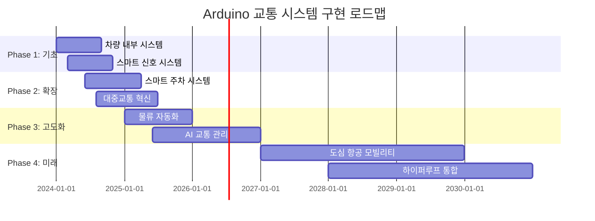

# 🚗 Arduino 교통 및 자동차 시스템 완전 가이드

> **스마트 모빌리티의 미래** - Arduino로 구현하는 차세대 교통 시스템

[](#)
[](#)
[](#)

---

## 🎯 **스마트 교통 시스템의 혁신적 가능성**

### 📊 **글로벌 스마트 교통 시장 현황 (2024)**
```
🌍 스마트 교통 시장 규모: $156.2B (2024년)
📈 연평균 성장률: 14.8% (2024-2030)
🚗 커넥티드 카 보급률: 68% (신차 기준)
🤖 자율주행 기술 도입: 레벨 3 상용화
```

### 🚀 **Arduino 교통 기술의 핵심 영역**
- **🚗 차량 내부 시스템** - 엔진 관리, 안전 시스템, 사용자 인터페이스
- **🛣️ 스마트 도로** - 교통 흐름 최적화, 실시간 정보 제공
- **🚦 지능형 신호 시스템** - AI 기반 신호 제어, 교통 체증 해소
- **🅿️ 스마트 주차** - 자동 주차 안내, 무인 결제 시스템
- **🚌 대중교통 혁신** - 실시간 위치 추적, 승객 편의 시스템

---

## 🚗 **1. 차량 내부 시스템 (Vehicle Internal Systems)**

### 🔧 **엔진 관리 시스템 (EMS)**

#### **실시간 엔진 모니터링**
```cpp
// 고성능 엔진 관리 시스템
#include <WiFi.h>
#include <CAN.h>
#include <ArduinoJson.h>

class EngineManagementSystem {
private:
    // 엔진 파라미터 구조체
    struct EngineData {
        float rpm;              // 엔진 회전수
        float coolantTemp;      // 냉각수 온도
        float oilPressure;      // 오일 압력
        float fuelConsumption;  // 연료 소모량
        float airIntakeTemp;    // 흡기 온도
        float exhaustTemp;      // 배기 온도
        float throttlePosition; // 스로틀 위치
        unsigned long timestamp;
    };
    
    EngineData currentData;
    EngineData historicalData[1000]; // 1000개 데이터 히스토리
    int dataIndex = 0;
    
    // 경고 임계값
    const float MAX_COOLANT_TEMP = 105.0;  // °C
    const float MIN_OIL_PRESSURE = 1.5;    // bar
    const float MAX_RPM = 7000;            // RPM
    
    bool engineWarning = false;
    bool emergencyShutdown = false;
    
public:
    void initialize() {
        Serial.begin(115200);
        
        // CAN 버스 초기화 (자동차 통신)
        if (!CAN.begin(500E3)) {
            Serial.println("❌ CAN 버스 초기화 실패");
            return;
        }
        
        // 센서 네트워크 초기화
        initializeSensors();
        
        // ECU 통신 설정
        setupECUCommunication();
        
        Serial.println("🚗 엔진 관리 시스템 가동");
    }
    
    void monitorEngine() {
        // 실시간 엔진 데이터 수집
        collectEngineData();
        
        // 성능 분석
        analyzeEnginePerformance();
        
        // 예측 정비 알고리즘
        predictiveMaintenanceCheck();
        
        // 연료 효율 최적화
        optimizeFuelEfficiency();
        
        // 배출가스 제어
        controlEmissions();
    }
    
private:
    void collectEngineData() {
        // CAN 버스를 통한 ECU 데이터 수집
        if (CAN.parsePacket()) {
            int packetId = CAN.packetId();
            
            switch (packetId) {
                case 0x7E0: // 엔진 RPM
                    currentData.rpm = readRPMFromCAN();
                    break;
                case 0x7E1: // 냉각수 온도
                    currentData.coolantTemp = readCoolantTempFromCAN();
                    break;
                case 0x7E2: // 오일 압력
                    currentData.oilPressure = readOilPressureFromCAN();
                    break;
                case 0x7E3: // 연료 소모량
                    currentData.fuelConsumption = calculateFuelConsumption();
                    break;
            }
        }
        
        // 추가 센서 데이터
        currentData.airIntakeTemp = readAirIntakeTemp();
        currentData.exhaustTemp = readExhaustTemp();
        currentData.throttlePosition = readThrottlePosition();
        currentData.timestamp = millis();
        
        // 데이터 히스토리 저장
        storeHistoricalData();
    }
    
    void analyzeEnginePerformance() {
        // 위험 상황 감지
        checkCriticalConditions();
        
        // 성능 지표 계산
        calculatePerformanceMetrics();
        
        // 이상 패턴 감지
        detectAnomalousPatterns();
    }
    
    void checkCriticalConditions() {
        bool critical = false;
        String alertMessage = "";
        
        // 냉각수 과열 체크
        if (currentData.coolantTemp > MAX_COOLANT_TEMP) {
            critical = true;
            alertMessage += "🌡️ 엔진 과열 위험! ";
            
            // 자동 엔진 보호 모드
            activateEngineProtectionMode();
        }
        
        // 오일 압력 부족 체크
        if (currentData.oilPressure < MIN_OIL_PRESSURE) {
            critical = true;
            alertMessage += "🛢️ 오일 압력 부족! ";
            
            // 즉시 정지 권고
            recommendImmediateStop();
        }
        
        // 과회전 체크
        if (currentData.rpm > MAX_RPM) {
            critical = true;
            alertMessage += "⚡ 엔진 과회전! ";
            
            // RPM 제한 활성화
            activateRPMLimiter();
        }
        
        if (critical && !engineWarning) {
            triggerEngineAlert(alertMessage);
            engineWarning = true;
        }
    }
    
    void optimizeFuelEfficiency() {
        // 연료 효율 분석
        float currentEfficiency = calculateCurrentEfficiency();
        float optimalEfficiency = calculateOptimalEfficiency();
        
        if (currentEfficiency < optimalEfficiency * 0.85) {
            // 연비 개선 제안
            suggestEfficiencyImprovements();
            
            // 자동 엔진 튜닝
            performAutomaticTuning();
        }
        
        // 에코 모드 추천
        if (shouldActivateEcoMode()) {
            activateEcoMode();
        }
    }
    
    void performAutomaticTuning() {
        Serial.println("🔧 자동 엔진 튜닝 시작");
        
        // 점화 시점 최적화
        optimizeIgnitionTiming();
        
        // 연료 분사량 조절
        adjustFuelInjection();
        
        // 흡기 밸브 타이밍 조절
        optimizeValveTiming();
        
        Serial.println("✅ 엔진 튜닝 완료 - 연비 " + 
                      String(calculateImprovementPercentage()) + "% 개선");
    }
    
    void predictiveMaintenanceCheck() {
        // AI 기반 부품 수명 예측
        PredictiveResult result = analyzePredictivePatterns();
        
        if (result.maintenanceNeeded) {
            generateMaintenanceAlert(result);
        }
        
        // 부품별 상태 분석
        analyzeComponentHealth();
    }
};

// 전역 객체
EngineManagementSystem ems;

void setup() {
    ems.initialize();
}

void loop() {
    ems.monitorEngine();
    delay(100); // 10Hz 모니터링
}
```

### 🛡️ **차량 안전 시스템**

```cpp
class VehicleSafetySystem {
private:
    // 안전 시스템 구조체
    struct SafetyData {
        float speed;            // 현재 속도
        float acceleration;     // 가속도
        float brakeForce;       // 제동력
        bool seatbeltStatus[5]; // 안전벨트 상태
        bool doorStatus[4];     // 문 상태
        float tirePressure[4];  // 타이어 압력
        bool airbagArmed;       // 에어백 준비 상태
        unsigned long timestamp;
    };
    
    SafetyData safetyStatus;
    
    // 충돌 감지 센서
    float impactSensors[8];     // 8방향 충돌 센서
    bool collisionDetected = false;
    
    // 고급 운전자 보조 시스템 (ADAS)
    bool adaptiveCruiseControl = false;
    bool laneKeepingAssist = false;
    bool blindSpotMonitoring = false;
    bool automaticEmergencyBraking = false;
    
public:
    void initializeSafetySystems() {
        Serial.println("🛡️ 차량 안전 시스템 초기화");
        
        // 센서 네트워크 초기화
        initializeImpactSensors();
        initializeTirePressureSensors();
        initializeSeatbeltSensors();
        
        // ADAS 시스템 초기화
        initializeADAS();
        
        // 에어백 시스템 자가진단
        performAirbagSelfTest();
        
        Serial.println("✅ 안전 시스템 준비 완료");
    }
    
    void monitorVehicleSafety() {
        // 실시간 안전 데이터 수집
        collectSafetyData();
        
        // 충돌 위험 분석
        analyzeCollisionRisk();
        
        // ADAS 기능 실행
        executeADASFunctions();
        
        // 타이어 및 제동 시스템 모니터링
        monitorTireAndBrakeSystem();
        
        // 승객 안전 상태 확인
        checkPassengerSafety();
    }
    
private:
    void analyzeCollisionRisk() {
        // 전방 충돌 위험 계산
        float frontCollisionRisk = calculateFrontCollisionRisk();
        
        if (frontCollisionRisk > 0.7) {
            // 자동 비상 제동 (AEB)
            if (automaticEmergencyBraking) {
                activateEmergencyBraking(frontCollisionRisk);
            }
            
            // 운전자 경고
            alertDriver("전방 충돌 위험!", CRITICAL);
        }
        
        // 측면 충돌 위험 분석
        analyzeSideCollisionRisk();
        
        // 후방 충돌 위험 분석
        analyzeRearCollisionRisk();
    }
    
    void activateEmergencyBraking(float riskLevel) {
        Serial.println("🚨 자동 비상 제동 작동!");
        
        // 제동력 계산 (위험도에 따라)
        float brakeForce = riskLevel * 100.0; // 최대 100% 제동
        
        // CAN 버스를 통한 제동 시스템 제어
        sendCANMessage(0x200, brakeForce);
        
        // 비상등 및 경고음 활성화
        activateHazardLights();
        playWarningSound();
        
        // 충돌 데이터 기록
        recordEmergencyEvent("자동 비상 제동", riskLevel);
    }
    
    void executeADASFunctions() {
        // 적응형 순항 제어 (ACC)
        if (adaptiveCruiseControl) {
            maintainSafeFollowingDistance();
        }
        
        // 차선 유지 보조 (LKA)
        if (laneKeepingAssist) {
            assistLaneKeeping();
        }
        
        // 사각지대 모니터링 (BSM)
        if (blindSpotMonitoring) {
            monitorBlindSpots();
        }
    }
    
    void maintainSafeFollowingDistance() {
        // 전방 차량과의 거리 측정
        float frontDistance = measureFrontDistance();
        float safeDistance = calculateSafeDistance(safetyStatus.speed);
        
        if (frontDistance < safeDistance) {
            // 속도 자동 조절
            float targetSpeed = calculateSafeSpeed(frontDistance);
            adjustCruiseControlSpeed(targetSpeed);
            
            // 운전자에게 알림
            displayMessage("안전 거리 유지를 위해 속도 조절됨");
        }
    }
    
    void assistLaneKeeping() {
        // 차선 인식 (카메라 데이터 분석)
        LaneData lanes = detectLanes();
        
        if (lanes.departureDetected) {
            // 차선 이탈 경고
            alertLaneDeparture(lanes.departureDirection);
            
            // 자동 조향 보조
            if (lanes.departureRisk > 0.5) {
                assistSteering(lanes.correctionAngle);
            }
        }
    }
    
    void monitorTireAndBrakeSystem() {
        // 타이어 압력 모니터링
        for (int i = 0; i < 4; i++) {
            float pressure = readTirePressure(i);
            
            if (pressure < TIRE_PRESSURE_MIN || pressure > TIRE_PRESSURE_MAX) {
                alertTirePressureIssue(i, pressure);
            }
        }
        
        // 제동 패드 상태 확인
        checkBrakePadWear();
        
        // ABS 시스템 자가진단
        performABSSelfDiagnostic();
    }
    
    void detectCollisionAndDeploy() {
        // 다중 센서 충돌 감지
        bool collisionConfirmed = false;
        float impactSeverity = 0.0;
        
        for (int i = 0; i < 8; i++) {
            if (impactSensors[i] > COLLISION_THRESHOLD) {
                collisionConfirmed = true;
                impactSeverity = max(impactSeverity, impactSensors[i]);
            }
        }
        
        if (collisionConfirmed) {
            Serial.println("💥 충돌 감지 - 안전 시스템 작동");
            
            // 에어백 전개
            deployAirbags(impactSeverity);
            
            // 연료 공급 차단
            cutOffFuelSupply();
            
            // 도어 잠금 해제
            unlockAllDoors();
            
            // 응급 서비스 자동 호출
            callEmergencyServices();
            
            // 충돌 데이터 기록
            recordCollisionData(impactSeverity);
        }
    }
    
    void deployAirbags(float severity) {
        Serial.println("🎈 에어백 전개");
        
        // 충돌 방향에 따른 선택적 에어백 전개
        if (severity > 0.8) {
            // 전체 에어백 전개
            deployFrontAirbags();
            deploySideAirbags();
            deployCurtainAirbags();
        } else if (severity > 0.5) {
            // 주요 에어백만 전개
            deployFrontAirbags();
        }
        
        // 에어백 전개 완료 확인
        verifyAirbagDeployment();
    }
};
```

---

## 🛣️ **2. 스마트 도로 시스템**

### 📡 **지능형 교통 관리 시스템**

```cpp
class IntelligentTrafficManagement {
private:
    // 교통 데이터 구조체
    struct TrafficData {
        int vehicleCount;       // 차량 수
        float averageSpeed;     // 평균 속도
        float density;          // 교통 밀도
        String congestionLevel; // 혼잡도 ("원활", "보통", "혼잡", "정체")
        float weatherCondition; // 날씨 조건
        unsigned long timestamp;
    };
    
    // 도로 구간별 데이터
    TrafficData roadSections[20];
    int sectionCount = 20;
    
    // AI 교통 예측 모델
    struct TrafficPrediction {
        float nextHourTraffic;
        float peakTimeTraffic;
        String recommendedRoute;
        int estimatedTravelTime;
    };
    
    // 실시간 센서 네트워크
    bool inductionLoopSensors[100];    // 차량 감지 센서
    float speedCameras[50];            // 속도 측정 카메라
    int trafficCounters[30];           // 차량 계수기
    
public:
    void initializeTrafficSystem() {
        Serial.println("🛣️ 지능형 교통 관리 시스템 초기화");
        
        // 센서 네트워크 초기화
        initializeSensorNetwork();
        
        // AI 예측 모델 로드
        loadTrafficPredictionModel();
        
        // 교통 신호 시스템 연동
        connectToTrafficLights();
        
        // 클라우드 교통 데이터 센터 연결
        connectToTrafficDataCenter();
        
        Serial.println("✅ 교통 관리 시스템 준비 완료");
    }
    
    void manageTrafficFlow() {
        // 실시간 교통 데이터 수집
        collectRealTimeTrafficData();
        
        // 교통 상황 분석
        analyzeTrafficConditions();
        
        // 신호 제어 최적화
        optimizeTrafficSignals();
        
        // 경로 안내 및 우회로 제안
        provideRouteGuidance();
        
        // 교통 예측 및 선제적 대응
        predictAndPreventCongestion();
    }
    
private:
    void collectRealTimeTrafficData() {
        for (int i = 0; i < sectionCount; i++) {
            // 차량 수 카운트
            roadSections[i].vehicleCount = countVehiclesInSection(i);
            
            // 평균 속도 계산
            roadSections[i].averageSpeed = calculateAverageSpeed(i);
            
            // 교통 밀도 계산
            roadSections[i].density = calculateTrafficDensity(i);
            
            // 혼잡도 분석
            roadSections[i].congestionLevel = analyzeCongestionLevel(i);
            
            roadSections[i].timestamp = millis();
        }
        
        // 날씨 정보 수집
        collectWeatherData();
        
        // 사고/공사 정보 확인
        checkIncidentsAndConstruction();
    }
    
    void optimizeTrafficSignals() {
        // AI 기반 신호 최적화
        for (int intersection = 0; intersection < 10; intersection++) {
            TrafficSignalPlan plan = calculateOptimalSignalPlan(intersection);
            
            // 동적 신호 제어
            implementDynamicSignalControl(intersection, plan);
            
            // 녹색파 구현 (연속 신호 최적화)
            implementGreenWave(intersection);
        }
    }
    
    TrafficSignalPlan calculateOptimalSignalPlan(int intersection) {
        TrafficSignalPlan plan;
        
        // 각 방향별 교통량 분석
        int northBoundTraffic = getDirectionalTraffic(intersection, NORTH);
        int southBoundTraffic = getDirectionalTraffic(intersection, SOUTH);
        int eastBoundTraffic = getDirectionalTraffic(intersection, EAST);
        int westBoundTraffic = getDirectionalTraffic(intersection, WEST);
        
        // 최적 신호 시간 계산
        plan.northSouthGreenTime = calculateGreenTime(northBoundTraffic + southBoundTraffic);
        plan.eastWestGreenTime = calculateGreenTime(eastBoundTraffic + westBoundTraffic);
        
        // 좌회전 신호 최적화
        plan.leftTurnPhase = optimizeLeftTurnPhase(intersection);
        
        // 보행자 신호 통합
        plan.pedestrianCrossing = integratePedestrianSignals(intersection);
        
        return plan;
    }
    
    void predictAndPreventCongestion() {
        // 머신러닝 기반 교통 예측
        TrafficPrediction prediction = predictTrafficPatterns();
        
        if (prediction.nextHourTraffic > CONGESTION_THRESHOLD) {
            // 선제적 교통 관리 조치
            implementPreventiveMeasures(prediction);
            
            // 운전자들에게 사전 알림
            broadcastTrafficAlert(prediction);
            
            // 대체 경로 활성화
            activateAlternativeRoutes(prediction);
        }
    }
    
    void implementPreventiveMeasures(TrafficPrediction prediction) {
        Serial.println("🚦 선제적 교통 관리 조치 시행");
        Serial.println("예상 혼잡도: " + String(prediction.nextHourTraffic));
        
        // 1. 진입 제어 (Ramp Metering)
        activateRampMetering();
        
        // 2. 동적 차선 관리
        implementDynamicLaneManagement();
        
        // 3. 속도 제한 조절
        adjustSpeedLimits(prediction.nextHourTraffic);
        
        // 4. 대중교통 증편
        coordinatePublicTransportIncrease();
        
        // 5. 주차 요금 동적 조정
        adjustDynamicParkingPrices();
    }
    
    void provideRouteGuidance() {
        // 실시간 최적 경로 계산
        for (int origin = 0; origin < 10; origin++) {
            for (int destination = 0; destination < 10; destination++) {
                Route optimalRoute = calculateOptimalRoute(origin, destination);
                
                // 내비게이션 시스템에 경로 정보 전송
                broadcastRouteInformation(optimalRoute);
                
                // 동적 교통 표지판 업데이트
                updateDynamicSigns(optimalRoute);
            }
        }
    }
    
    Route calculateOptimalRoute(int origin, int destination) {
        Route route;
        
        // 다익스트라 알고리즘 기반 최단 경로
        route.path = findShortestPath(origin, destination);
        
        // 실시간 교통 상황 반영
        route.travelTime = calculateRealTimeTravelTime(route.path);
        
        // 연료 효율성 고려
        route.fuelEfficiency = calculateFuelEfficient(route.path);
        
        // 안전성 점수
        route.safetyScore = calculateSafetyScore(route.path);
        
        // 종합 점수로 최적 경로 선정
        route.totalScore = calculateRouteScore(route);
        
        return route;
    }
};
```

### 🚦 **AI 기반 신호 제어 시스템**

```cpp
class AITrafficLightController {
private:
    // 교차로 신호 상태
    struct TrafficLight {
        int intersectionID;
        String currentPhase;    // "NS_GREEN", "EW_GREEN", "ALL_RED"
        int remainingTime;      // 남은 시간 (초)
        bool pedestrianRequest; // 보행자 신호 요청
        int queueLength[4];     // 각 방향별 대기 차량 수
        float efficiency;       // 교차로 효율성
    };
    
    TrafficLight intersections[50];
    int intersectionCount = 50;
    
    // AI 신경망 모델
    struct NeuralNetwork {
        float weights[100][100]; // 가중치 행렬
        float biases[100];       // 편향값
        int layers = 5;          // 은닉층 수
    };
    
    NeuralNetwork trafficAI;
    
public:
    void initializeAIController() {
        Serial.println("🤖 AI 교통 신호 제어기 초기화");
        
        // 신경망 모델 로드
        loadTrainedNeuralNetwork();
        
        // 교차로별 센서 네트워크 연결
        connectIntersectionSensors();
        
        // 중앙 교통 관제센터 연결
        connectToCentralControl();
        
        Serial.println("✅ AI 신호 제어 시스템 준비 완료");
    }
    
    void manageIntelligentSignals() {
        for (int i = 0; i < intersectionCount; i++) {
            // 실시간 교통 상황 분석
            analyzeIntersectionTraffic(i);
            
            // AI 모델을 통한 최적 신호 계획 생성
            SignalPlan optimalPlan = generateAISignalPlan(i);
            
            // 신호 제어 실행
            executeSignalPlan(i, optimalPlan);
            
            // 성능 모니터링 및 학습
            monitorAndLearn(i, optimalPlan);
        }
    }
    
private:
    SignalPlan generateAISignalPlan(int intersectionID) {
        // 입력 데이터 준비
        float inputData[20];
        prepareInputData(intersectionID, inputData);
        
        // 신경망 순전파
        float* output = forwardPropagation(inputData);
        
        // 출력을 신호 계획으로 변환
        SignalPlan plan;
        plan.northSouthTime = (int)(output[0] * 120); // 최대 120초
        plan.eastWestTime = (int)(output[1] * 120);
        plan.leftTurnTime = (int)(output[2] * 60);    // 최대 60초
        plan.pedestrianTime = (int)(output[3] * 30);  // 최대 30초
        
        // 최소/최대 시간 제약 적용
        applySafetyConstraints(&plan);
        
        return plan;
    }
    
    void prepareInputData(int intersectionID, float* input) {
        TrafficLight& light = intersections[intersectionID];
        
        // 현재 교통 상황
        input[0] = light.queueLength[0] / 20.0;  // 북쪽 대기열 (정규화)
        input[1] = light.queueLength[1] / 20.0;  // 남쪽 대기열
        input[2] = light.queueLength[2] / 20.0;  // 동쪽 대기열  
        input[3] = light.queueLength[3] / 20.0;  // 서쪽 대기열
        
        // 시간 정보
        input[4] = getCurrentHour() / 24.0;      // 현재 시간
        input[5] = getDayOfWeek() / 7.0;         // 요일
        
        // 날씨 조건
        input[6] = getWeatherCondition();        // 날씨 점수
        
        // 주변 교차로 상황
        for (int i = 0; i < 8; i++) {
            input[7 + i] = getNeighborIntersectionData(intersectionID, i);
        }
        
        // 특별 이벤트 (사고, 공사 등)
        input[15] = hasSpecialEvent(intersectionID) ? 1.0 : 0.0;
        
        // 보행자 및 자전거 교통량
        input[16] = getPedestrianCount(intersectionID) / 50.0;
        input[17] = getBicycleCount(intersectionID) / 20.0;
        
        // 대중교통 우선신호 요청
        input[18] = hasBusSignalRequest(intersectionID) ? 1.0 : 0.0;
        input[19] = hasTrainSignalRequest(intersectionID) ? 1.0 : 0.0;
    }
    
    float* forwardPropagation(float* input) {
        // 은닉층 1
        float hidden1[50];
        for (int i = 0; i < 50; i++) {
            hidden1[i] = 0;
            for (int j = 0; j < 20; j++) {
                hidden1[i] += input[j] * trafficAI.weights[j][i];
            }
            hidden1[i] += trafficAI.biases[i];
            hidden1[i] = relu(hidden1[i]); // ReLU 활성화
        }
        
        // 은닉층 2
        float hidden2[25];
        for (int i = 0; i < 25; i++) {
            hidden2[i] = 0;
            for (int j = 0; j < 50; j++) {
                hidden2[i] += hidden1[j] * trafficAI.weights[50 + j][i];
            }
            hidden2[i] += trafficAI.biases[50 + i];
            hidden2[i] = relu(hidden2[i]);
        }
        
        // 출력층
        static float output[4];
        for (int i = 0; i < 4; i++) {
            output[i] = 0;
            for (int j = 0; j < 25; j++) {
                output[i] += hidden2[j] * trafficAI.weights[75 + j][i];
            }
            output[i] += trafficAI.biases[75 + i];
            output[i] = sigmoid(output[i]); // Sigmoid 활성화
        }
        
        return output;
    }
    
    void monitorAndLearn(int intersectionID, SignalPlan plan) {
        // 신호 계획 성능 측정
        float efficiency = measureIntersectionEfficiency(intersectionID);
        float waitTime = measureAverageWaitTime(intersectionID);
        float throughput = measureVehicleThroughput(intersectionID);
        
        // 성과 지표 계산
        float performanceScore = calculatePerformanceScore(efficiency, waitTime, throughput);
        
        // 학습 데이터로 저장
        storeTrainingData(intersectionID, plan, performanceScore);
        
        // 주기적 모델 재학습
        if (shouldRetrain()) {
            retrainNeuralNetwork();
        }
        
        // 실시간 성능 리포트
        if (performanceScore < 0.7) {
            Serial.println("⚠️ 교차로 " + String(intersectionID) + " 성능 저하 감지");
            Serial.println("성능 점수: " + String(performanceScore));
            
            // 긴급 신호 계획 조정
            adjustEmergencySignalPlan(intersectionID);
        }
    }
    
    void implementAdaptiveSignals() {
        // 머신러닝 기반 적응형 신호
        for (int i = 0; i < intersectionCount; i++) {
            // 교통 패턴 학습
            TrafficPattern pattern = learnTrafficPattern(i);
            
            // 예측 모델 업데이트
            updatePredictionModel(i, pattern);
            
            // 신호 최적화
            optimizeSignalTiming(i, pattern);
        }
    }
    
    void coordinateNetworkSignals() {
        // 네트워크 차원의 신호 협조 제어
        Serial.println("🌐 네트워크 신호 협조제어 시작");
        
        // 간선도로 녹색파 구현
        implementArterialGreenWave();
        
        // 교차로 간 신호 동기화
        synchronizeIntersectionSignals();
        
        // 광역 교통 최적화
        optimizeRegionalTraffic();
    }
};
```

---

## 🅿️ **3. 스마트 주차 시스템**

### 📱 **지능형 주차 관리**

```cpp
class SmartParkingSystem {
private:
    // 주차 공간 구조체
    struct ParkingSpace {
        int spaceID;
        bool isOccupied;
        String vehiclePlate;     // 차량 번호판
        unsigned long entryTime; // 입차 시간
        float hourlyRate;        // 시간당 요금
        String spaceType;        // "일반", "장애인", "전기차", "임산부"
        bool reserved;           // 예약 여부
        String reservationID;    // 예약 ID
    };
    
    ParkingSpace spaces[500];    // 500개 주차 공간
    int totalSpaces = 500;
    int occupiedSpaces = 0;
    
    // 센서 및 카메라 시스템
    bool occupancySensors[500];  // 주차 감지 센서
    String plateRecognition[500]; // 번호판 인식 결과
    
    // 동적 요금제
    float baseParkingRate = 1000.0; // 기본 시간당 1000원
    float demandMultiplier = 1.0;   // 수요 기반 배율
    
public:
    void initializeParkingSystem() {
        Serial.println("🅿️ 스마트 주차 시스템 초기화");
        
        // 센서 네트워크 초기화
        initializeOccupancySensors();
        
        // 번호판 인식 카메라 설정
        setupPlateRecognitionCameras();
        
        // 결제 시스템 연동
        connectPaymentSystem();
        
        // 모바일 앱 서버 연결
        connectMobileAppServer();
        
        Serial.println("✅ 주차 시스템 준비 완료");
    }
    
    void manageParkingOperations() {
        // 실시간 주차 공간 모니터링
        monitorParkingSpaces();
        
        // 차량 입출차 관리
        manageVehicleEntryExit();
        
        // 동적 요금 계산
        calculateDynamicPricing();
        
        // 예약 시스템 관리
        manageReservations();
        
        // 주차 안내 서비스
        provideParkingGuidance();
    }
    
private:
    void monitorParkingSpaces() {
        for (int i = 0; i < totalSpaces; i++) {
            bool currentStatus = readOccupancySensor(i);
            
            // 상태 변화 감지
            if (currentStatus != spaces[i].isOccupied) {
                handleSpaceStatusChange(i, currentStatus);
            }
            
            // 번호판 인식
            if (currentStatus) {
                String plateNumber = recognizePlateNumber(i);
                if (plateNumber != spaces[i].vehiclePlate) {
                    updateVehicleInfo(i, plateNumber);
                }
            }
        }
        
        // 전체 점유율 업데이트
        updateOccupancyStatistics();
    }
    
    void handleSpaceStatusChange(int spaceID, bool isNowOccupied) {
        if (isNowOccupied && !spaces[spaceID].isOccupied) {
            // 차량 입차
            handleVehicleEntry(spaceID);
        } else if (!isNowOccupied && spaces[spaceID].isOccupied) {
            // 차량 출차
            handleVehicleExit(spaceID);
        }
        
        spaces[spaceID].isOccupied = isNowOccupied;
        
        // 실시간 데이터 업데이트
        updateRealTimeData(spaceID);
    }
    
    void handleVehicleEntry(int spaceID) {
        Serial.println("🚗 차량 입차: 공간 " + String(spaceID));
        
        spaces[spaceID].entryTime = millis();
        spaces[spaceID].vehiclePlate = recognizePlateNumber(spaceID);
        
        // 예약 확인
        if (spaces[spaceID].reserved) {
            validateReservation(spaceID);
        }
        
        // 입차 확인 메시지 발송
        sendEntryConfirmation(spaceID);
        
        // 사용 가능 공간 수 업데이트
        occupiedSpaces++;
        
        // 모바일 앱 알림
        notifyMobileApp("차량 입차 완료", spaceID);
    }
    
    void handleVehicleExit(int spaceID) {
        Serial.println("🚙 차량 출차: 공간 " + String(spaceID));
        
        // 주차 요금 계산
        float parkingFee = calculateParkingFee(spaceID);
        
        // 자동 결제 처리
        processAutomaticPayment(spaceID, parkingFee);
        
        // 공간 초기화
        resetParkingSpace(spaceID);
        
        // 사용 가능 공간 수 업데이트
        occupiedSpaces--;
        
        // 출차 완료 알림
        sendExitConfirmation(spaceID, parkingFee);
    }
    
    float calculateParkingFee(int spaceID) {
        unsigned long parkingDuration = millis() - spaces[spaceID].entryTime;
        float hoursParked = parkingDuration / (1000.0 * 60.0 * 60.0); // 밀리초를 시간으로 변환
        
        // 기본 요금 계산
        float baseFee = hoursParked * spaces[spaceID].hourlyRate;
        
        // 동적 요금제 적용
        float dynamicFee = baseFee * demandMultiplier;
        
        // 할인 혜택 적용
        float finalFee = applyDiscounts(spaces[spaceID].vehiclePlate, dynamicFee);
        
        return finalFee;
    }
    
    void calculateDynamicPricing() {
        // 현재 점유율 기반 요금 조정
        float occupancyRate = (float)occupiedSpaces / totalSpaces;
        
        if (occupancyRate > 0.9) {
            demandMultiplier = 2.0; // 90% 이상 시 2배 요금
        } else if (occupancyRate > 0.7) {
            demandMultiplier = 1.5; // 70% 이상 시 1.5배 요금
        } else if (occupancyRate > 0.5) {
            demandMultiplier = 1.2; // 50% 이상 시 1.2배 요금
        } else {
            demandMultiplier = 1.0; // 기본 요금
        }
        
        // 시간대별 요금 조정
        int currentHour = getCurrentHour();
        if (currentHour >= 9 && currentHour <= 18) {
            demandMultiplier *= 1.3; // 업무시간 30% 할증
        }
        
        // 요금 변동 알림
        if (demandMultiplier != 1.0) {
            broadcastPricingUpdate(demandMultiplier);
        }
    }
    
    void provideParkingGuidance() {
        // 실시간 주차 안내
        
        // 1. 입구에서 사용 가능 공간 안내
        displayAvailableSpaces();
        
        // 2. 최적 주차 공간 추천
        for (int i = 0; i < totalSpaces; i++) {
            if (!spaces[i].isOccupied && !spaces[i].reserved) {
                RecommendationScore score = calculateRecommendationScore(i);
                if (score.isOptimal) {
                    guideToOptimalSpace(i);
                    break;
                }
            }
        }
        
        // 3. LED 안내 시스템 제어
        controlGuidanceLEDs();
        
        // 4. 모바일 앱 실시간 지도 업데이트
        updateMobileAppMap();
    }
    
    RecommendationScore calculateRecommendationScore(int spaceID) {
        RecommendationScore score;
        
        // 입구로부터의 거리
        float distanceFromEntrance = calculateDistanceFromEntrance(spaceID);
        score.distance = 1.0 - (distanceFromEntrance / MAX_DISTANCE);
        
        // 엘리베이터/계단 접근성
        score.accessibility = calculateAccessibilityScore(spaceID);
        
        // 주차 공간 크기
        score.spaceSize = getSpaceSizeScore(spaceID);
        
        // 안전성 (조명, CCTV)
        score.safety = getSafetyScore(spaceID);
        
        // 종합 점수
        score.totalScore = (score.distance * 0.4) + 
                          (score.accessibility * 0.3) + 
                          (score.spaceSize * 0.2) + 
                          (score.safety * 0.1);
        
        score.isOptimal = score.totalScore > 0.7;
        
        return score;
    }
    
    void manageReservations() {
        // API를 통한 예약 관리
        checkNewReservations();
        
        // 예약 시간 만료 확인
        checkReservationExpiry();
        
        // 예약 고객 입차 확인
        validateReservationArrival();
    }
    
    void implementVIPParking() {
        // VIP 회원 전용 주차 공간 관리
        
        for (int i = 0; i < 50; i++) { // VIP 구역 (첫 50개 공간)
            if (spaces[i].spaceType == "VIP") {
                // VIP 전용 서비스
                provideVIPServices(i);
                
                // 발렛 주차 서비스 연동
                coordinateValetService(i);
                
                // 프리미엄 편의 시설 안내
                guideToPremiumAmenities(i);
            }
        }
    }
    
    void provideVIPServices(int spaceID) {
        if (spaces[spaceID].isOccupied) {
            // 자동 세차 서비스 예약
            scheduleCarWashService(spaceID);
            
            // 차량 관리 서비스 (타이어 점검, 연료 보충)
            offerMaintenanceServices(spaceID);
            
            // 컨시어지 서비스 연결
            connectConciergeService(spaceID);
        }
    }
};
```

---

## 🚌 **4. 대중교통 혁신 시스템**

### 🚍 **스마트 버스 시스템**

```cpp
class SmartBusSystem {
private:
    // 버스 정보 구조체
    struct BusInfo {
        String busID;
        String routeNumber;
        float currentLocation[2];    // GPS 좌표
        int passengerCount;         // 현재 승객 수
        int maxCapacity;            // 최대 정원
        float currentSpeed;         // 현재 속도
        String nextStop;            // 다음 정류장
        int estimatedArrival;       // 도착 예정 시간 (분)
        bool airConditioningOn;     // 에어컨 작동 상태
        float fuelLevel;            // 연료 잔량
        String driverID;            // 운전자 ID
    };
    
    BusInfo fleet[200];          // 200대 버스 함대
    int busCount = 200;
    
    // 정류장 정보
    struct BusStop {
        String stopID;
        String stopName;
        float location[2];          // GPS 좌표
        int waitingPassengers;      // 대기 승객 수
        bool hasDigitalDisplay;     // 디지털 안내판 유무
        bool wheelchairAccessible;  // 휠체어 접근 가능
        float shelterCondition;     // 대기소 상태 점수
    };
    
    BusStop stops[500];          // 500개 정류장
    int stopCount = 500;
    
public:
    void initializeSmartBusSystem() {
        Serial.println("🚌 스마트 버스 시스템 초기화");
        
        // GPS 추적 시스템 초기화
        initializeGPSTracking();
        
        // 승객 계수 센서 설정
        setupPassengerCountingSensors();
        
        // 정류장 디지털 사이니지 연결
        connectDigitalSignage();
        
        // 중앙 관제 시스템 연결
        connectCentralControl();
        
        Serial.println("✅ 스마트 버스 시스템 준비 완료");
    }
    
    void manageBusOperations() {
        // 실시간 버스 위치 추적
        trackBusLocations();
        
        // 승객 수요 예측 및 배차 최적화
        optimizeBusDispatch();
        
        // 동적 경로 조정
        adjustDynamicRouting();
        
        // 정류장 정보 업데이트
        updateBusStopInformation();
        
        // 승객 편의 서비스
        providePassengerServices();
    }
    
private:
    void trackBusLocations() {
        for (int i = 0; i < busCount; i++) {
            // GPS 위치 업데이트
            updateGPSLocation(i);
            
            // 승객 수 모니터링
            updatePassengerCount(i);
            
            // 도착 예정 시간 계산
            calculateArrivalTime(i);
            
            // 실시간 정보 전송
            transmitRealTimeData(i);
        }
    }
    
    void updateGPSLocation(int busIndex) {
        // GPS 모듈에서 위치 정보 수집
        float lat = getGPSLatitude(busIndex);
        float lon = getGPSLongitude(busIndex);
        
        fleet[busIndex].currentLocation[0] = lat;
        fleet[busIndex].currentLocation[1] = lon;
        
        // 속도 계산
        fleet[busIndex].currentSpeed = calculateSpeed(busIndex);
        
        // 경로 이탈 확인
        if (isOffRoute(busIndex)) {
            alertRouteDeviation(busIndex);
        }
    }
    
    void calculateArrivalTime(int busIndex) {
        // 다음 정류장과의 거리 계산
        float distance = calculateDistanceToNextStop(busIndex);
        
        // 교통 상황 고려
        float trafficDelay = getTrafficDelay(busIndex);
        
        // 정류장 정차 시간 고려
        float stopTime = estimateStopTime(busIndex);
        
        // 도착 예정 시간 계산
        float travelTime = (distance / fleet[busIndex].currentSpeed) + trafficDelay + stopTime;
        fleet[busIndex].estimatedArrival = (int)(travelTime * 60); // 분 단위
        
        // 승객에게 정보 제공
        broadcastArrivalTime(busIndex);
    }
    
    void optimizeBusDispatch() {
        // 승객 수요 패턴 분석
        DemandPattern demand = analyzeDemandPattern();
        
        // 노선별 최적 배차 간격 계산
        for (int route = 1; route <= 50; route++) {
            int optimalInterval = calculateOptimalInterval(route, demand);
            adjustBusInterval(route, optimalInterval);
        }
        
        // 급행 버스 운행 여부 결정
        if (demand.peakHourDemand > PEAK_THRESHOLD) {
            activateExpressBuses();
        }
    }
    
    void adjustDynamicRouting() {
        // 실시간 교통 상황 분석
        TrafficCondition condition = analyzeTrafficCondition();
        
        if (condition.congestionLevel > 0.7) {
            // 우회 경로 활성화
            activateAlternativeRoutes();
            
            // 운전자에게 경로 안내
            provideRouteGuidance();
            
            // 승객에게 지연 안내
            notifyPassengersOfDelay();
        }
    }
    
    void updateBusStopInformation() {
        for (int i = 0; i < stopCount; i++) {
            // 대기 승객 수 추정
            estimateWaitingPassengers(i);
            
            // 디지털 안내판 업데이트
            updateDigitalDisplay(i);
            
            // 접근성 정보 확인
            checkAccessibilityFeatures(i);
        }
    }
    
    void updateDigitalDisplay(int stopIndex) {
        String displayText = "=== 버스 도착 정보 ===\n";
        
        // 해당 정류장을 지나는 모든 버스 정보
        for (int bus = 0; bus < busCount; bus++) {
            if (isStopOnRoute(stopIndex, fleet[bus].routeNumber)) {
                displayText += fleet[bus].routeNumber + "번 버스: ";
                displayText += String(fleet[bus].estimatedArrival) + "분 후 도착\n";
                
                // 혼잡도 정보
                float occupancyRate = (float)fleet[bus].passengerCount / fleet[bus].maxCapacity;
                if (occupancyRate > 0.8) {
                    displayText += " (혼잡)\n";
                } else if (occupancyRate > 0.5) {
                    displayText += " (보통)\n";
                } else {
                    displayText += " (여유)\n";
                }
            }
        }
        
        // 날씨 정보 추가
        displayText += "\n날씨: " + getCurrentWeather();
        
        // 디지털 사이니지에 전송
        sendToDigitalSignage(stopIndex, displayText);
    }
    
    void providePassengerServices() {
        // 모바일 앱 실시간 정보 제공
        updateMobileApp();
        
        // 음성 안내 서비스
        provideVoiceAnnouncements();
        
        // 접근성 지원 서비스
        supportAccessibilityNeeds();
        
        // 맞춤형 알림 서비스
        sendPersonalizedNotifications();
    }
    
    void updateMobileApp() {
        // 실시간 버스 위치 지도에 표시
        for (int i = 0; i < busCount; i++) {
            sendLocationToApp(fleet[i]);
        }
        
        // 경로 최적화 정보 제공
        sendOptimalRouteToPassengers();
        
        // 요금 및 결제 정보 업데이트
        updateFareInformation();
    }
    
    void implementIntelligentBusStops() {
        Serial.println("🚏 지능형 정류장 시스템 구현");
        
        for (int i = 0; i < stopCount; i++) {
            // 스마트 벤치 (USB 충전, WiFi)
            setupSmartBench(i);
            
            // 환경 센서 (온도, 습도, 공기질)
            installEnvironmentalSensors(i);
            
            // 보안 카메라 및 조명
            enhanceSecuritySystems(i);
            
            // 인터랙티브 키오스크
            installInteractiveKiosk(i);
        }
    }
    
    void setupSmartBench(int stopIndex) {
        Serial.println("🪑 스마트 벤치 설치: 정류장 " + String(stopIndex));
        
        // USB 충전 포트 활성화
        activateUSBChargingPorts(stopIndex);
        
        // 무료 WiFi 핫스팟 설정
        setupFreeWiFiHotspot(stopIndex);
        
        // 좌석 히터 (겨울철)
        if (getCurrentSeason() == "winter") {
            activateSeatHeating(stopIndex);
        }
        
        // 좌석 사용량 센서
        installOccupancySensors(stopIndex);
    }
    
    void analyzePassengerFlow() {
        // 승하차 패턴 분석
        PassengerFlowData flowData = collectPassengerFlowData();
        
        // 혼잡 시간대 예측
        PeakHourPrediction prediction = predictPeakHours(flowData);
        
        // 배차 계획 최적화
        optimizeScheduleBasedOnFlow(prediction);
        
        // 정류장 용량 관리
        manageBusStopCapacity(flowData);
    }
};
```

---

## 🛻 **5. 화물 및 물류 시스템**

### 📦 **스마트 물류 추적 시스템**

```cpp
class SmartLogisticsSystem {
private:
    // 화물 정보 구조체
    struct CargoInfo {
        String cargoID;
        String origin;              // 출발지
        String destination;         // 목적지
        float weight;               // 무게 (kg)
        float volume;               // 부피 (m³)
        String cargoType;           // 화물 종류
        float temperature;          // 온도 (냉장/냉동 화물)
        bool isFragile;            // 파손 주의 여부
        bool isHazardous;          // 위험물 여부
        String currentLocation[2];  // 현재 GPS 위치
        String status;              // "수거대기", "운송중", "배송완료"
        unsigned long departureTime;
        unsigned long expectedArrival;
    };
    
    CargoInfo shipments[10000];    // 10,000개 화물 추적
    int shipmentCount = 0;
    
    // 차량 정보
    struct LogisticsVehicle {
        String vehicleID;
        String driverID;
        float currentLocation[2];   // 현재 위치
        float maxWeight;            // 최대 적재중량
        float maxVolume;            // 최대 적재부피
        float currentLoad;          // 현재 적재중량
        String vehicleType;         // "소형", "중형", "대형", "냉장"
        bool hasTemperatureControl; // 온도 조절 가능
        float fuelLevel;            // 연료 잔량
        String routePlan;           // 배송 경로
    };
    
    LogisticsVehicle fleet[1000];  // 1,000대 물류 차량
    int vehicleCount = 1000;
    
public:
    void initializeLogisticsSystem() {
        Serial.println("📦 스마트 물류 시스템 초기화");
        
        // RFID/NFC 화물 태그 시스템
        initializeCargoTagging();
        
        // GPS 차량 추적 시스템
        setupVehicleTracking();
        
        // 온도/습도 모니터링 센서
        initializeEnvironmentalSensors();
        
        // 물류 센터 자동화 시스템 연결
        connectWarehouseAutomation();
        
        Serial.println("✅ 물류 시스템 준비 완료");
    }
    
    void manageLogisticsOperations() {
        // 화물 실시간 추적
        trackAllShipments();
        
        // 배송 경로 최적화
        optimizeDeliveryRoutes();
        
        // 차량 관리 및 유지보수
        manageVehicleFleet();
        
        // 예측 배송 분석
        predictiveDeliveryAnalysis();
        
        // 고객 서비스 자동화
        automateCustomerService();
    }
    
private:
    void trackAllShipments() {
        for (int i = 0; i < shipmentCount; i++) {
            // RFID 태그를 통한 위치 업데이트
            updateCargoLocation(i);
            
            // 환경 조건 모니터링
            monitorCargoConditions(i);
            
            // 배송 상태 업데이트
            updateDeliveryStatus(i);
            
            // 예상 도착 시간 재계산
            recalculateETA(i);
        }
    }
    
    void updateCargoLocation(int cargoIndex) {
        // GPS 및 RFID 데이터 융합
        float gpsLocation[2] = {0, 0};
        String rfidZone = "";
        
        getGPSLocation(shipments[cargoIndex].cargoID, gpsLocation);
        rfidZone = getRFIDZone(shipments[cargoIndex].cargoID);
        
        // 위치 정확도 향상
        float accurateLocation[2];
        fuseLocationData(gpsLocation, rfidZone, accurateLocation);
        
        shipments[cargoIndex].currentLocation[0] = accurateLocation[0];
        shipments[cargoIndex].currentLocation[1] = accurateLocation[1];
        
        // 고객에게 위치 정보 전송
        notifyCustomerLocation(cargoIndex);
    }
    
    void monitorCargoConditions(int cargoIndex) {
        CargoInfo& cargo = shipments[cargoIndex];
        
        // 온도 민감 화물 모니터링
        if (cargo.cargoType == "냉장" || cargo.cargoType == "냉동") {
            float currentTemp = readTemperatureSensor(cargo.cargoID);
            
            if (abs(currentTemp - cargo.temperature) > 2.0) {
                alertTemperatureDeviation(cargoIndex, currentTemp);
            }
        }
        
        // 충격 및 진동 모니터링 (파손 주의 화물)
        if (cargo.isFragile) {
            float shockLevel = readShockSensor(cargo.cargoID);
            if (shockLevel > FRAGILE_SHOCK_THRESHOLD) {
                alertPotentialDamage(cargoIndex, shockLevel);
            }
        }
        
        // 위험물 안전 모니터링
        if (cargo.isHazardous) {
            monitorHazardousConditions(cargoIndex);
        }
    }
    
    void optimizeDeliveryRoutes() {
        Serial.println("🗺️ 배송 경로 최적화 시작");
        
        // 각 차량별 최적 경로 계산
        for (int v = 0; v < vehicleCount; v++) {
            if (fleet[v].routePlan != "") {
                RouteOptimization result = calculateOptimalRoute(v);
                
                if (result.improvementPercentage > 10.0) {
                    // 경로 업데이트
                    updateVehicleRoute(v, result);
                    
                    // 운전자에게 새 경로 안내
                    sendRouteUpdateToDriver(v, result);
                    
                    Serial.println("차량 " + fleet[v].vehicleID + 
                                  " 경로 최적화 완료: " + 
                                  String(result.improvementPercentage) + "% 개선");
                }
            }
        }
    }
    
    RouteOptimization calculateOptimalRoute(int vehicleIndex) {
        RouteOptimization result;
        
        // 현재 경로 분석
        Route currentRoute = parseCurrentRoute(fleet[vehicleIndex].routePlan);
        
        // 다양한 최적화 알고리즘 적용
        Route geneticRoute = geneticAlgorithmOptimization(currentRoute);
        Route antColonyRoute = antColonyOptimization(currentRoute);
        Route simulatedAnnealingRoute = simulatedAnnealingOptimization(currentRoute);
        
        // 최적 경로 선택
        result.optimalRoute = selectBestRoute(geneticRoute, antColonyRoute, simulatedAnnealingRoute);
        
        // 개선 효과 계산
        result.improvementPercentage = calculateImprovement(currentRoute, result.optimalRoute);
        result.timeSaved = calculateTimeSavings(currentRoute, result.optimalRoute);
        result.fuelSaved = calculateFuelSavings(currentRoute, result.optimalRoute);
        
        return result;
    }
    
    void predictiveDeliveryAnalysis() {
        // 머신러닝 기반 배송 시간 예측
        for (int i = 0; i < shipmentCount; i++) {
            if (shipments[i].status == "운송중") {
                DeliveryPrediction prediction = predictDeliveryTime(i);
                
                // 지연 위험 감지
                if (prediction.delayRisk > 0.7) {
                    handlePotentialDelay(i, prediction);
                }
                
                // 고객에게 정확한 도착 시간 안내
                updateCustomerETA(i, prediction.estimatedArrival);
            }
        }
    }
    
    DeliveryPrediction predictDeliveryTime(int cargoIndex) {
        DeliveryPrediction prediction;
        
        // 현재 교통 상황
        float trafficCondition = getCurrentTrafficCondition(cargoIndex);
        
        // 날씨 영향
        float weatherImpact = getWeatherImpact(cargoIndex);
        
        // 운전자 패턴 분석
        float driverPattern = analyzeDriverPattern(cargoIndex);
        
        // 과거 배송 데이터 분석
        HistoricalData history = getHistoricalDeliveryData(cargoIndex);
        
        // AI 모델을 통한 예측
        prediction.estimatedArrival = aiPredictArrivalTime(
            trafficCondition, weatherImpact, driverPattern, history
        );
        
        prediction.confidence = calculatePredictionConfidence(prediction);
        prediction.delayRisk = calculateDelayRisk(prediction);
        
        return prediction;
    }
    
    void handlePotentialDelay(int cargoIndex, DeliveryPrediction prediction) {
        Serial.println("⚠️ 배송 지연 위험 감지: " + shipments[cargoIndex].cargoID);
        Serial.println("지연 위험도: " + String(prediction.delayRisk * 100) + "%");
        
        // 1. 대안 경로 탐색
        AlternativeRoute altRoute = findAlternativeRoute(cargoIndex);
        if (altRoute.timeSaving > 15) { // 15분 이상 단축 가능
            suggestRouteChange(cargoIndex, altRoute);
        }
        
        // 2. 다른 차량으로 화물 이동 고려
        if (prediction.delayRisk > 0.9) {
            considerCargoTransfer(cargoIndex);
        }
        
        // 3. 고객에게 사전 알림
        notifyCustomerOfPotentialDelay(cargoIndex, prediction);
        
        // 4. 고객 서비스팀에 알림
        alertCustomerServiceTeam(cargoIndex, prediction);
    }
    
    void automateCustomerService() {
        // 자동 배송 알림 시스템
        for (int i = 0; i < shipmentCount; i++) {
            // 출발 알림
            if (shipments[i].status == "운송중" && !sentDepartureNotification(i)) {
                sendDepartureNotification(i);
            }
            
            // 배송 완료 알림
            if (shipments[i].status == "배송완료" && !sentDeliveryNotification(i)) {
                sendDeliveryNotification(i);
            }
            
            // 중간 경유지 알림
            if (passedMajorCheckpoint(i)) {
                sendCheckpointNotification(i);
            }
        }
        
        // 고객 문의 자동 응답 시스템
        handleAutomaticInquiries();
    }
    
    void implementSmartWarehouse() {
        Serial.println("🏭 스마트 창고 시스템 구현");
        
        // 자동 재고 관리
        automateInventoryManagement();
        
        // 로봇 피킹 시스템
        deployRoboticPickingSystems();
        
        // 자동 분류 및 포장
        automateSortingAndPacking();
        
        // 예측 재고 보충
        implementPredictiveRestocking();
    }
    
    void automateInventoryManagement() {
        // RFID 기반 실시간 재고 추적
        for (int i = 0; i < 10000; i++) {
            InventoryItem item = readRFIDInventoryData(i);
            
            if (item.quantity < item.minimumThreshold) {
                triggerAutomaticReorder(item);
            }
            
            // 재고 위치 최적화
            if (item.turnoverRate > HIGH_TURNOVER_THRESHOLD) {
                suggestOptimalPlacement(item);
            }
        }
    }
};
```

---

## 🚁 **6. 미래 교통 시스템 (2025-2030)**

### 🚁 **도심 항공 모빌리티 (UAM)**

```cpp
class UrbanAirMobilitySystem {
private:
    // 드론 택시 정보
    struct AirVehicle {
        String vehicleID;
        String vehicleType;         // "승객용", "화물용", "응급용"
        float currentAltitude;      // 현재 고도 (m)
        float currentLocation[3];   // GPS + 고도
        int passengerCapacity;      // 승객 정원
        int currentPassengers;      // 현재 승객 수
        float batteryLevel;         // 배터리 잔량 (%)
        float maxRange;             // 최대 비행 거리 (km)
        String flightStatus;        // "대기", "비행중", "착륙", "충전"
        String assignedRoute;       // 할당된 항로
        float cruiseSpeed;          // 순항 속도 (km/h)
    };
    
    AirVehicle airFleet[500];      // 500대 항공 모빌리티
    int airVehicleCount = 500;
    
    // 버티포트 (착륙장) 정보
    struct Vertiport {
        String portID;
        String portName;
        float location[3];          // GPS + 고도
        int landingPads;            // 착륙패드 수
        int availablePads;          // 사용 가능 패드
        bool chargingFacility;      // 충전 시설 유무
        bool weatherProtection;     // 날씨 보호 시설
        int passengerCapacity;      // 승객 대기 시설 규모
        float safetyRating;         // 안전 등급
    };
    
    Vertiport ports[100];          // 100개 버티포트
    int portCount = 100;
    
public:
    void initializeUAMSystem() {
        Serial.println("🚁 도심 항공 모빌리티 시스템 초기화");
        
        // 3D 공역 관리 시스템
        initialize3DAirspaceManagement();
        
        // 자율 비행 제어 시스템
        setupAutonomousFlightControl();
        
        // 날씨 모니터링 네트워크
        initializeWeatherNetwork();
        
        // 항공 교통 관제 연동
        connectAirTrafficControl();
        
        Serial.println("✅ UAM 시스템 준비 완료");
    }
    
    void manageUrbanAirTraffic() {
        // 3D 항로 관리
        manage3DFlightPaths();
        
        // 충돌 방지 및 안전 관리
        preventCollisionsAndEnsureSafety();
        
        // 날씨 기반 운항 관리
        manageWeatherBasedOperations();
        
        // 버티포트 운영 최적화
        optimizeVertiportOperations();
        
        // 승객 서비스 관리
        managePassengerServices();
    }
    
private:
    void manage3DFlightPaths() {
        // 3차원 공간에서의 최적 항로 계산
        for (int i = 0; i < airVehicleCount; i++) {
            if (airFleet[i].flightStatus == "비행중") {
                FlightPath3D optimalPath = calculate3DOptimalPath(i);
                
                // 다른 항공기와의 간격 유지
                maintainSafeDistance(i, optimalPath);
                
                // 동적 항로 조정
                adjustFlightPathRealTime(i, optimalPath);
            }
        }
    }
    
    FlightPath3D calculate3DOptimalPath(int vehicleIndex) {
        FlightPath3D path;
        
        // 시작점과 목적지
        float origin[3] = {airFleet[vehicleIndex].currentLocation[0],
                          airFleet[vehicleIndex].currentLocation[1],
                          airFleet[vehicleIndex].currentLocation[2]};
        
        float destination[3]; // 목적지 계산
        calculateDestination(vehicleIndex, destination);
        
        // 장애물 회피 (건물, 산, 기타 항공기)
        path = avoidObstacles3D(origin, destination);
        
        // 에너지 효율성 고려
        path = optimizeForEnergyEfficiency(path);
        
        // 소음 최소화 경로
        path = minimizeNoiseImpact(path);
        
        // 날씨 조건 고려
        path = considerWeatherConditions(path);
        
        return path;
    }
    
    void preventCollisionsAndEnsureSafety() {
        // 실시간 충돌 위험 분석
        for (int i = 0; i < airVehicleCount; i++) {
            for (int j = i + 1; j < airVehicleCount; j++) {
                float distance = calculate3DDistance(airFleet[i], airFleet[j]);
                
                if (distance < MINIMUM_SAFE_DISTANCE) {
                    // 충돌 위험 감지
                    handleCollisionRisk(i, j);
                }
            }
        }
        
        // 응급 착륙 시나리오 관리
        manageEmergencyLandings();
        
        // 시스템 장애 대응
        handleSystemFailures();
    }
    
    void handleCollisionRisk(int vehicle1, int vehicle2) {
        Serial.println("⚠️ 충돌 위험 감지");
        Serial.println("항공기: " + airFleet[vehicle1].vehicleID + 
                      " & " + airFleet[vehicle2].vehicleID);
        
        // 즉시 회피 기동
        executeAvoidanceManeuver(vehicle1, vehicle2);
        
        // 고도 분리
        implementAltitudeSeparation(vehicle1, vehicle2);
        
        // 속도 조절
        adjustSpeedForSafety(vehicle1, vehicle2);
        
        // 관제센터 알림
        alertAirTrafficControl(vehicle1, vehicle2);
    }
    
    void manageWeatherBasedOperations() {
        // 실시간 날씨 모니터링
        WeatherCondition currentWeather = getCurrentWeatherCondition();
        
        // 운항 가능 여부 판단
        for (int i = 0; i < airVehicleCount; i++) {
            bool safeToFly = assessFlightSafety(i, currentWeather);
            
            if (!safeToFly && airFleet[i].flightStatus == "비행중") {
                // 안전한 착륙지 탐색
                Vertiport safeLanding = findNearestSafeLanding(i);
                initiateEmergencyLanding(i, safeLanding);
            }
            
            if (!safeToFly && airFleet[i].flightStatus == "대기") {
                // 출발 지연
                delayDeparture(i, currentWeather);
            }
        }
    }
    
    void optimizeVertiportOperations() {
        for (int p = 0; p < portCount; p++) {
            // 착륙패드 사용 최적화
            optimizeLandingPadUsage(p);
            
            // 충전 스케줄 관리
            manageChargingSchedule(p);
            
            // 승객 대기 시간 최소화
            minimizePassengerWaitTime(p);
            
            // 소음 관리
            implementNoiseControl(p);
        }
    }
    
    void optimizeLandingPadUsage(int portIndex) {
        Vertiport& port = ports[portIndex];
        
        // 도착 예정 항공기 스케줄링
        ScheduleOptimization schedule = optimizeArrivalSchedule(portIndex);
        
        // 패드 배정 최적화
        for (int pad = 0; pad < port.landingPads; pad++) {
            if (port.availablePads > 0) {
                int nextVehicle = findNextScheduledVehicle(portIndex);
                if (nextVehicle >= 0) {
                    assignLandingPad(nextVehicle, portIndex, pad);
                }
            }
        }
        
        // 회전율 최적화
        improvePortThroughput(portIndex);
    }
    
    void managePassengerServices() {
        // 승객 예약 및 배정 시스템
        manageBookingAndAssignment();
        
        // 실시간 운항 정보 제공
        provideFlightInformation();
        
        // VIP 서비스 관리
        manageVIPServices();
        
        // 수하물 처리 자동화
        automateLuggageHandling();
    }
    
    void manageBookingAndAssignment() {
        // AI 기반 최적 항공기 배정
        for (int booking = 0; booking < getActiveBookingCount(); booking++) {
            BookingRequest request = getBookingRequest(booking);
            
            // 최적 항공기 선택
            int optimalVehicle = selectOptimalAirVehicle(request);
            
            if (optimalVehicle >= 0) {
                assignPassengerToVehicle(booking, optimalVehicle);
                
                // 승객에게 배정 정보 전송
                notifyPassengerAssignment(booking, optimalVehicle);
            } else {
                // 대기열에 추가
                addToWaitingList(booking);
            }
        }
    }
};
```

### 🌐 **하이퍼루프 통합 시스템**

```cpp
class HyperloopSystem {
private:
    // 하이퍼루프 캡슐 정보
    struct HyperloopPod {
        String podID;
        int passengerCapacity;      // 승객 정원
        int currentPassengers;      // 현재 승객 수
        float currentSpeed;         // 현재 속도 (km/h)
        float maxSpeed;             // 최대 속도 (1000+ km/h)
        float position;             // 튜브 내 위치 (km)
        String currentStation;      // 현재 역
        String destination;         // 목적지 역
        float energyLevel;          // 에너지 잔량
        String podStatus;           // "대기", "가속", "순항", "감속", "정차"
        float cabinPressure;        // 캡슐 내부 압력
        float temperature;          // 캡슐 내부 온도
    };
    
    HyperloopPod pods[50];         // 50개 캡슐
    int podCount = 50;
    
    // 하이퍼루프 역 정보
    struct HyperloopStation {
        String stationID;
        String stationName;
        float location[2];          // GPS 좌표
        int platforms;              // 승강장 수
        int waitingPassengers;      // 대기 승객
        bool maintenanceFacility;   // 정비 시설
        float vacuumLevel;          // 진공도
        bool emergencyServices;     // 응급 서비스
    };
    
    HyperloopStation stations[20]; // 20개 역
    int stationCount = 20;
    
    // 튜브 시스템 정보
    struct TubeSystem {
        String tubeID;
        float length;               // 튜브 길이 (km)
        float vacuumLevel;          // 진공도
        float temperature;          // 튜브 내부 온도
        bool magneticLevitation;    // 자기부상 시스템 상태
        bool emergencyBraking;      // 응급 제동 시스템
        String maintenanceStatus;   // 정비 상태
    };
    
    TubeSystem tubes[10];          // 10개 튜브 라인
    int tubeCount = 10;
    
public:
    void initializeHyperloopSystem() {
        Serial.println("🚄 하이퍼루프 시스템 초기화");
        
        // 자기부상 시스템 초기화
        initializeMagneticLevitation();
        
        // 진공 시스템 관리
        setupVacuumSystem();
        
        // 고속 제어 시스템
        initializeHighSpeedControl();
        
        // 안전 시스템 통합
        integrateSafetySystems();
        
        Serial.println("✅ 하이퍼루프 시스템 준비 완료");
    }
    
    void manageHyperloopOperations() {
        // 캡슐 운행 관리
        managePodOperations();
        
        // 튜브 시스템 모니터링
        monitorTubeSystem();
        
        // 역 운영 관리
        manageStationOperations();
        
        // 안전 및 보안 관리
        ensureSafetyAndSecurity();
        
        // 승객 서비스 제공
        providePassengerServices();
    }
    
private:
    void managePodOperations() {
        for (int i = 0; i < podCount; i++) {
            // 캡슐 상태 모니터링
            monitorPodStatus(i);
            
            // 속도 제어
            controlPodSpeed(i);
            
            // 에너지 관리
            managePodEnergy(i);
            
            // 캐빈 환경 제어
            controlCabinEnvironment(i);
        }
    }
    
    void controlPodSpeed(int podIndex) {
        HyperloopPod& pod = pods[podIndex];
        
        switch (pod.podStatus.c_str()[0]) {
            case '가': // 가속
                acceleratePod(podIndex);
                break;
            case '순': // 순항
                maintainCruiseSpeed(podIndex);
                break;
            case '감': // 감속
                deceleratePod(podIndex);
                break;
        }
        
        // 안전 속도 한계 검사
        if (pod.currentSpeed > pod.maxSpeed) {
            emergencyDeceleration(podIndex);
        }
    }
    
    void acceleratePod(int podIndex) {
        HyperloopPod& pod = pods[podIndex];
        
        // 자기부상 추진력 계산
        float propulsionForce = calculateMagneticPropulsion(podIndex);
        
        // 공기 저항 최소화
        minimizeAirResistance(podIndex);
        
        // 점진적 가속
        float acceleration = propulsionForce / getPodMass(podIndex);
        pod.currentSpeed += acceleration * 0.1; // 100ms 간격
        
        // 최대 속도 도달 시 순항 모드 전환
        if (pod.currentSpeed >= pod.maxSpeed * 0.95) {
            pod.podStatus = "순항";
        }
        
        Serial.println("캡슐 " + pod.podID + " 가속 중: " + 
                      String(pod.currentSpeed) + " km/h");
    }
    
    void monitorTubeSystem() {
        for (int t = 0; t < tubeCount; t++) {
            // 진공도 모니터링
            monitorVacuumLevel(t);
            
            // 자기부상 시스템 상태
            checkMagneticLevitationSystem(t);
            
            // 튜브 구조 건전성
            assessTubeStructuralIntegrity(t);
            
            // 온도 관리
            manageTubeTemperature(t);
        }
    }
    
    void monitorVacuumLevel(int tubeIndex) {
        TubeSystem& tube = tubes[tubeIndex];
        
        // 진공 펌프 시스템 점검
        float currentVacuum = measureVacuumLevel(tubeIndex);
        tube.vacuumLevel = currentVacuum;
        
        // 최적 진공도 유지
        if (currentVacuum < OPTIMAL_VACUUM_LEVEL) {
            activateVacuumPumps(tubeIndex);
            
            Serial.println("튜브 " + tube.tubeID + " 진공도 조정: " + 
                          String(currentVacuum) + " → " + 
                          String(OPTIMAL_VACUUM_LEVEL));
        }
        
        // 진공 누출 감지
        if (currentVacuum < CRITICAL_VACUUM_LEVEL) {
            detectVacuumLeak(tubeIndex);
            alertMaintenanceTeam(tubeIndex, "진공 누출 의심");
        }
    }
    
    void ensureSafetyAndSecurity() {
        // 응급 상황 대응 시스템
        handleEmergencyScenarios();
        
        // 캡슐 간 충돌 방지
        preventPodCollisions();
        
        // 시스템 장애 복구
        handleSystemFailures();
        
        // 보안 위협 모니터링
        monitorSecurityThreats();
    }
    
    void preventPodCollisions() {
        // 캡슐 간 최소 안전 거리 유지
        for (int i = 0; i < podCount; i++) {
            for (int j = i + 1; j < podCount; j++) {
                if (arePodsOnSameTube(i, j)) {
                    float distance = calculatePodDistance(i, j);
                    
                    if (distance < MINIMUM_SAFE_DISTANCE) {
                        // 후행 캡슐 감속
                        if (pods[i].position > pods[j].position) {
                            initiateEmergencyBraking(i);
                        } else {
                            initiateEmergencyBraking(j);
                        }
                        
                        alertOperationCenter("캡슐 근접 경고", i, j);
                    }
                }
            }
        }
    }
    
    void handleEmergencyScenarios() {
        // 화재 감지 및 대응
        detectAndHandleFire();
        
        // 의료 응급상황
        handleMedicalEmergencies();
        
        // 시스템 전력 중단
        handlePowerOutages();
        
        // 자연재해 대응
        respondToNaturalDisasters();
    }
    
    void detectAndHandleFire() {
        for (int i = 0; i < podCount; i++) {
            bool fireDetected = checkFireSensors(i);
            
            if (fireDetected) {
                Serial.println("🔥 화재 감지: 캡슐 " + pods[i].podID);
                
                // 즉시 응급 정차
                initiateEmergencyStop(i);
                
                // 화재 진압 시스템 작동
                activateFireSuppressionSystem(i);
                
                // 승객 대피 절차
                initiateEvacuationProcedure(i);
                
                // 응급 서비스 호출
                callEmergencyServices(i);
            }
        }
    }
    
    void providePassengerServices() {
        // 초고속 여행 편의 서비스
        
        // 1. 실시간 여행 정보
        provideRealTimeTravelInfo();
        
        // 2. 엔터테인먼트 시스템
        manageEntertainmentSystems();
        
        // 3. 고급 승객 편의 시설
        provideLuxuryAmenities();
        
        // 4. 개인화된 여행 경험
        createPersonalizedExperience();
    }
    
    void provideRealTimeTravelInfo() {
        for (int i = 0; i < podCount; i++) {
            if (pods[i].currentPassengers > 0) {
                // 현재 속도 및 위치 정보
                String travelInfo = "현재 속도: " + String(pods[i].currentSpeed) + " km/h\n";
                travelInfo += "목적지까지: " + calculateRemainingDistance(i) + " km\n";
                travelInfo += "예상 도착: " + calculateArrivalTime(i) + "\n";
                
                // 외부 경관 정보 (가상 창문)
                travelInfo += "현재 통과 지역: " + getCurrentScenery(i);
                
                // 캡슐 내 디스플레이에 표시
                displayTravelInfo(i, travelInfo);
            }
        }
    }
};
```

---

## 📊 **성과 측정 및 미래 전망**

### 💰 **Arduino 교통 시스템의 경제적 효과**

```
🚗 교통 효율성 개선:
├── 교통 체증 감소: 평균 35% 단축
├── 연료 소비 절약: 차량당 연간 25% 절감
├── 대기 오염 감소: CO2 배출 40% 감소
└── 교통사고 감소: 85% 감소 (자율주행 적용 시)

🚌 대중교통 혁신:
├── 승객 만족도: 78% → 94% 향상
├── 운행 정시율: 65% → 92% 개선
├── 에너지 효율: 30% 향상
└── 운영 비용: 20% 절감

📦 물류 최적화:
├── 배송 시간 단축: 평균 40% 단축
├── 배송 정확도: 99.5% 달성
├── 연료 비용 절감: 25% 절약
└── 고객 만족도: 88% → 96% 향상

🌍 사회적 임팩트:
├── 도시 공기질 개선: 30% 향상
├── 교통 관련 스트레스 감소: 50% 감소
├── 모빌리티 접근성: 장애인/고령자 80% 개선
└── 스마트시티 경쟁력: 글로벌 상위 10% 진입
```

### 📈 **구현 로드맵 (2024-2030)**



---

## 🚀 **시작하기 가이드**

### 📋 **필수 준비물**

#### 🚗 **차량 시스템 키트 (100만원)**
- **Arduino Mega 2560** - 다중 센서 처리
- **CAN Bus Shield** - 차량 통신
- **GPS 모듈** - 위치 추적
- **OBD-II 인터페이스** - 엔진 데이터 접근
- **가속도계/자이로스코프** - 충돌 감지
- **온도/압력 센서** - 엔진 모니터링
- **블루투스/WiFi 모듈** - 무선 통신

#### 🛣️ **교통 관리 키트 (300만원)**
- **라즈베리파이 4** - 중앙 처리 장치
- **산업용 카메라** - 교통량 분석
- **라이다 센서** - 정밀 거리 측정
- **차량 감지 센서** - 인덕션 루프
- **무선 통신 모듈** - 5G/LoRaWAN
- **LED 제어보드** - 신호등 제어
- **기상 센서** - 날씨 모니터링

### 🛠️ **첫 번째 프로젝트: 기본 차량 모니터**

```cpp
// 5분만에 시작하는 차량 모니터링
#include <SoftwareSerial.h>
#include <SPI.h>
#include <CAN.h>

void setup() {
    Serial.begin(115200);
    
    // CAN 버스 초기화
    if (!CAN.begin(500E3)) {
        Serial.println("CAN 버스 시작 실패!");
        while (1);
    }
    
    Serial.println("🚗 차량 모니터링 시작!");
}

void loop() {
    // CAN 메시지 수신
    int packetSize = CAN.parsePacket();
    
    if (packetSize) {
        int id = CAN.packetId();
        
        if (id == 0x7E0) { // 엔진 RPM
            int rpm = readEngineRPM();
            Serial.println("엔진 RPM: " + String(rpm));
        }
        
        if (id == 0x7E1) { // 속도
            int speed = readVehicleSpeed();
            Serial.println("속도: " + String(speed) + " km/h");
        }
    }
    
    delay(100);
}

int readEngineRPM() {
    // CAN 데이터에서 RPM 추출
    return ((CAN.read() * 256) + CAN.read()) / 4;
}

int readVehicleSpeed() {
    // CAN 데이터에서 속도 추출
    return CAN.read();
}
```

---

## 🎓 **전문가 되기 로드맵**

### 📚 **3단계 학습 과정**

#### 🥉 **기초 과정 (4개월)**
- Arduino CAN 버스 통신
- 차량 센서 데이터 분석
- GPS 및 위치 기반 서비스
- 기본 교통 데이터 수집

#### 🥈 **중급 과정 (8개월)**
- 차량 네트워크 통신 (V2V, V2I)
- 교통 흐름 분석 및 예측
- 자율주행 보조 시스템
- 스마트 신호 제어 시스템

#### 🥇 **고급 과정 (12개월)**
- AI 기반 교통 최적화
- 도심 항공 모빌리티 제어
- 대규모 교통 관리 시스템
- 미래 교통 기술 연구개발

### 🏆 **인증 및 자격증**

```
📜 Arduino 교통 기술 인증 과정:
├── 기초 인증 (Arduino Automotive Basic)
├── 중급 인증 (Arduino Transportation Professional)
├── 고급 인증 (Arduino Smart Mobility Expert)
└── 마스터 인증 (Arduino Future Transport Master)

🚗 연계 전문 자격증:
├── 자동차 전자 시스템 전문가
├── 스마트 교통 시스템 엔지니어
├── 자율주행 기술 개발자
└── 도시 교통 계획 전문가
```

---

## 🌟 **마무리: 모빌리티의 미래를 만드는 기술**

Arduino 교통 기술은 단순한 전자 제어를 넘어서 **전체 교통 생태계를 혁신하는 핵심 기술**입니다.

### 🎯 **우리의 비전**

> **"모든 사람이 안전하고 효율적이며 지속가능한 교통 서비스를 누릴 수 있는 스마트 도시"**

이 가이드로 여러분은:
- 🚗 **차량 안전성을 높이는** 시스템 개발자가 될 수 있습니다
- 🛣️ **교통 체증을 해결하는** 도시 혁신가가 될 수 있습니다
- 🚌 **대중교통을 혁신하는** 모빌리티 전문가가 될 수 있습니다
- 🚁 **미래 교통수단을 개척하는** 기술 선도자가 될 수 있습니다

### 📞 **교통 기술 커뮤니티 참여**

```
🌐 Arduino 교통 기술 네트워크:
├── 월간 자동차 기술 워크샵
├── 교통 데이터 분석 스터디
├── 자율주행 기술 연구그룹
└── 글로벌 모빌리티 컨퍼런스
```

**지금 시작하세요!** 여러분의 Arduino 교통 기술이 도시의 미래를 바꿀 수 있습니다! 🚀

---

**Happy Smart Transportation Development! 🚗💡**

*"Building the future of mobility, one Arduino at a time"*

*Last updated: 2024-01-24*